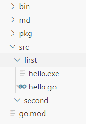

### 基本形式

```go
package main
// 当前包名

import "fmt"
// 导入单个包：后面加不加;都问题不大

func main() {
	fmt.Println("hello go")
}
// 使用包里面的Println进行简单的字符串的打印
```

> 注意 函数后面的{ 必须与函数在同一行

### go命令行的使用

#### 直接运行

例如：

```go
go run hello.go
```

然后直接就可以看见结果

#### 编译运行

需要进入对应的文件夹中，前面也一样

```go
go build hello.go
```

##### 指定生成exe的名字

```go
go build -o heiheihei.exe
```

### 关于无法使用vscode用f5进行调试

#### 先安装下列包文件

```go
go install github.com/go-delve/delve/cmd/dlv@latest
go install github.com/mdempsky/gocode@latest
go install github.com/rogpeppe/godef@latest
go install golang.org/x/lint/golint@latest
go install github.com/ramya-rao-a/go-outline@latest
go install github.com/uudashr/gopkgs/v2/cmd/gopkgs@latest
go install golang.org/x/tools/cmd/gorename@latest
go install github.com/sqs/goreturns@latest
go install github.com/acroca/go-symbols@latest
go install golang.org/x/tour@gotour
go install golang.org/x/tools/cmd/guru@latest
```

#### 报错信息如下

```go
Starting: C:\Users\27892\Desktop\Golang\bin\dlv.exe dap --listen=127.0.0.1:6895 from c:\Users\27892\Desktop\Golang\src\first
DAP server listening at: 127.0.0.1:6895
Build Error: go build -o c:\Users\27892\Desktop\Golang\src\first\__debug_bin219222439.exe -gcflags all=-N -l .
go: go.mod file not found in current directory or any parent directory; see 'go help modules' (exit status 1)
```

> 从信息中知道缺少module模块

#### 解决方案

```go
cd C:\Users\27892\Desktop\Golang\src\first

go mod init first
```

> 也就是将first模块化

#### 查看mod

```go
module first

go 1.22.4
```

然后就可以快乐调试咯


