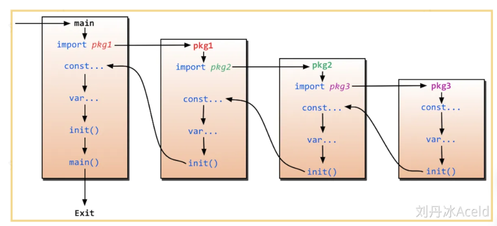

## 函数

### 定义

#### 简单定义

```go
package main


import "fmt"


func swap(x, y string) (string, string) {
   return y, x
}


func main() {
   a, b := swap("Mahesh", "Kumar")
   fmt.Println(a, b)
}
```

> 简单的定义了一个swap函数

#### 多个返回值的定义

```go
package main

import "fmt"

// 定义函数及其两个返回值的类型
func swap(x, y string) (string, string) {
	return y, x
}

func fun1(x string, y int) (r1 int, r2 int) {
	r1 = len(x) // 字符串x的长度
	r2 = y      // 提供的整数值
	// 这里可以不初始化：当然不初始化就是0咯
	return
}

func main() {
	a, b := swap("Mahesh", "Kumar") // 用两个变量去接收两个参数
	fmt.Println(a, b)
	// 打印结果是：Kumar Mahesh

	r1, r2 := fun1("Mahesh", 100)
	fmt.Println(r1, r2)
	// 假设的打印结果，取决于fun1函数的实际逻辑。在这个例子中，如果使用"Mahesh"和100调用fun1，将打印：6 100
}
```

```go
func fun1(x string, y int) (r1 ,r2 int) {
	return
}
// 这样进行初始化也是正确的
```

### 多个包的执行顺序

#### main同时导入两个包



##### 创建包1

> Lib1.go 当然放到文件夹 Lab1下

```go
package InitLib1

import "fmt"

func init() {
    fmt.Println("lib1")
}
```

##### 创建包2

> Lib2.go 当然放到文件夹 Lab2下

```go
package InitLib2

import "fmt"

func init() {
    fmt.Println("lib2")
}
```

##### 创建main

```go
package main

import (
    "fmt"
    _ "GolangTraining/InitLib1"
    _ "GolangTraining/InitLib2"
    // 匿名导包：不使用也不会报错
    // 前面还还可以起别名
)

func init() {
    fmt.Println("libmain init")
}

func main() {
    fmt.Println("libmian main")
}
```

#### main导入一个嵌套包

> 一个包嵌套另一个包

略

执行过程就是上面那张图

#### 函数参数


函数如果使用参数，该变量可称为函数的形参。


形参就像定义在函数体内的局部变量。


调用函数，可以通过两种方式来传递参数：


##### 值传递


值传递是指在调用函数时将实际参数复制一份传递到函数中，这样在函数中如果对参数进行修改，将不会影响到实际参数。


默认情况下，Go 语言使用的是值传递，即在调用过程中不会影响到实际参数。

> 默认值传递：不影响其对应的实际值

以下定义了 swap() 函数：


```go
/* 定义相互交换值的函数 */
func swap(x, y int) int {
   var temp int


   temp = x /* 保存 x 的值 */
   x = y    /* 将 y 值赋给 x */
   y = temp /* 将 temp 值赋给 y*/


   return temp;
}
```


接下来，让我们使用值传递来调用 swap() 函数：


```go
package main


import "fmt"


func main() {
   /* 定义局部变量 */
   var a int = 100
   var b int = 200


   fmt.Printf("交换前 a 的值为 : %d\n", a )
   fmt.Printf("交换前 b 的值为 : %d\n", b )


   /* 通过调用函数来交换值 */
   swap(a, b)


   fmt.Printf("交换后 a 的值 : %d\n", a )
   fmt.Printf("交换后 b 的值 : %d\n", b )
}


/* 定义相互交换值的函数 */
func swap(x, y int) int {
   var temp int


   temp = x /* 保存 x 的值 */
   x = y    /* 将 y 值赋给 x */
   y = temp /* 将 temp 值赋给 y*/


   return temp;
}
```


以下代码执行结果为：


交换前 a 的值为 : 100


交换前 b 的值为 : 200


交换后 a 的值 : 100


交换后 b 的值 : 200

------

##### 引用传递(指针传递)


**指针**


Go 语言中指针是很容易学习的，Go 语言中使用指针可以更简单的执行一些任务。


接下来让我们来一步步学习 Go 语言指针。


我们都知道，变量是一种使用方便的占位符，用于引用计算机内存地址。


Go 语言的取地址符是 &，放到一个变量前使用就会返回相应变量的内存地址。


以下实例演示了变量在内存中地址：


```go
package main


import "fmt"


func main() {
   var a int = 10   


   fmt.Printf("变量的地址: %x\n", &a  )
}
```


执行以上代码输出结果为：


```bash
变量的地址: 20818a220
```

------

现在我们已经了解了什么是内存地址和如何去访问它。接下来我们将具体介绍指针。


引用传递是指在调用函数时将实际参数的地址传递到函数中，那么在函数中对参数所进行的修改，将影响到实际参数。


引用传递指针参数传递到函数内，以下是交换函数 swap() 使用了引用传递：


```go
/* 定义交换值函数*/
func swap(x *int, y *int) {
   var temp int
   temp = *x    /* 保持 x 地址上的值 */
   *x = *y      /* 将 y 值赋给 x */
   *y = temp    /* 将 temp 值赋给 y */
}
```


以下我们通过使用引用传递来调用 swap() 函数：


```go
package main


import "fmt"


func main() {
   /* 定义局部变量 */
   var a int = 100
   var b int= 200


   fmt.Printf("交换前，a 的值 : %d\n", a )
   fmt.Printf("交换前，b 的值 : %d\n", b )


   /* 调用 swap() 函数
   * &a 指向 a 指针，a 变量的地址
   * &b 指向 b 指针，b 变量的地址
   */
   swap(&a, &b)
   // 由于是指针传递：所以实际上修改了a，b其对应的值


   fmt.Printf("交换后，a 的值 : %d\n", a )
   fmt.Printf("交换后，b 的值 : %d\n", b )
}


func swap(x *int, y *int) {  // 传递两个指针
   var temp int
   temp = *x    /* 保存 x 地址上的值 */
   *x = *y      /* 将 y 值赋给 x */
   *y = temp    /* 将 temp 值赋给 y */
}
```


以上代码执行结果为：


交换前，a 的值 : 100


交换前，b 的值 : 200


交换后，a 的值 : 200


交换后，b 的值 : 100

> 所以说  go语言的指针的使用和c语言基本一致了
