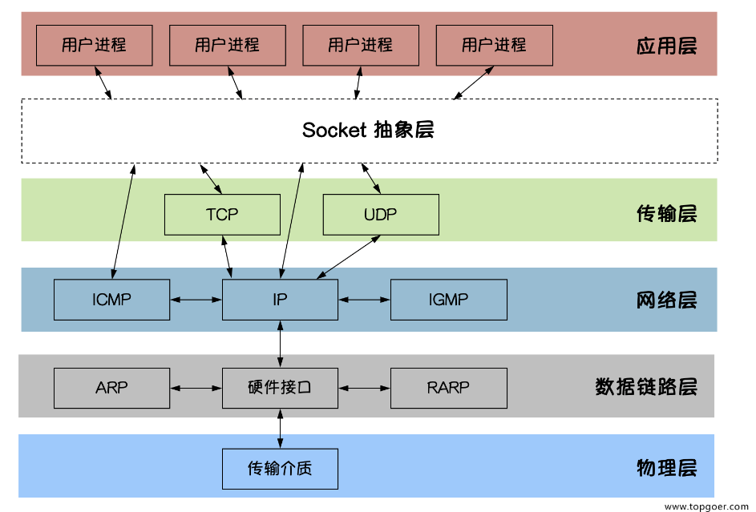
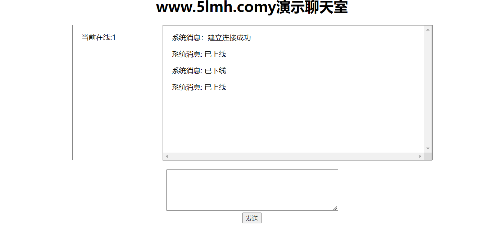
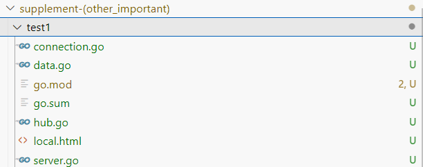

> 转载来源：
> https://www.topgoer.com
>
> 不要老是想着copy笔记，将笔记源站保存没事看看就好：记录的笔记只能是自己不理解不熟悉不会的地方

# 摘录

## 面向对象编程

### 接口

关于下列代码能否通过编译？

```go
type People interface {
    Speak(string) string
}

type Student struct{}

func (stu *Stduent) Speak(think string) (talk string) {  // 这不是指针实现接口嘛？
    if think == "sb" {
        talk = "你是个大帅比"
    } else {
        talk = "您好"
    }
    return
}

func main() {
    var peo People = Student{}  // 创建接口：将Student对象传给它
    think := "bitch"
    fmt.Println(peo.Speak(think))  // 调用接口函数
}
```

> 答案是 不能	接口实现的对象不一致
>
>  var peo People = &Student{}
>
> 声明了一个名为`peo`的变量，类型为`People`接口，并将一个`Student`结构体的指针赋值给它。
>
> 对这句的不理解是因为没理解到接口的赋值
>
>  var peo People = &Student{}改这里就行了

#### 值接收者和指针接收者实现接口的区别

有接口和示例如下：
```go
type Mover interface {
    move()
}

type dog struct {}
// 已经有了Mover接口和dog对象
```

##### 	值接收者实现接口

```go
func (d dog) move() {
    fmt.Println("狗会动")
}
// 值接收者实现接口（值为dog对象）
```

此时实现接口的是dog类型：

```go
func main() {
    var x Mover  // 创建接口
    var wangcai = dog{} // 创建dog对象 旺财
    x = wangcai         // 将dog对象赋予给x接口（值实现接口）
    var fugui = &dog{}  // 创建*dog对象 富贵
    x = fugui           // 将*dog对象赋予给x接口（指针实现接口）
    x.move()
}
```

> 因为`dog`类型定义了`move`方法。所以，`dog`类型的变量和`*dog`类型的变量都可以赋值给`Mover`类型的变量。

##### 指针接收者实现接口

```go
func (d *dog) move() {
    fmt.Println("狗会动")
}
func main() {
    var x Mover
    var wangcai = dog{} // 旺财是dog类型
    x = wangcai         // x不可以接收dog类型
    var fugui = &dog{}  // 富贵是*dog类型
    x = fugui           // x可以接收*dog类型
}
```

> 此时实现Mover接口的是`*dog`类型，所以不能给x传入dog类型的wangcai，此时x只能存储`*dog`类型的值。

> 有一种大范围小范围的概念在里面： dog对象包括dog对象和 *dog  但是 *dog没有包括dog

#### 接口的使用

已知下列接口：

```go
// Sayer 接口
type Sayer interface {
    say()
}

// Mover 接口
type Mover interface {
    move()
}
```

使用如下：

```go
type dog struct {
    name string
}

// 实现Sayer接口
func (d dog) say() {
    fmt.Printf("%s会叫汪汪汪\n", d.name)
}

// 实现Mover接口
func (d dog) move() {
    fmt.Printf("%s会动\n", d.name)
}

func main() {
    var x Sayer
    var y Mover

    var a = dog{name: "旺财"}
    x = a
    y = a
    x.say()
    y.move()
}
```

> 总结就是 创建接口 -> 用对象给接口赋值 -> 接口调用函数

### 空接口

定义示例：

```go
func main() {
    // 定义一个空接口x
    var x interface{}
    s := "pprof.cn"
    x = s
    fmt.Printf("type:%T value:%v\n", x, x)
    i := 100
    x = i
    fmt.Printf("type:%T value:%v\n", x, x)
    b := true
    x = b
    fmt.Printf("type:%T value:%v\n", x, x)
}
```

输出结果：
>type:string value:pprof.cn
>type:int value:100
>type:bool value:true
>
>// 容易知道 %T指的是类型 %v指的是value

#### 应用

#####  空接口作为函数的参数

​	使用空接口实现可以接收任意类型的函数参数。

```go
// 空接口作为函数参数
func show(a interface{}) {
    fmt.Printf("type:%T value:%v\n", a, a)
}
```

#####  空接口作为map的值

实现任意数据类型的字典

```go
// 空接口作为map值
    var studentInfo = make(map[string]interface{})
    studentInfo["name"] = "李白"
    studentInfo["age"] = 18
    studentInfo["married"] = false
    fmt.Println(studentInfo)
```

#### 对于空接口的类型断言

```go
func main() {
    var x interface{}
    x = "pprof.cn"
    v, ok := x.(string)  // 只有string类型才匹配断言才ok~
    if ok {
        fmt.Println(v)
    } else {
        fmt.Println("类型断言失败")
    }
}
```

## 网络编程

### socket图解



- Socket又称“套接字”，应用程序通常通过“套接字”向网络发出请求或者应答网络请求
- 常用的Socket类型有两种：流式Socket和数据报式Socket，流式是一种面向连接的Socket，针对于面向连接的TCP服务应用，数据报式Socket是一种无连接的Socket，针对于无连接的UDP服务应用

### go-TCP编程

#### TCP服务端口

一个TCP服务端可以同时连接很多个客户端，例如世界各地的用户使用自己电脑上的浏览器访问淘宝网。因为Go语言中创建多个goroutine实现并发非常方便和高效，所以我们**可以每建立一次链接就创建一个goroutine去处理。**

TCP服务端程序的处理流程：

```
1.监听端口
2.接收客户端请求建立链接
3.创建goroutine处理链接。
```

> 监听 -> 链接 -> 处理

我们使用Go语言的net包实现的TCP服务端代码如下：

```go
// tcp/server/main.go

// TCP server端

// 处理函数
func process(conn net.Conn) {  // 传入一个conn
    defer conn.Close() // 关闭连接
    for {
        reader := bufio.NewReader(conn)  // 创建reader接收连接
        var buf [128]byte
        n, err := reader.Read(buf[:]) // 读取数据 到buf中
        if err != nil {
            fmt.Println("read from client failed, err:", err)
            break
        }
        // 抛出读取错误
        recvStr := string(buf[:n])  // 转为string
        fmt.Println("收到client端发来的数据：", recvStr)
        conn.Write([]byte(recvStr)) // 发送数据
    }
}
// 处理函数两部曲 接收 -> 处理

func main() {
    listen, err := net.Listen("tcp", "127.0.0.1:20000")  // 监听20000端口
    if err != nil {
        fmt.Println("listen failed, err:", err)
        return
    }
    // 抛出监听错误
    for {
        conn, err := listen.Accept() // 建立连接
        if err != nil {
            fmt.Println("accept failed, err:", err)
            continue
        }
        // 抛出连接错误
        go process(conn) // 启动一个goroutine处理连接
    }
}
// main函数共3部曲 监听 -> 连接 -> 处理
```

将上面的代码保存之后编译成server或server.exe可执行文件。

#### TCP客户端

一个TCP客户端进行TCP通信的流程如下：

```
1.建立与服务端的链接
2.进行数据收发
3.关闭链接
```

使用Go语言的net包实现的TCP客户端代码如下：

```go
// tcp/client/main.go

// 客户端
func main() {
    conn, err := net.Dial("tcp", "127.0.0.1:20000")  // 调用接口 ： 尝试建立TCP连接 两个返回值：一个conn  一个如果err
    if err != nil {
        fmt.Println("err :", err)
        return
    }
    // 抛出连接错误
    defer conn.Close() // 关闭连接
    inputReader := bufio.NewReader(os.Stdin)
    for {
        input, _ := inputReader.ReadString('\n') // 读取用户输入
        inputInfo := strings.Trim(input, "\r\n")
        if strings.ToUpper(inputInfo) == "Q" { // 如果输入q就退出
            return
        }
        _, err = conn.Write([]byte(inputInfo)) // 发送数据
        if err != nil {
            return
        }
        buf := [512]byte{}
        n, err := conn.Read(buf[:])
        if err != nil {
            fmt.Println("recv failed, err:", err)
            return
        }
        fmt.Println(string(buf[:n]))
    }
}
```

将上面的代码编译成client或client.exe可执行文件，先启动server端再启动client端，在client端输入任意内容回车之后就能够在server端看到client端发送的数据，从而实现TCP通信。

### go-UDP编程

#### UDP服务端

使用Go语言的net包实现的UDP服务端代码如下：

```go
// UDP/server/main.go

// UDP server端
func main() {
    listen, err := net.ListenUDP("udp", &net.UDPAddr{
        IP:   net.IPv4(0, 0, 0, 0),
        Port: 30000,
    })
    if err != nil {
        fmt.Println("listen failed, err:", err)
        return
    }
    // 一致略
    defer listen.Close()  //只不过处理放到了main函数里面
    for {
        var data [1024]byte
        n, addr, err := listen.ReadFromUDP(data[:]) // 接收数据  3个返回值  // 接收客户端发送的数据
        if err != nil {
            fmt.Println("read udp failed, err:", err)
            continue
        }
        fmt.Printf("data:%v addr:%v count:%v\n", string(data[:n]), addr, n)
        _, err = listen.WriteToUDP(data[:n], addr) // 发送数据  // 像客户端发送数据
        if err != nil {
            fmt.Println("write to udp failed, err:", err)
            continue
        }
    }
}
// 三部曲 监听端口 -> 接收数据 -> 发送数据
```

#### UDP客户端

使用Go语言的net包实现的UDP客户端代码如下：

```go
// UDP 客户端
func main() {
    socket, err := net.DialUDP("udp", nil, &net.UDPAddr{
        IP:   net.IPv4(0, 0, 0, 0),
        Port: 30000,
    })
    // 建立连接
    if err != nil {
        fmt.Println("连接服务端失败，err:", err)
        return
    }
    defer socket.Close()
    sendData := []byte("Hello server")
    _, err = socket.Write(sendData) // 发送数据
    if err != nil {
        fmt.Println("发送数据失败，err:", err)
        return
    }
    data := make([]byte, 4096)
    n, remoteAddr, err := socket.ReadFromUDP(data) // 接收数据
    if err != nil {
        fmt.Println("接收数据失败，err:", err)
        return
    }
    fmt.Printf("recv:%v addr:%v count:%v\n", string(data[:n]), remoteAddr, n)
}
// 三部曲 建立连接 -> 发送数据 -> 接收数据
```

### go-TCP粘包

#### 问题展示

出现”粘包”的关键在于接收方不确定将要传输的数据包的大小，因此我们可以对数据包进行封包和拆包的操作。

现象如下：服务端代码如下：

```go
// socket_stick/server/main.go

func process(conn net.Conn) {
    defer conn.Close()
    reader := bufio.NewReader(conn)
    var buf [1024]byte
    for {
        n, err := reader.Read(buf[:])
        if err == io.EOF {
            break
        }
        if err != nil {
            fmt.Println("read from client failed, err:", err)
            break
        }
        recvStr := string(buf[:n])
        fmt.Println("收到client发来的数据：", recvStr)
    }
}

func main() {

    listen, err := net.Listen("tcp", "127.0.0.1:30000")
    if err != nil {
        fmt.Println("listen failed, err:", err)
        return
    }
    defer listen.Close()
    for {
        conn, err := listen.Accept()
        if err != nil {
            fmt.Println("accept failed, err:", err)
            continue
        }
        go process(conn)
    }
    // 监听 -> 连接 -> 处理
}
```

客户端代码如下：

```go
// socket_stick/client/main.go

func main() {
    conn, err := net.Dial("tcp", "127.0.0.1:30000")
    if err != nil {
        fmt.Println("dial failed, err", err)
        return
    }
    defer conn.Close()
    for i := 0; i < 20; i++ {
        msg := `Hello, Hello. How are you?`
        conn.Write([]byte(msg))
    }
    // 连接 -> 发送数据
}
```

将上面的代码保存后，分别编译。先启动服务端再启动客户端，可以看到服务端输出结果如下：

```
收到client发来的数据： Hello, Hello. How are you?Hello, Hello. How are you?Hello, Hello. How are you?Hello, Hello. How are you?Hello, Hello. How are you?
收到client发来的数据： Hello, Hello. How are you?Hello, Hello. How are you?Hello, Hello. How are you?Hello, Hello. How are you?Hello, Hello. How are you?Hello, Hello. How are you?Hello, Hello. How are you?Hello, Hello. How are you?
收到client发来的数据： Hello, Hello. How are you?Hello, Hello. How are you?
收到client发来的数据： Hello, Hello. How are you?Hello, Hello. How are you?Hello, Hello. How are you?
收到client发来的数据： Hello, Hello. How are you?Hello, Hello. How are you?
```

客户端分10次发送的数据，在服务端并没有成功的输出10次，而是多条数据“粘”到了一起。

>主要原因就是tcp数据传递模式是流模式，在保持长连接的时候可以进行多次的收和发。
>
>“粘包”可发生在发送端也可发生在接收端：

#### 解决办法

我们可以自己定义一个协议，比如数据包的前4个字节为包头，里面存储的是发送的数据的长度。

```go
// socket_stick/proto/proto.go
package proto

import (
    "bufio"
    "bytes"
    "encoding/binary"
)

// Encode 将消息编码
func Encode(message string) ([]byte, error) {
    // 读取消息的长度，转换成int32类型（占4个字节）
    var length = int32(len(message))  // 转类型
    var pkg = new(bytes.Buffer)
    // 写入消息头
    err := binary.Write(pkg, binary.LittleEndian, length)
    if err != nil {
        return nil, err
    }
    // 写入消息实体
    err = binary.Write(pkg, binary.LittleEndian, []byte(message))
    if err != nil {
        return nil, err
    }
    return pkg.Bytes(), nil
}

// Decode 解码消息
func Decode(reader *bufio.Reader) (string, error) {
    // 读取消息的长度
    lengthByte, _ := reader.Peek(4) // 读取前4个字节的数据
    lengthBuff := bytes.NewBuffer(lengthByte)
    var length int32
    err := binary.Read(lengthBuff, binary.LittleEndian, &length)
    if err != nil {
        return "", err
    }
    // Buffered返回缓冲中现有的可读取的字节数。
    if int32(reader.Buffered()) < length+4 {
        return "", err
    }

    // 读取真正的消息数据
    pack := make([]byte, int(4+length))
    _, err = reader.Read(pack)
    if err != nil {
        return "", err
    }
    return string(pack[4:]), nil
}
```

接下来在服务端和客户端分别使用上面定义的proto包的Decode和Encode函数处理数据。

服务端代码如下：

```go
// socket_stick/server2/main.go

func process(conn net.Conn) {
    defer conn.Close()
    reader := bufio.NewReader(conn)  // 建立连接对象 reader
    for {
        msg, err := proto.Decode(reader)  // 使用连接对象读取数据到msg中
        if err == io.EOF {
            return
        }
        if err != nil {
            fmt.Println("decode msg failed, err:", err)
            return
        }
        fmt.Println("收到client发来的数据：", msg)
    }
}

func main() {

    listen, err := net.Listen("tcp", "127.0.0.1:30000")
    if err != nil {
        fmt.Println("listen failed, err:", err)
        return
    }
    defer listen.Close()
    for {
        conn, err := listen.Accept()
        if err != nil {
            fmt.Println("accept failed, err:", err)
            continue
        }
        go process(conn)
    }
}
// main函数没什么变化
```

客户端代码如下：

```go
// socket_stick/client2/main.go

func main() {
    conn, err := net.Dial("tcp", "127.0.0.1:30000")
    if err != nil {
        fmt.Println("dial failed, err", err)
        return
    }
    defer conn.Close()
    // 建立TCP连接
    for i := 0; i < 20; i++ {
        msg := `Hello, Hello. How are you?`
        data, err := proto.Encode(msg)  // 将要发送的数据msg编码 到data中
        if err != nil {
            fmt.Println("encode msg failed, err:", err)
            return
        }
        conn.Write(data)  // 写入数据到conn中
    }
    // 循环20次发送数据
}
```

### go-HTTP编程（重点）

> 之前的项目开发使用的就是go语言的HTTP编程实现后端功能  ：： 当然对于前端来说就是API接口

#### web工作流程

- Web服务器的工作原理可以简单地归纳为
  - 客户机通过TCP/IP协议建立到服务器的TCP连接
  - 客户端向服务器发送HTTP协议请求包，请求服务器里的资源文档
  - 服务器向客户机发送HTTP协议应答包，如果请求的资源包含有动态语言的内容，那么服务器会调用动态语言的解释引擎负责处理“动态内容”，并将处理得到的数据返回给客户端
  - 客户机与服务器断开。由客户端解释HTML文档，在客户端屏幕上渲染图形结果

#### HTTP协议

- 超文本传输协议(HTTP，HyperText Transfer Protocol)是互联网上应用最为广泛的一种网络协议，它详细规定了浏览器和万维网服务器之间互相通信的规则，通过因特网传送万维网文档的数据传送协议
- HTTP协议通常承载于TCP协议之上

> 注意：http协议就是超文本传输协议-别想太多了

#### HTTP服务端

```go
package main

import (
    "fmt"
    "net/http"
)

func main() {
    //http://127.0.0.1:8000/go
    // 单独写回调函数
    http.HandleFunc("/go", myHandler)    // 将接收的路径和myHandler绑定起来：只有当接收路径中为go时才去处理
    //http.HandleFunc("/ungo",myHandler2 )
    // addr：监听的地址
    // handler：回调函数
    http.ListenAndServe("127.0.0.1:8000", nil)  // 监听本地ip和端口
}
// main 二部曲 创建回调函数 -> 监听端口  ：：总结就是 处理回调 和 监听端口


// handler函数
func myHandler(w http.ResponseWriter, r *http.Request) {  // 接收头和请求体
    fmt.Println(r.RemoteAddr, "连接成功")
    // 请求方式：GET POST DELETE PUT UPDATE
    fmt.Println("method:", r.Method)  // 查看接收头的状态码时什么
    // /go
    fmt.Println("url:", r.URL.Path)
    fmt.Println("header:", r.Header)
    fmt.Println("body:", r.Body)  // 打印路径
    // 回复
    w.Write([]byte("www.5lmh.com"))  // 恢复一个带有网站连接的byte切片数据
}
// 比较重要的几种基本使用方式 GET POST DELETE PUT UPDATE
```

#### HTTP客户端

```go
package main

import (
    "fmt"
    "io"
    "net/http"
)

func main() {
    //resp, _ := http.Get("http://www.baidu.com")
    //fmt.Println(resp)
    resp, _ := http.Get("http://127.0.0.1:8000/go")  // 发送请求 向本地的800端口 路径为go 发送的时GET请求体
    defer resp.Body.Close()
    // 200 OK
    fmt.Println(resp.Status)
    fmt.Println(resp.Header)  // 答应连接状态和接收的头

    buf := make([]byte, 1024)  // 创建byte切片
    for {
        // 接收服务端信息
        n, err := resp.Body.Read(buf)  // 将接收的数 写入buf中
        if err != nil && err != io.EOF {
            fmt.Println(err)
            return  // 错误处理
        } else {
            fmt.Println("读取完毕")
            res := string(buf[:n])
            fmt.Println(res)
            break
        }
        // 读取完毕 输出结果
    }
}
```

> 相对来说：gttp编程还是非常重要的 -> 对于处理哪几种基本请求很请求来说

### WebSocket编程（重点）

#### webSocket是什么

- WebSocket是一种在单个TCP连接上进行全双工通信的协议
- WebSocket使得客户端和服务器之间的数据交换变得更加简单，允许服务端主动向客户端推送数据
- 在WebSocket API中，浏览器和服务器只需要完成一次握手，两者之间就直接可以创建持久性的连接，并进行双向数据传输
- 需要安装第三方包：
  - cmd中：go get -u -v github.com/gorilla/websocket

#### 举个聊天室的小例子

在同一级目录下新建四个go文件`connection.go|data.go|hub.go|server.go`

**运行**

```
go run server.go hub.go data.go connection.go
// 将这一个main包里面的四个go语言代码同时运行
```

运行之后执行local.html文件

##### server.go文件代码

```go
package main

import (
    "fmt"
    "net/http"

    "github.com/gorilla/mux"
)

func main() {
    router := mux.NewRouter()  // 创建路由
    go h.run()  // 执行go程
    router.HandleFunc("/ws", myws)  // 当路由为/ws的时候调用myws函数处理路由
    if err := http.ListenAndServe("127.0.0.1:8080", router); err != nil {
        fmt.Println("err:", err)
    }
    // 监听端口 路由
}

```

##### hub.go文件代码

```go
package main

import "encoding/json"

var h = hub{
    c: make(map[*connection]bool),
    u: make(chan *connection),
    b: make(chan []byte),
    r: make(chan *connection),
}
// 创建chan通道

type hub struct {
    c map[*connection]bool  // map
    b chan []byte
    r chan *connection
    u chan *connection
}
// 创建hub结构体 上面是定义了一个hub变量h

func (h *hub) run() {
    for {
        select {
        case c := <-h.r:
            h.c[c] = true
            c.data.Ip = c.ws.RemoteAddr().String()
            c.data.Type = "handshake"
            c.data.UserList = user_list
            data_b, _ := json.Marshal(c.data)
            c.sc <- data_b
        case c := <-h.u:
            if _, ok := h.c[c]; ok {
                delete(h.c, c)
                close(c.sc)
            }
        case data := <-h.b:
            for c := range h.c {
                select {
                case c.sc <- data:
                default:
                    delete(h.c, c)
                    close(c.sc)
                }
            }
        }
        // 将多个if-else语句改为switch-select简洁多了
        // 对接收的多种connection的判断和处理
    }
}
// 创建run方法
```

##### data.go文件代码

```go
package main

type Data struct {
    Ip       string   `json:"ip"`
    User     string   `json:"user"`
    From     string   `json:"from"`
    Type     string   `json:"type"`
    Content  string   `json:"content"`
    UserList []string `json:"user_list"`
}
// 主要是处理数据类型  创建结构体 用于json数据之间的转换
```

##### connection.go文件代码

```go
package main

import (
    "encoding/json"
    "fmt"
    "net/http"

    "github.com/gorilla/websocket"
)

type connection struct {
    ws   *websocket.Conn
    sc   chan []byte
    data *Data
}

var wu = &websocket.Upgrader{ReadBufferSize: 512,
    WriteBufferSize: 512, CheckOrigin: func(r *http.Request) bool { return true }}

func myws(w http.ResponseWriter, r *http.Request) {
    ws, err := wu.Upgrade(w, r, nil)
    if err != nil {
        return
    }
    c := &connection{sc: make(chan []byte, 256), ws: ws, data: &Data{}}
    h.r <- c
    go c.writer()
    c.reader()
    defer func() {
        c.data.Type = "logout"
        user_list = del(user_list, c.data.User)
        c.data.UserList = user_list
        c.data.Content = c.data.User
        data_b, _ := json.Marshal(c.data)
        h.b <- data_b
        h.r <- c
    }()
}

func (c *connection) writer() {
    for message := range c.sc {
        c.ws.WriteMessage(websocket.TextMessage, message)
    }
    c.ws.Close()
}

var user_list = []string{}

func (c *connection) reader() {
    for {
        _, message, err := c.ws.ReadMessage()
        if err != nil {
            h.r <- c
            break
        }
        json.Unmarshal(message, &c.data)
        switch c.data.Type {
        case "login":
            c.data.User = c.data.Content
            c.data.From = c.data.User
            user_list = append(user_list, c.data.User)
            c.data.UserList = user_list
            data_b, _ := json.Marshal(c.data)
            h.b <- data_b
        case "user":
            c.data.Type = "user"
            data_b, _ := json.Marshal(c.data)
            h.b <- data_b
        case "logout":
            c.data.Type = "logout"
            user_list = del(user_list, c.data.User)
            data_b, _ := json.Marshal(c.data)
            h.b <- data_b
            h.r <- c
        default:
            fmt.Print("========default================")
        }
    }
}

func del(slice []string, user string) []string {
    count := len(slice)
    if count == 0 {
        return slice
    }
    if count == 1 && slice[0] == user {
        return []string{}
    }
    var n_slice = []string{}
    for i := range slice {
        if slice[i] == user && i == count {
            return slice[:count]
        } else if slice[i] == user {
            n_slice = append(slice[:i], slice[i+1:]...)
            break
        }
    }
    fmt.Println(n_slice)
    return n_slice
}
```

##### local.html文件代码  (基于websocket和html和javascript的聊天室代码)

```html
<!DOCTYPE html>
<html>
<head>
    <title></title>
    <meta http-equiv="content-type" content="text/html;charset=utf-8">
    <style>
        p {
            text-align: left;
            padding-left: 20px;
        }
    </style>
</head>
<body>
<div style="width: 800px;height: 600px;margin: 30px auto;text-align: center">
    <h1>www.5lmh.comy演示聊天室</h1>
    <div style="width: 800px;border: 1px solid gray;height: 300px;">
        <div style="width: 200px;height: 300px;float: left;text-align: left;">
            <p><span>当前在线:</span><span id="user_num">0</span></p>
            <div id="user_list" style="overflow: auto;">
            </div>
        </div>
        <div id="msg_list" style="width: 598px;border:  1px solid gray; height: 300px;overflow: scroll;float: left;">
        </div>
    </div>
    <br>
    <textarea id="msg_box" rows="6" cols="50" onkeydown="confirm(event)"></textarea><br>
    <input type="button" value="发送" onclick="send()">
</div>
</body>
</html>
<script type="text/javascript">
    var uname = prompt('请输入用户名', 'user' + uuid(8, 16));
    var ws = new WebSocket("ws://127.0.0.1:8080/ws");
    ws.onopen = function () {
        var data = "系统消息：建立连接成功";
        listMsg(data);
    };
    ws.onmessage = function (e) {
        var msg = JSON.parse(e.data);
        var sender, user_name, name_list, change_type;
        switch (msg.type) {
            case 'system':
                sender = '系统消息: ';
                break;
            case 'user':
                sender = msg.from + ': ';
                break;
            case 'handshake':
                var user_info = {'type': 'login', 'content': uname};
                sendMsg(user_info);
                return;
            case 'login':
            case 'logout':
                user_name = msg.content;
                name_list = msg.user_list;
                change_type = msg.type;
                dealUser(user_name, change_type, name_list);
                return;
        }
        var data = sender + msg.content;
        listMsg(data);
    };
    ws.onerror = function () {
        var data = "系统消息 : 出错了,请退出重试.";
        listMsg(data);
    };
    function confirm(event) {
        var key_num = event.keyCode;
        if (13 == key_num) {
            send();
        } else {
            return false;
        }
    }
    function send() {
        var msg_box = document.getElementById("msg_box");
        var content = msg_box.value;
        var reg = new RegExp("\r\n", "g");
        content = content.replace(reg, "");
        var msg = {'content': content.trim(), 'type': 'user'};
        sendMsg(msg);
        msg_box.value = '';
    }
    function listMsg(data) {
        var msg_list = document.getElementById("msg_list");
        var msg = document.createElement("p");
        msg.innerHTML = data;
        msg_list.appendChild(msg);
        msg_list.scrollTop = msg_list.scrollHeight;
    }
    function dealUser(user_name, type, name_list) {
        var user_list = document.getElementById("user_list");
        var user_num = document.getElementById("user_num");
        while(user_list.hasChildNodes()) {
            user_list.removeChild(user_list.firstChild);
        }
        for (var index in name_list) {
            var user = document.createElement("p");
            user.innerHTML = name_list[index];
            user_list.appendChild(user);
        }
        user_num.innerHTML = name_list.length;
        user_list.scrollTop = user_list.scrollHeight;
        var change = type == 'login' ? '上线' : '下线';
        var data = '系统消息: ' + user_name + ' 已' + change;
        listMsg(data);
    }
    function sendMsg(msg) {
        var data = JSON.stringify(msg);
        ws.send(data);
    }
    function uuid(len, radix) {
        var chars = '0123456789ABCDEFGHIJKLMNOPQRSTUVWXYZabcdefghijklmnopqrstuvwxyz'.split('');
        var uuid = [], i;
        radix = radix || chars.length;
        if (len) {
            for (i = 0; i < len; i++) uuid[i] = chars[0 | Math.random() * radix];
        } else {
            var r;
            uuid[8] = uuid[13] = uuid[18] = uuid[23] = '-';
            uuid[14] = '4';
            for (i = 0; i < 36; i++) {
                if (!uuid[i]) {
                    r = 0 | Math.random() * 16;
                    uuid[i] = chars[(i == 19) ? (r & 0x3) | 0x8 : r];
                }
            }
        }
        return uuid.join('');
    }
</script>
```

> 好像稍微HTTP编程简单点

> 关于websocket编程：
> WebSocket是一种网络通信协议，提供了浏览器（客户端）与服务器之间的**全双工通信能力**。这意味着客户端和服务器可以在建立连接后随时相互发送数据，非常适合需要实时数据更新的应用，比如在线游戏、聊天应用等。Go语言对WebSocket编程提供了支持，可以通过多种库来实现，其中最流行的是`gorilla/websocket`。

先看看演示效果吧：


> 感觉就很nb  使用vscode live share打开：不然不排除出现跨域问题



现在go需要在go mod下导入模块 

所以需要先 go mod init test1

然后下载对应的包文件

go get github.com/gorilla/websocket

...

如果是需要运行起来就： （一起跑一遍就行了）

```
go run server.go hub.go data.go connection.go
```

挺复杂的但是又很有意思

文件结果如下（同意目录即可）

		

## 并发编程

