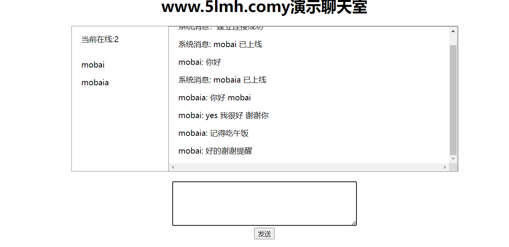
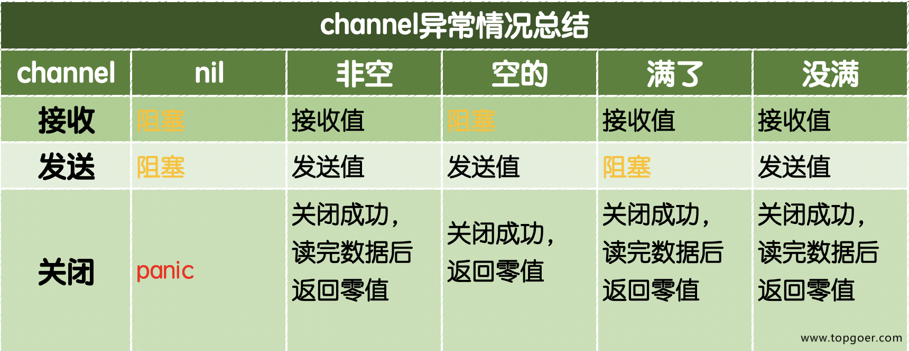

> 转载来源：
> https://www.topgoer.com
>
> 不要老是想着copy笔记，将笔记源站保存没事看看就好：记录的笔记只能是自己不理解不熟悉不会的地方
>
> 这里对我动不动就cv的行为表示强烈谴责，并且加以修改，应该是要深度学习，仔细思考
>
> 因为cv就是没有思考的浅学习吧

# 摘录

## 面向对象编程

### 接口

关于下列代码能否通过编译？

```go
type People interface {
    Speak(string) string
}

type Student struct{}

func (stu *Stduent) Speak(think string) (talk string) {  // 这不是指针实现接口嘛？
    if think == "sb" {
        talk = "你是个大帅比"
    } else {
        talk = "您好"
    }
    return
}

func main() {
    var peo People = Student{}  // 创建接口：将Student对象传给它
    think := "bitch"
    fmt.Println(peo.Speak(think))  // 调用接口函数
}
```

> 答案是 不能	接口实现的对象不一致
>
>  var peo People = &Student{}
>
> 声明了一个名为`peo`的变量，类型为`People`接口，并将一个`Student`结构体的指针赋值给它。
>
> 对这句的不理解是因为没理解到接口的赋值
>
>  var peo People = &Student{}改这里就行了

#### 值接收者和指针接收者实现接口的区别

有接口和示例如下：
```go
type Mover interface {
    move()
}

type dog struct {}
// 已经有了Mover接口和dog对象
```

##### 	值接收者实现接口

```go
func (d dog) move() {
    fmt.Println("狗会动")
}
// 值接收者实现接口（值为dog对象）
```

此时实现接口的是dog类型：

```go
func main() {
    var x Mover  // 创建接口
    var wangcai = dog{} // 创建dog对象 旺财
    x = wangcai         // 将dog对象赋予给x接口（值实现接口）
    var fugui = &dog{}  // 创建*dog对象 富贵
    x = fugui           // 将*dog对象赋予给x接口（指针实现接口）
    x.move()
}
```

> 因为`dog`类型定义了`move`方法。所以，`dog`类型的变量和`*dog`类型的变量都可以赋值给`Mover`类型的变量。

##### 指针接收者实现接口

```go
func (d *dog) move() {
    fmt.Println("狗会动")
}
func main() {
    var x Mover
    var wangcai = dog{} // 旺财是dog类型
    x = wangcai         // x不可以接收dog类型
    var fugui = &dog{}  // 富贵是*dog类型
    x = fugui           // x可以接收*dog类型
}
```

> 此时实现Mover接口的是`*dog`类型，所以不能给x传入dog类型的wangcai，此时x只能存储`*dog`类型的值。

> 有一种大范围小范围的概念在里面： dog对象包括dog对象和 *dog  但是 *dog没有包括dog

#### 接口的使用

已知下列接口：

```go
// Sayer 接口
type Sayer interface {
    say()
}

// Mover 接口
type Mover interface {
    move()
}
```

使用如下：

```go
type dog struct {
    name string
}

// 实现Sayer接口
func (d dog) say() {
    fmt.Printf("%s会叫汪汪汪\n", d.name)
}

// 实现Mover接口
func (d dog) move() {
    fmt.Printf("%s会动\n", d.name)
}

func main() {
    var x Sayer
    var y Mover

    var a = dog{name: "旺财"}
    x = a
    y = a
    x.say()
    y.move()
}
```

> 总结就是 创建接口 -> 用对象给接口赋值 -> 接口调用函数

### 空接口

定义示例：

```go
func main() {
    // 定义一个空接口x
    var x interface{}
    s := "pprof.cn"
    x = s
    fmt.Printf("type:%T value:%v\n", x, x)
    i := 100
    x = i
    fmt.Printf("type:%T value:%v\n", x, x)
    b := true
    x = b
    fmt.Printf("type:%T value:%v\n", x, x)
}
```

输出结果：
>type:string value:pprof.cn
>type:int value:100
>type:bool value:true
>
>// 容易知道 %T指的是类型 %v指的是value

#### 应用

#####  空接口作为函数的参数

​	使用空接口实现可以接收任意类型的函数参数。

```go
// 空接口作为函数参数
func show(a interface{}) {
    fmt.Printf("type:%T value:%v\n", a, a)
}
```

#####  空接口作为map的值

实现任意数据类型的字典

```go
// 空接口作为map值
    var studentInfo = make(map[string]interface{})
    studentInfo["name"] = "李白"
    studentInfo["age"] = 18
    studentInfo["married"] = false
    fmt.Println(studentInfo)
```

#### 对于空接口的类型断言

```go
func main() {
    var x interface{}
    x = "pprof.cn"
    v, ok := x.(string)  // 只有string类型才匹配断言才ok~
    if ok {
        fmt.Println(v)
    } else {
        fmt.Println("类型断言失败")
    }
}
```

## 网络编程

### socket图解


- Socket又称“套接字”，应用程序通常通过“套接字”向网络发出请求或者应答网络请求
- 常用的Socket类型有两种：流式Socket和数据报式Socket，流式是一种面向连接的Socket，针对于面向连接的TCP服务应用，数据报式Socket是一种无连接的Socket，针对于无连接的UDP服务应用

### go-TCP编程

#### TCP服务端口

一个TCP服务端可以同时连接很多个客户端，例如世界各地的用户使用自己电脑上的浏览器访问淘宝网。因为Go语言中创建多个goroutine实现并发非常方便和高效，所以我们**可以每建立一次链接就创建一个goroutine去处理。**

TCP服务端程序的处理流程：

```
1.监听端口
2.接收客户端请求建立链接
3.创建goroutine处理链接。
```

> 监听 -> 链接 -> 处理

我们使用Go语言的net包实现的TCP服务端代码如下：

```go
// tcp/server/main.go

// TCP server端

// 处理函数
func process(conn net.Conn) {  // 传入一个conn
    defer conn.Close() // 关闭连接
    for {
        reader := bufio.NewReader(conn)  // 创建reader接收连接
        var buf [128]byte
        n, err := reader.Read(buf[:]) // 读取数据 到buf中
        if err != nil {
            fmt.Println("read from client failed, err:", err)
            break
        }
        // 抛出读取错误
        recvStr := string(buf[:n])  // 转为string
        fmt.Println("收到client端发来的数据：", recvStr)
        conn.Write([]byte(recvStr)) // 发送数据
    }
}
// 处理函数两部曲 接收 -> 处理

func main() {
    listen, err := net.Listen("tcp", "127.0.0.1:20000")  // 监听20000端口
    if err != nil {
        fmt.Println("listen failed, err:", err)
        return
    }
    // 抛出监听错误
    for {
        conn, err := listen.Accept() // 建立连接
        if err != nil {
            fmt.Println("accept failed, err:", err)
            continue
        }
        // 抛出连接错误
        go process(conn) // 启动一个goroutine处理连接
    }
}
// main函数共3部曲 监听 -> 连接 -> 处理
```

将上面的代码保存之后编译成server或server.exe可执行文件。

#### TCP客户端

一个TCP客户端进行TCP通信的流程如下：

```
1.建立与服务端的链接
2.进行数据收发
3.关闭链接
```

使用Go语言的net包实现的TCP客户端代码如下：

```go
// tcp/client/main.go

// 客户端
func main() {
    conn, err := net.Dial("tcp", "127.0.0.1:20000")  // 调用接口 ： 尝试建立TCP连接 两个返回值：一个conn  一个如果err
    if err != nil {
        fmt.Println("err :", err)
        return
    }
    // 抛出连接错误
    defer conn.Close() // 关闭连接
    inputReader := bufio.NewReader(os.Stdin)
    for {
        input, _ := inputReader.ReadString('\n') // 读取用户输入
        inputInfo := strings.Trim(input, "\r\n")
        if strings.ToUpper(inputInfo) == "Q" { // 如果输入q就退出
            return
        }
        _, err = conn.Write([]byte(inputInfo)) // 发送数据
        if err != nil {
            return
        }
        buf := [512]byte{}
        n, err := conn.Read(buf[:])
        if err != nil {
            fmt.Println("recv failed, err:", err)
            return
        }
        fmt.Println(string(buf[:n]))
    }
}
```

将上面的代码编译成client或client.exe可执行文件，先启动server端再启动client端，在client端输入任意内容回车之后就能够在server端看到client端发送的数据，从而实现TCP通信。

### go-UDP编程

#### UDP服务端

使用Go语言的net包实现的UDP服务端代码如下：

```go
// UDP/server/main.go

// UDP server端
func main() {
    listen, err := net.ListenUDP("udp", &net.UDPAddr{
        IP:   net.IPv4(0, 0, 0, 0),
        Port: 30000,
    })
    if err != nil {
        fmt.Println("listen failed, err:", err)
        return
    }
    // 一致略
    defer listen.Close()  //只不过处理放到了main函数里面
    for {
        var data [1024]byte
        n, addr, err := listen.ReadFromUDP(data[:]) // 接收数据  3个返回值  // 接收客户端发送的数据
        if err != nil {
            fmt.Println("read udp failed, err:", err)
            continue
        }
        fmt.Printf("data:%v addr:%v count:%v\n", string(data[:n]), addr, n)
        _, err = listen.WriteToUDP(data[:n], addr) // 发送数据  // 像客户端发送数据
        if err != nil {
            fmt.Println("write to udp failed, err:", err)
            continue
        }
    }
}
// 三部曲 监听端口 -> 接收数据 -> 发送数据
```

#### UDP客户端

使用Go语言的net包实现的UDP客户端代码如下：

```go
// UDP 客户端
func main() {
    socket, err := net.DialUDP("udp", nil, &net.UDPAddr{
        IP:   net.IPv4(0, 0, 0, 0),
        Port: 30000,
    })
    // 建立连接
    if err != nil {
        fmt.Println("连接服务端失败，err:", err)
        return
    }
    defer socket.Close()
    sendData := []byte("Hello server")
    _, err = socket.Write(sendData) // 发送数据
    if err != nil {
        fmt.Println("发送数据失败，err:", err)
        return
    }
    data := make([]byte, 4096)
    n, remoteAddr, err := socket.ReadFromUDP(data) // 接收数据
    if err != nil {
        fmt.Println("接收数据失败，err:", err)
        return
    }
    fmt.Printf("recv:%v addr:%v count:%v\n", string(data[:n]), remoteAddr, n)
}
// 三部曲 建立连接 -> 发送数据 -> 接收数据
```

### go-TCP粘包

#### 问题展示

出现”粘包”的关键在于接收方不确定将要传输的数据包的大小，因此我们可以对数据包进行封包和拆包的操作。

现象如下：服务端代码如下：

```go
// socket_stick/server/main.go

func process(conn net.Conn) {
    defer conn.Close()
    reader := bufio.NewReader(conn)
    var buf [1024]byte
    for {
        n, err := reader.Read(buf[:])
        if err == io.EOF {
            break
        }
        if err != nil {
            fmt.Println("read from client failed, err:", err)
            break
        }
        recvStr := string(buf[:n])
        fmt.Println("收到client发来的数据：", recvStr)
    }
}

func main() {

    listen, err := net.Listen("tcp", "127.0.0.1:30000")
    if err != nil {
        fmt.Println("listen failed, err:", err)
        return
    }
    defer listen.Close()
    for {
        conn, err := listen.Accept()
        if err != nil {
            fmt.Println("accept failed, err:", err)
            continue
        }
        go process(conn)
    }
    // 监听 -> 连接 -> 处理
}
```

客户端代码如下：

```go
// socket_stick/client/main.go

func main() {
    conn, err := net.Dial("tcp", "127.0.0.1:30000")
    if err != nil {
        fmt.Println("dial failed, err", err)
        return
    }
    defer conn.Close()
    for i := 0; i < 20; i++ {
        msg := `Hello, Hello. How are you?`
        conn.Write([]byte(msg))
    }
    // 连接 -> 发送数据
}
```

将上面的代码保存后，分别编译。先启动服务端再启动客户端，可以看到服务端输出结果如下：

```
收到client发来的数据： Hello, Hello. How are you?Hello, Hello. How are you?Hello, Hello. How are you?Hello, Hello. How are you?Hello, Hello. How are you?
收到client发来的数据： Hello, Hello. How are you?Hello, Hello. How are you?Hello, Hello. How are you?Hello, Hello. How are you?Hello, Hello. How are you?Hello, Hello. How are you?Hello, Hello. How are you?Hello, Hello. How are you?
收到client发来的数据： Hello, Hello. How are you?Hello, Hello. How are you?
收到client发来的数据： Hello, Hello. How are you?Hello, Hello. How are you?Hello, Hello. How are you?
收到client发来的数据： Hello, Hello. How are you?Hello, Hello. How are you?
```

客户端分10次发送的数据，在服务端并没有成功的输出10次，而是多条数据“粘”到了一起。

>主要原因就是tcp数据传递模式是流模式，在保持长连接的时候可以进行多次的收和发。
>
>“粘包”可发生在发送端也可发生在接收端：

#### 解决办法

我们可以自己定义一个协议，比如数据包的前4个字节为包头，里面存储的是发送的数据的长度。

```go
// socket_stick/proto/proto.go
package proto

import (
    "bufio"
    "bytes"
    "encoding/binary"
)

// Encode 将消息编码
func Encode(message string) ([]byte, error) {
    // 读取消息的长度，转换成int32类型（占4个字节）
    var length = int32(len(message))  // 转类型
    var pkg = new(bytes.Buffer)
    // 写入消息头
    err := binary.Write(pkg, binary.LittleEndian, length)
    if err != nil {
        return nil, err
    }
    // 写入消息实体
    err = binary.Write(pkg, binary.LittleEndian, []byte(message))
    if err != nil {
        return nil, err
    }
    return pkg.Bytes(), nil
}

// Decode 解码消息
func Decode(reader *bufio.Reader) (string, error) {
    // 读取消息的长度
    lengthByte, _ := reader.Peek(4) // 读取前4个字节的数据
    lengthBuff := bytes.NewBuffer(lengthByte)
    var length int32
    err := binary.Read(lengthBuff, binary.LittleEndian, &length)
    if err != nil {
        return "", err
    }
    // Buffered返回缓冲中现有的可读取的字节数。
    if int32(reader.Buffered()) < length+4 {
        return "", err
    }

    // 读取真正的消息数据
    pack := make([]byte, int(4+length))
    _, err = reader.Read(pack)
    if err != nil {
        return "", err
    }
    return string(pack[4:]), nil
}
```

接下来在服务端和客户端分别使用上面定义的proto包的Decode和Encode函数处理数据。

服务端代码如下：

```go
// socket_stick/server2/main.go

func process(conn net.Conn) {
    defer conn.Close()
    reader := bufio.NewReader(conn)  // 建立连接对象 reader
    for {
        msg, err := proto.Decode(reader)  // 使用连接对象读取数据到msg中
        if err == io.EOF {
            return
        }
        if err != nil {
            fmt.Println("decode msg failed, err:", err)
            return
        }
        fmt.Println("收到client发来的数据：", msg)
    }
}

func main() {

    listen, err := net.Listen("tcp", "127.0.0.1:30000")
    if err != nil {
        fmt.Println("listen failed, err:", err)
        return
    }
    defer listen.Close()
    for {
        conn, err := listen.Accept()
        if err != nil {
            fmt.Println("accept failed, err:", err)
            continue
        }
        go process(conn)
    }
}
// main函数没什么变化
```

客户端代码如下：

```go
// socket_stick/client2/main.go

func main() {
    conn, err := net.Dial("tcp", "127.0.0.1:30000")
    if err != nil {
        fmt.Println("dial failed, err", err)
        return
    }
    defer conn.Close()
    // 建立TCP连接
    for i := 0; i < 20; i++ {
        msg := `Hello, Hello. How are you?`
        data, err := proto.Encode(msg)  // 将要发送的数据msg编码 到data中
        if err != nil {
            fmt.Println("encode msg failed, err:", err)
            return
        }
        conn.Write(data)  // 写入数据到conn中
    }
    // 循环20次发送数据
}
```

### go-HTTP编程（重点）

> 之前的项目开发使用的就是go语言的HTTP编程实现后端功能  ：： 当然对于前端来说就是API接口

#### web工作流程

- Web服务器的工作原理可以简单地归纳为
  - 客户机通过TCP/IP协议建立到服务器的TCP连接
  - 客户端向服务器发送HTTP协议请求包，请求服务器里的资源文档
  - 服务器向客户机发送HTTP协议应答包，如果请求的资源包含有动态语言的内容，那么服务器会调用动态语言的解释引擎负责处理“动态内容”，并将处理得到的数据返回给客户端
  - 客户机与服务器断开。由客户端解释HTML文档，在客户端屏幕上渲染图形结果

#### HTTP协议

- 超文本传输协议(HTTP，HyperText Transfer Protocol)是互联网上应用最为广泛的一种网络协议，它详细规定了浏览器和万维网服务器之间互相通信的规则，通过因特网传送万维网文档的数据传送协议
- HTTP协议通常承载于TCP协议之上

> 注意：http协议就是超文本传输协议-别想太多了

#### HTTP服务端

```go
package main

import (
    "fmt"
    "net/http"
)

func main() {
    //http://127.0.0.1:8000/go
    // 单独写回调函数
    http.HandleFunc("/go", myHandler)    // 将接收的路径和myHandler绑定起来：只有当接收路径中为go时才去处理
    //http.HandleFunc("/ungo",myHandler2 )
    // addr：监听的地址
    // handler：回调函数
    http.ListenAndServe("127.0.0.1:8000", nil)  // 监听本地ip和端口
}
// main 二部曲 创建回调函数 -> 监听端口  ：：总结就是 处理回调 和 监听端口


// handler函数
func myHandler(w http.ResponseWriter, r *http.Request) {  // 接收头和请求体
    fmt.Println(r.RemoteAddr, "连接成功")
    // 请求方式：GET POST DELETE PUT UPDATE
    fmt.Println("method:", r.Method)  // 查看接收头的状态码时什么
    // /go
    fmt.Println("url:", r.URL.Path)
    fmt.Println("header:", r.Header)
    fmt.Println("body:", r.Body)  // 打印路径
    // 回复
    w.Write([]byte("www.5lmh.com"))  // 恢复一个带有网站连接的byte切片数据
}
// 比较重要的几种基本使用方式 GET POST DELETE PUT UPDATE
```

#### HTTP客户端

```go
package main

import (
    "fmt"
    "io"
    "net/http"
)

func main() {
    //resp, _ := http.Get("http://www.baidu.com")
    //fmt.Println(resp)
    resp, _ := http.Get("http://127.0.0.1:8000/go")  // 发送请求 向本地的800端口 路径为go 发送的时GET请求体
    defer resp.Body.Close()
    // 200 OK
    fmt.Println(resp.Status)
    fmt.Println(resp.Header)  // 答应连接状态和接收的头

    buf := make([]byte, 1024)  // 创建byte切片
    for {
        // 接收服务端信息
        n, err := resp.Body.Read(buf)  // 将接收的数 写入buf中
        if err != nil && err != io.EOF {
            fmt.Println(err)
            return  // 错误处理
        } else {
            fmt.Println("读取完毕")
            res := string(buf[:n])
            fmt.Println(res)
            break
        }
        // 读取完毕 输出结果
    }
}
```

> 相对来说：gttp编程还是非常重要的 -> 对于处理哪几种基本请求很请求来说

### WebSocket编程（重点）

#### webSocket是什么

- WebSocket是一种在单个TCP连接上进行全双工通信的协议
- WebSocket使得客户端和服务器之间的数据交换变得更加简单，允许服务端主动向客户端推送数据
- 在WebSocket API中，浏览器和服务器只需要完成一次握手，两者之间就直接可以创建持久性的连接，并进行双向数据传输
- 需要安装第三方包：
  - cmd中：go get -u -v github.com/gorilla/websocket

#### 举个聊天室的小例子

在同一级目录下新建四个go文件`connection.go|data.go|hub.go|server.go`

**运行**

```
go run server.go hub.go data.go connection.go
// 将这一个main包里面的四个go语言代码同时运行
```

运行之后执行local.html文件

##### server.go文件代码

```go
package main

import (
    "fmt"
    "net/http"

    "github.com/gorilla/mux"
)

func main() {
    router := mux.NewRouter()  // 创建路由
    go h.run()  // 执行go程
    router.HandleFunc("/ws", myws)  // 当路由为/ws的时候调用myws函数处理路由
    if err := http.ListenAndServe("127.0.0.1:8080", router); err != nil {
        fmt.Println("err:", err)
    }
    // 监听端口 路由
}

```

##### hub.go文件代码

```go
package main

import "encoding/json"

var h = hub{
    c: make(map[*connection]bool),
    u: make(chan *connection),
    b: make(chan []byte),
    r: make(chan *connection),
}
// 创建chan通道

type hub struct {
    c map[*connection]bool  // map
    b chan []byte
    r chan *connection
    u chan *connection
}
// 创建hub结构体 上面是定义了一个hub变量h

func (h *hub) run() {
    for {
        select {
        case c := <-h.r:
            h.c[c] = true
            c.data.Ip = c.ws.RemoteAddr().String()
            c.data.Type = "handshake"
            c.data.UserList = user_list
            data_b, _ := json.Marshal(c.data)
            c.sc <- data_b
        case c := <-h.u:
            if _, ok := h.c[c]; ok {
                delete(h.c, c)
                close(c.sc)
            }
        case data := <-h.b:
            for c := range h.c {
                select {
                case c.sc <- data:
                default:
                    delete(h.c, c)
                    close(c.sc)
                }
            }
        }
        // 将多个if-else语句改为switch-select简洁多了
        // 对接收的多种connection的判断和处理
    }
}
// 创建run方法
```

##### data.go文件代码

```go
package main

type Data struct {
    Ip       string   `json:"ip"`
    User     string   `json:"user"`
    From     string   `json:"from"`
    Type     string   `json:"type"`
    Content  string   `json:"content"`
    UserList []string `json:"user_list"`
}
// 主要是处理数据类型  创建结构体 用于json数据之间的转换
```

##### connection.go文件代码

```go
package main

import (
    "encoding/json"
    "fmt"
    "net/http"

    "github.com/gorilla/websocket"
)

type connection struct {
    ws   *websocket.Conn
    sc   chan []byte
    data *Data
}

var wu = &websocket.Upgrader{ReadBufferSize: 512,
    WriteBufferSize: 512, CheckOrigin: func(r *http.Request) bool { return true }}

func myws(w http.ResponseWriter, r *http.Request) {
    ws, err := wu.Upgrade(w, r, nil)
    if err != nil {
        return
    }
    c := &connection{sc: make(chan []byte, 256), ws: ws, data: &Data{}}
    h.r <- c
    go c.writer()
    c.reader()
    defer func() {
        c.data.Type = "logout"
        user_list = del(user_list, c.data.User)
        c.data.UserList = user_list
        c.data.Content = c.data.User
        data_b, _ := json.Marshal(c.data)
        h.b <- data_b
        h.r <- c
    }()
}

func (c *connection) writer() {
    for message := range c.sc {
        c.ws.WriteMessage(websocket.TextMessage, message)
    }
    c.ws.Close()
}

var user_list = []string{}

func (c *connection) reader() {
    for {
        _, message, err := c.ws.ReadMessage()
        if err != nil {
            h.r <- c
            break
        }
        json.Unmarshal(message, &c.data)
        switch c.data.Type {
        case "login":
            c.data.User = c.data.Content
            c.data.From = c.data.User
            user_list = append(user_list, c.data.User)
            c.data.UserList = user_list
            data_b, _ := json.Marshal(c.data)
            h.b <- data_b
        case "user":
            c.data.Type = "user"
            data_b, _ := json.Marshal(c.data)
            h.b <- data_b
        case "logout":
            c.data.Type = "logout"
            user_list = del(user_list, c.data.User)
            data_b, _ := json.Marshal(c.data)
            h.b <- data_b
            h.r <- c
        default:
            fmt.Print("========default================")
        }
    }
}

func del(slice []string, user string) []string {
    count := len(slice)
    if count == 0 {
        return slice
    }
    if count == 1 && slice[0] == user {
        return []string{}
    }
    var n_slice = []string{}
    for i := range slice {
        if slice[i] == user && i == count {
            return slice[:count]
        } else if slice[i] == user {
            n_slice = append(slice[:i], slice[i+1:]...)
            break
        }
    }
    fmt.Println(n_slice)
    return n_slice
}
```

##### local.html文件代码  (基于websocket和html和javascript的聊天室代码)

```html
<!DOCTYPE html>
<html>
<head>
    <title></title>
    <meta http-equiv="content-type" content="text/html;charset=utf-8">
    <style>
        p {
            text-align: left;
            padding-left: 20px;
        }
    </style>
</head>
<body>
<div style="width: 800px;height: 600px;margin: 30px auto;text-align: center">
    <h1>www.5lmh.comy演示聊天室</h1>
    <div style="width: 800px;border: 1px solid gray;height: 300px;">
        <div style="width: 200px;height: 300px;float: left;text-align: left;">
            <p><span>当前在线:</span><span id="user_num">0</span></p>
            <div id="user_list" style="overflow: auto;">
            </div>
        </div>
        <div id="msg_list" style="width: 598px;border:  1px solid gray; height: 300px;overflow: scroll;float: left;">
        </div>
    </div>
    <br>
    <textarea id="msg_box" rows="6" cols="50" onkeydown="confirm(event)"></textarea><br>
    <input type="button" value="发送" onclick="send()">
</div>
</body>
</html>
<script type="text/javascript">
    var uname = prompt('请输入用户名', 'user' + uuid(8, 16));
    var ws = new WebSocket("ws://127.0.0.1:8080/ws");
    ws.onopen = function () {
        var data = "系统消息：建立连接成功";
        listMsg(data);
    };
    ws.onmessage = function (e) {
        var msg = JSON.parse(e.data);
        var sender, user_name, name_list, change_type;
        switch (msg.type) {
            case 'system':
                sender = '系统消息: ';
                break;
            case 'user':
                sender = msg.from + ': ';
                break;
            case 'handshake':
                var user_info = {'type': 'login', 'content': uname};
                sendMsg(user_info);
                return;
            case 'login':
            case 'logout':
                user_name = msg.content;
                name_list = msg.user_list;
                change_type = msg.type;
                dealUser(user_name, change_type, name_list);
                return;
        }
        var data = sender + msg.content;
        listMsg(data);
    };
    ws.onerror = function () {
        var data = "系统消息 : 出错了,请退出重试.";
        listMsg(data);
    };
    function confirm(event) {
        var key_num = event.keyCode;
        if (13 == key_num) {
            send();
        } else {
            return false;
        }
    }
    function send() {
        var msg_box = document.getElementById("msg_box");
        var content = msg_box.value;
        var reg = new RegExp("\r\n", "g");
        content = content.replace(reg, "");
        var msg = {'content': content.trim(), 'type': 'user'};
        sendMsg(msg);
        msg_box.value = '';
    }
    function listMsg(data) {
        var msg_list = document.getElementById("msg_list");
        var msg = document.createElement("p");
        msg.innerHTML = data;
        msg_list.appendChild(msg);
        msg_list.scrollTop = msg_list.scrollHeight;
    }
    function dealUser(user_name, type, name_list) {
        var user_list = document.getElementById("user_list");
        var user_num = document.getElementById("user_num");
        while(user_list.hasChildNodes()) {
            user_list.removeChild(user_list.firstChild);
        }
        for (var index in name_list) {
            var user = document.createElement("p");
            user.innerHTML = name_list[index];
            user_list.appendChild(user);
        }
        user_num.innerHTML = name_list.length;
        user_list.scrollTop = user_list.scrollHeight;
        var change = type == 'login' ? '上线' : '下线';
        var data = '系统消息: ' + user_name + ' 已' + change;
        listMsg(data);
    }
    function sendMsg(msg) {
        var data = JSON.stringify(msg);
        ws.send(data);
    }
    function uuid(len, radix) {
        var chars = '0123456789ABCDEFGHIJKLMNOPQRSTUVWXYZabcdefghijklmnopqrstuvwxyz'.split('');
        var uuid = [], i;
        radix = radix || chars.length;
        if (len) {
            for (i = 0; i < len; i++) uuid[i] = chars[0 | Math.random() * radix];
        } else {
            var r;
            uuid[8] = uuid[13] = uuid[18] = uuid[23] = '-';
            uuid[14] = '4';
            for (i = 0; i < 36; i++) {
                if (!uuid[i]) {
                    r = 0 | Math.random() * 16;
                    uuid[i] = chars[(i == 19) ? (r & 0x3) | 0x8 : r];
                }
            }
        }
        return uuid.join('');
    }
</script>
```

> 好像稍微HTTP编程简单点

> 关于websocket编程：
> WebSocket是一种网络通信协议，提供了浏览器（客户端）与服务器之间的**全双工通信能力**。这意味着客户端和服务器可以在建立连接后随时相互发送数据，非常适合需要实时数据更新的应用，比如在线游戏、聊天应用等。Go语言对WebSocket编程提供了支持，可以通过多种库来实现，其中最流行的是`gorilla/websocket`。

先看看演示效果吧：



> 感觉就很nb  使用vscode live share打开：不然不排除出现跨域问题


现在go需要在go mod下导入模块 

所以需要先 go mod init test1

然后下载对应的包文件

go get github.com/gorilla/websocket

...

如果是需要运行起来就： （一起跑一遍就行了）

```
go run server.go hub.go data.go connection.go
```

挺复杂的但是又很有意思

文件结果如下（同意目录即可）

		

## 并发编程

### 并发介绍

#### 进程和线程

```
    A. 进程是程序在操作系统中的一次执行过程，系统进行资源分配和调度的一个独立单位。
    B. 线程是进程的一个执行实体,是CPU调度和分派的基本单位,它是比进程更小的能独立运行的基本单位。
    C.一个进程可以创建和撤销多个线程;同一个进程中的多个线程之间可以并发执行。
```

#### 并发和并行

```
    A. 多线程程序在一个核的cpu上运行，就是并发。
    B. 多线程程序在多个核的cpu上运行，就是并行。
```

#### 并发


#### 并行


#### 协程和线程

```
协程：独立的栈空间，共享堆空间，调度由用户自己控制，本质上有点类似于用户级线程，这些用户级线程的调度也是自己实现的。
线程：一个线程上可以跑多个协程，协程是轻量级的线程。
```

#### goroutine 只是由官方实现的超级"线程池"。

每个实力`4~5KB`的栈内存占用和由于实现机制而大幅减少的创建和销毁开销是go高并发的根本原因。

#### 并发不是并行：

并发主要由切换时间片来实现"同时"运行，并行则是直接利用多核实现多线程的运行，go可以设置使用核数，以发挥多核计算机的能力。

#### goroutine 奉行通过通信来共享内存，而不是共享内存来通信。

### go程

Go语言中的goroutine就是这样一种机制，goroutine的概念类似于线程，但 goroutine是由Go的运行时（runtime）调度和管理的。Go程序会智能地将 goroutine 中的任务合理地分配给每个CPU。Go语言之所以被称为现代化的编程语言，就是因为它在语言层面已经内置了调度和上下文切换的机制。

在Go语言编程中你不需要去自己写进程、线程、协程，你的技能包里只有一个技能–goroutine，当你需要让某个任务并发执行的时候，你只需要把这个任务包装成一个函数，开启一个goroutine去执行这个函数就可以了，就是这么简单粗暴。

#### 使用go程

go + go程

串行执行：

```go
func hello() {
    fmt.Println("Hello Goroutine!")
}
func main() {
    hello()
    fmt.Println("main goroutine done!")
}
```

并行执行：

```go
func main() {
    go hello() // 启动另外一个goroutine去执行hello函数
    fmt.Println("main goroutine done!")
}
```


main等待go程：

```go
func main() {
    go hello() // 启动另外一个goroutine去执行hello函数
    fmt.Println("main goroutine done!")
    time.Sleep(time.Second)
}
```

####  启动多个goroutine  

> 这里是启动了多个go程
>
> var wg sync.WaitGroup 并发安全与锁

```go
var wg sync.WaitGroup
//Add、Done和Wait。

func hello(i int) {
    defer wg.Done() // goroutine结束就登记-1
    fmt.Println("Hello Goroutine!", i)
}
func main() {

    for i := 0; i < 10; i++ {
        wg.Add(1) // 启动一个goroutine就登记+1
        go hello(i)
    }
    wg.Wait() // 等待所有登记的goroutine都结束
}
```

多次执行上面的代码，会发现每次打印的数字的顺序都不一致。这是因为10个goroutine是并发执行的，而goroutine的调度是随机的。

```go
package main

import (
    "fmt"
    "time"
)

func main() {
    // 合起来写  ；也就是将go程写入主函数中直接执行
    go func() {
        i := 0
        for {
            i++
            fmt.Printf("new goroutine: i = %d\n", i)
            time.Sleep(time.Second)
        }
    }()
    // 这个go程是无限打印
    
    i := 0
    for {
        i++
        fmt.Printf("main goroutine: i = %d\n", i)
        time.Sleep(time.Second)
        if i == 2 {
            break
        }
    }
}
```

>当主协程结束时，程序会立即退出，不会等待其他goroutine。因此，即使新的goroutine的循环没有退出条件，当主协程结束时，新的goroutine也会被强制结束。

#### 可增长的栈

OS线程（操作系统线程）一般都有固定的栈内存（通常为2MB）,一个goroutine的栈在其生命周期开始时只有很小的栈（典型情况下2KB），goroutine的栈不是固定的，他可以按需增大和缩小，goroutine的栈大小限制可以达到1GB，虽然极少会用到这个大。所以在Go语言中一次创建十万左右的goroutine也是可以的。

#### oroutine调度

GPM是Go语言运行时（runtime）层面的实现，是go语言自己实现的一套调度系统。区别于操作系统调度OS线程。

- 1.G很好理解，就是个goroutine的，里面除了存放本goroutine信息外 还有与所在P的绑定等信息。
- 2.P管理着一组goroutine队列，P里面会存储当前goroutine运行的上下文环境（函数指针，堆栈地址及地址边界），P会对自己管理的goroutine队列做一些调度（比如把占用CPU时间较长的goroutine暂停、运行后续的goroutine等等）当自己的队列消费完了就去全局队列里取，如果全局队列里也消费完了会去其他P的队列里抢任务。
- 3.M（machine）是Go运行时（runtime）对操作系统内核线程的虚拟， M与内核线程一般是一一映射的关系， 一个groutine最终是要放到M上执行的；

P与M一般也是一一对应的。他们关系是： P管理着一组G挂载在M上运行。当一个G长久阻塞在一个M上时，runtime会新建一个M，阻塞G所在的P会把其他的G 挂载在新建的M上。当旧的G阻塞完成或者认为其已经死掉时 回收旧的M。

P的个数是通过runtime.GOMAXPROCS设定（最大256），Go1.5版本之后默认为物理线程数。 在并发量大的时候会增加一些P和M，但不会太多，切换太频繁的话得不偿失。

单从线程调度讲，Go语言相比起其他语言的优势在于OS线程是由OS内核来调度的，goroutine则是由Go运行时（runtime）自己的调度器调度的，这个调度器使用一个称为m:n调度的技术（复用/调度m个goroutine到n个OS线程）。 其一大特点是goroutine的调度是在用户态下完成的， 不涉及内核态与用户态之间的频繁切换，包括内存的分配与释放，都是在用户态维护着一块大的内存池， 不直接调用系统的malloc函数（除非内存池需要改变），成本比调度OS线程低很多。 另一方面充分利用了多核的硬件资源，近似的把若干goroutine均分在物理线程上， 再加上本身goroutine的超轻量，以上种种保证了go调度方面的性能。


### runtime包

####  runtime.Gosched()

让出CPU时间片，重新等待安排任务(大概意思就是本来计划的好好的周末出去烧烤，但是你妈让你去相亲,两种情况第一就是你相亲速度非常快，见面就黄不耽误你继续烧烤，第二种情况就是你相亲速度特别慢，见面就是你侬我侬的，耽误了烧烤，但是还馋就是耽误了烧烤你还得去烧烤)

```go
package main

import (
    "fmt"
    "runtime"
)

func main() {
    go func(s string) {
        for i := 0; i < 2; i++ {
            fmt.Println(s)
        }
    }("world")
    // 主协程
    
    
    for i := 0; i < 2; i++ {
        // 切一下，再次分配任务
        runtime.Gosched()
        fmt.Println("hello")
    }
}
```

> `runtime.Gosched()`函数会让当前goroutine让出CPU，使得其他goroutine有机会运行。这不保证其他goroutine会立即运行，具体取决于Go运行时的调度。
>
> 需要注意的是，当主协程结束时，程序会立即退出，不会等待其他goroutine。因此，如果主协程先于新的goroutine结束，新的goroutine可能不会有机会打印出"world"。

#### runtime.Goexit()

退出当前协程(一边烧烤一边相亲，突然发现相亲对象太丑影响烧烤，果断让她滚蛋，然后也就没有然后了)

```go
package main

import (
    "fmt"
    "runtime"
)

func main() {
    go func() {
        defer fmt.Println("A.defer")
        func() {
            defer fmt.Println("B.defer")
            // 结束协程
            runtime.Goexit()  // 后面两行直接直接结束了（并未运行）
            defer fmt.Println("C.defer")
            fmt.Println("B")
        }()
        fmt.Println("A")
    }()
    
    for {
    }
    // 防止main程结束导致其他go程陆陆续续结束
}
```

>B.defer
>A.defer
>这两行字符串的打印顺序是由 defer 的后进先出（LIFO）规则决定的。

#### runtime.GOMAXPROCS

Go运行时的调度器使用GOMAXPROCS参数来确定需要使用多少个OS线程来同时执行Go代码。默认值是机器上的CPU核心数。例如在一个8核心的机器上，调度器会把Go代码同时调度到8个OS线程上（GOMAXPROCS是m:n调度中的n）。

**Go语言中可以通过runtime.GOMAXPROCS()函数设置当前程序并发时占用的CPU逻辑核心数。**

Go1.5版本之前，默认使用的是单核心执行。Go1.5版本之后，默认使用全部的CPU逻辑核心数。

我们可以通过将任务分配到不同的CPU逻辑核心上实现并行的效果，这里举个例子：

```go
func a() {
    for i := 1; i < 10; i++ {
        fmt.Println("A:", i)
    }
}

func b() {
    for i := 1; i < 10; i++ {
        fmt.Println("B:", i)
    }
}

func main() {
    runtime.GOMAXPROCS(1)
    go a()
    go b()
    time.Sleep(time.Second)
}
```

两个任务只有一个逻辑核心，此时是做完一个任务再做另一个任务。 将逻辑核心数设为2，此时两个任务并行执行，代码如下。

```go
func a() {
    for i := 1; i < 10; i++ {
        fmt.Println("A:", i)
    }
}

func b() {
    for i := 1; i < 10; i++ {
        fmt.Println("B:", i)
    }
}

func main() {
    runtime.GOMAXPROCS(2)
    go a()
    go b()
    time.Sleep(time.Second)
}
```

Go语言中的操作系统线程和goroutine的关系：

- 1.一个操作系统线程对应用户态多个goroutine。
- 2.go程序可以同时使用多个操作系统线程。
- 3.goroutine和OS线程是多对多的关系，即m:n。

## channel

### channel简介

channel的缓冲大小是可选的。

```
make(chan 元素类型, [缓冲大小])
```

```go
ch4 := make(chan int)
ch5 := make(chan bool)
ch6 := make(chan []int)
```

### channel操作

通道有发送（send）、接收(receive）和关闭（close）三种操作。

发送和接收都使用<-符号。

### 无缓冲的channel


无缓冲的通道又称为阻塞的通道。我们来看一下下面的代码：

```go
func main() {
    ch := make(chan int)
    ch <- 10
    fmt.Println("发送成功")
}
```

上面这段代码能够通过编译，但是执行的时候会出现以下错误：

```
fatal error: all goroutines are asleep - deadlock!

goroutine 1 [chan send]:
main.main()
        .../src/github.com/pprof/studygo/day06/channel02/main.go:8 +0x54
```

因为我们使用ch := make(chan int)创建的是无缓冲的通道，无缓冲的通道只有在有人接收值的时候才能发送值。就像你住的小区没有快递柜和代收点，快递员给你打电话必须要把这个物品送到你的手中，简单来说就是无缓冲的通道必须有接收才能发送。

解决方案：

```go
func recv(c chan int) {
    ret := <-c
    fmt.Println("接收成功", ret)
}
// 通过并行的go程来接收chan

func main() {
    ch := make(chan int)
    go recv(ch) // 启用goroutine从通道接收值
    ch <- 10
    fmt.Println("发送成功")
}
```

### 有缓冲的channel


```go
func main() {
    ch := make(chan int, 1) // 创建一个容量为1的有缓冲区通道
    ch <- 10
    fmt.Println("发送成功")
}
```

只要通道的容量大于零，那么该通道就是有缓冲的通道，通道的容量表示通道中能存放元素的数量。就像你小区的快递柜只有那么个多格子，格子满了就装不下了，就阻塞了，等到别人取走一个快递员就能往里面放一个。

我们可以使用内置的len函数获取通道内元素的数量，使用cap函数获取通道的容量，虽然我们很少会这么做。

在正确的时机关闭：

```go
package main

import "fmt"

func main() {
    c := make(chan int)
    go func() {
        for i := 0; i < 5; i++ {
            c <- i
        }
        close(c)
    }()
    for {
        if data, ok := <-c; ok {
            fmt.Println(data)
        } else {
            break
        }
    }
    fmt.Println("main结束")
}
```

优雅的从channel中取值：

```go
// channel 练习
func main() {
    ch1 := make(chan int)
    ch2 := make(chan int)
    // 开启goroutine将0~100的数发送到ch1中
    go func() {
        for i := 0; i < 100; i++ {
            ch1 <- i
        }
        close(ch1)
    }()
    // 开启goroutine从ch1中接收值，并将该值的平方发送到ch2中
    go func() {
        for {
            i, ok := <-ch1 // 通道关闭后再取值ok=false
            if !ok {
                break
            }
            ch2 <- i * i
        }
        close(ch2)
    }()
    // 在主goroutine中从ch2中接收值打印
    for i := range ch2 { // 通道关闭后会退出for range循环
        fmt.Println(i)
    }
}
```

#### 单向通道

```
1.chan<- int是一个只能发送的通道，可以发送但是不能接收；
2.<-chan int是一个只能接收的通道，可以接收但是不能发送。
```

```go
func counter(out chan<- int) {
    for i := 0; i < 100; i++ {
        out <- i
    }
    close(out)
}

func squarer(out chan<- int, in <-chan int) {
    for i := range in {
        out <- i * i
    }
    close(out)
}
func printer(in <-chan int) {
    for i := range in {
        fmt.Println(i)
    }
}

func main() {
    ch1 := make(chan int)
    ch2 := make(chan int)
    go counter(ch1)
    go squarer(ch2, ch1)
    printer(ch2)
}
```

### 通道总结



## worker pool（goroutine池）

- 本质上是生产者消费者模型

```go
package main

import (
    "fmt"
    "math/rand"
)

type Job struct {
    // id
    Id int
    // 需要计算的随机数
    RandNum int
}

type Result struct {
    // 这里必须传对象实例
    job *Job
    // 求和
    sum int
}

func main() {
    // 需要2个管道
    // 1.job管道
    jobChan := make(chan *Job, 128)
    // 2.结果管道
    resultChan := make(chan *Result, 128)
    // 3.创建工作池
    createPool(64, jobChan, resultChan)
    // 4.开个打印的协程
    go func(resultChan chan *Result) {
        // 遍历结果管道打印
        for result := range resultChan {
            fmt.Printf("job id:%v randnum:%v result:%d\n", result.job.Id,
                result.job.RandNum, result.sum)
        }
    }(resultChan)
    var id int
    // 循环创建job，输入到管道
    for {
        id++
        // 生成随机数
        r_num := rand.Int()
        job := &Job{
            Id:      id,
            RandNum: r_num,
        }
        jobChan <- job
    }
}

// 创建工作池
// 参数1：开几个协程
func createPool(num int, jobChan chan *Job, resultChan chan *Result) {
    // 根据开协程个数，去跑运行
    for i := 0; i < num; i++ {
        go func(jobChan chan *Job, resultChan chan *Result) {
            // 执行运算
            // 遍历job管道所有数据，进行相加
            for job := range jobChan {
                // 随机数接过来
                r_num := job.RandNum
                // 随机数每一位相加
                // 定义返回值
                var sum int
                for r_num != 0 {
                    tmp := r_num % 10
                    sum += tmp
                    r_num /= 10
                }
                // 想要的结果是Result
                r := &Result{
                    job: job,
                    sum: sum,
                }
                //运算结果扔到管道
                resultChan <- r
            }
        }(jobChan, resultChan)
    }
}
```

### 定时器

- Timer：时间到了，执行只执行1次

示例代码：

```go
package main

import (
    "fmt"
    "time"
)

func main() {
    // 1.timer基本使用
    //timer1 := time.NewTimer(2 * time.Second)
    //t1 := time.Now()
    //fmt.Printf("t1:%v\n", t1)
    //t2 := <-timer1.C
    //fmt.Printf("t2:%v\n", t2)

    // 2.验证timer只能响应1次
    //timer2 := time.NewTimer(time.Second)
    //for {
    // <-timer2.C
    // fmt.Println("时间到")
    //}

    // 3.timer实现延时的功能
    //(1)
    //time.Sleep(time.Second)
    //(2)
    //timer3 := time.NewTimer(2 * time.Second)
    //<-timer3.C
    //fmt.Println("2秒到")
    //(3)
    //<-time.After(2*time.Second)
    //fmt.Println("2秒到")

    // 4.停止定时器
    //timer4 := time.NewTimer(2 * time.Second)
    //go func() {
    // <-timer4.C
    // fmt.Println("定时器执行了")
    //}()
    //b := timer4.Stop()
    //if b {
    // fmt.Println("timer4已经关闭")
    //}

    // 5.重置定时器
    timer5 := time.NewTimer(3 * time.Second)
    timer5.Reset(1 * time.Second)
    fmt.Println(time.Now())
    fmt.Println(<-timer5.C)

    for {
    }
}
```

- Ticker：时间到了，多次执行

```go
package main

import (
    "fmt"
    "time"
)

func main() {
    // 1.获取ticker对象
    ticker := time.NewTicker(1 * time.Second)
    i := 0
    // 子协程
    go func() {
        for {
            //<-ticker.C
            i++
            fmt.Println(<-ticker.C)
            if i == 5 {
                //停止
                ticker.Stop()
            }
        }
    }()
    for {
    }
}
```

>`<-ticker.C` 是从 `ticker.C` channel 接收一个值。在这个例子中，它会阻塞，直到 `ticker` 发送一个值到 
>
>`ticker.C` channel。


--------------------------------------------------------------------------------------------------------------------------------------------

###  select

#### select多路复用

> 实现通道的选择

```go
for{
    // 尝试从ch1接收值
    data, ok := <-ch1
    // 尝试从ch2接收值
    data, ok := <-ch2
    …
}
```

使用select关键字：

```
select {
case <-chan1:
   // 如果chan1成功读到数据，则进行该case处理语句
case chan2 <- 1:
   // 如果成功向chan2写入数据，则进行该case处理语句
default:
   // 如果上面都没有成功，则进入default处理流程
}
```

- select可以同时监听一个或多个channel，直到其中一个channel ready

```go
func test1(ch chan string) {
   time.Sleep(time.Second * 5)
   ch <- "test1"
}
func test2(ch chan string) {
   time.Sleep(time.Second * 2)
   ch <- "test2"
}

select {
case s1 := <-output1:
  fmt.Println("s1=", s1)
case s2 := <-output2:
  fmt.Println("s2=", s2)
}
```

- 如果多个channel同时ready，则随机选择一个执行

```go
 go func() {
      //time.Sleep(2 * time.Second)
      int_chan <- 1
   }()
   go func() {
      string_chan <- "hello"
   }()
   select {
   case value := <-int_chan:
      fmt.Println("int:", value)
   case value := <-string_chan:
      fmt.Println("string:", value)
   }
```

- 可以用于判断管道是否存满

```go
package main

import (
   "fmt"
   "time"
)

// 判断管道有没有存满
func main() {
   // 创建管道
   output1 := make(chan string, 10)  // 创建拥有10哥缓冲区的管道
   // 调用子协程写数据
   go write(output1)
   // 取数据
   for s := range output1 {
      fmt.Println("res:", s)
      time.Sleep(time.Second)
   }
    // 打印数据 // 每次打印一条信息都停留1s
}

func write(ch chan string) {  // 字go程用来写数据的
   for {
      select {
      // 写数据
      case ch <- "hello":  // 用于判断是否还可以写入数据：如果还可以则写入hello
         fmt.Println("write hello")
      default:
         fmt.Println("channel full")
      }
      time.Sleep(time.Millisecond * 500)
   }
}
```

### 并发安全和锁

有时候在Go代码中可能会存在多个goroutine同时操作一个资源（临界区），这种情况会发生竞态问题（数据竞态）。类比现实生活中的例子有十字路口被各个方向的的汽车竞争；还有火车上的卫生间被车厢里的人竞争。

典型的channel竞争关系：

```go
var x int64
var wg sync.WaitGroup

func add() {
    for i := 0; i < 5000; i++ {
        x = x + 1
    }
    wg.Done()
}
func main() {
    wg.Add(2)  // 添加两个go程管理
    go add()
    go add()
    wg.Wait()
    fmt.Println(x)
}
```

- `Add(delta int)`：用来增加WaitGroup计数器的值，`delta`可以是正数也可以是负数。通常在启动一个新的goroutine之前调用，并且`delta`通常设置为1。
- `Done()`：用来减少WaitGroup计数器的值，等同于`Add(-1)`。通常在goroutine的任务完成时调用。
- `Wait()`：阻塞调用它的goroutine，直到WaitGroup计数器的值变为0，即等待所有通过`Add`方法增加的计数通过`Done`方法都已经减去。

> 上面的代码分析：
>
> 当两个 goroutine 同时尝试更新 `x` 的值时，它们可能会读取到 `x` 的旧值，然后基于这个旧值进行计算，

#### 互斥锁

正确代码：

```go
package main

import (
    "fmt"
    "sync"
)

var x int64
var wg sync.WaitGroup
var lock sync.Mutex  // 声明一个互斥锁	

func add() {
    for i := 0; i < 5000; i++ {
        lock.Lock()  // 在修改x之前加锁
        x = x + 1
        lock.Unlock()  // 修改完成后解锁
        			   // 这里有点像是数据库的锁机制
    }
    wg.Done()
}

func main() {
    wg.Add(2)  // 添加两个goroutine到WaitGroup
    go add()
    go add()
    wg.Wait()  // 等待所有goroutine完成
    fmt.Println(x)  // 输出x的值
}
```

#### 读写互斥锁

```go
var (
    x      int64
    wg     sync.WaitGroup
    lock   sync.Mutex      // 互斥锁
    rwlock sync.RWMutex    // 读写互斥锁
)
// 创建全局变量

func write() {
    // lock.Lock()   // 加互斥锁
    rwlock.Lock() // 加写锁
    x = x + 1
    time.Sleep(10 * time.Millisecond) // 假设读操作耗时10毫秒
    rwlock.Unlock()                   // 解写锁
    // lock.Unlock()                     // 解互斥锁
    wg.Done()
}

func read() {
    // lock.Lock()                  // 加互斥锁
    rwlock.RLock()               // 加读锁
    time.Sleep(time.Millisecond) // 假设读操作耗时1毫秒
    rwlock.RUnlock()             // 解读锁
    // lock.Unlock()                // 解互斥锁
    wg.Done()
}

func main() {
    start := time.Now()
    for i := 0; i < 10; i++ {
        wg.Add(1)
        go write()
    }
    // 添加10个go程去write

    for i := 0; i < 1000; i++ {
        wg.Add(1)
        go read()
    }
    // 添加1000个go程去read

    wg.Wait()
    end := time.Now()
    fmt.Println(end.Sub(start))
    // 输出运行结果
}
```

> 两种锁的使用主要看应用场景

### Sync

#### sync.WaitGroup

在代码中生硬的使用time.Sleep肯定是不合适的，Go语言中可以使用sync.WaitGroup来实现并发任务的同步。 sync.WaitGroup有以下几个方法：

| 计数器+delta        | (wg * WaitGroup) Add(delta int) |
| ------------------- | ------------------------------- |
| 计数器-1            | (wg *WaitGroup) Done()          |
| 阻塞直到计数器变为0 | (wg *WaitGroup) Wait()          |

sync.WaitGroup内部维护着一个计数器，计数器的值可以增加和减少。例如当我们启动了N 个并发任务时，就将计数器值增加N。每个任务完成时通过调用Done()方法将计数器减1。通过调用Wait()来等待并发任务执行完，当计数器值为0时，表示所有并发任务已经完成。

```go
var wg sync.WaitGroup

func hello() {
    defer wg.Done()
    fmt.Println("Hello Goroutine!")
}
func main() {
    wg.Add(1)
    go hello() // 启动另外一个goroutine去执行hello函数
    fmt.Println("main goroutine done!")
    wg.Wait()
    // 避免了生硬的使用sleep函数
}
```

#### sync.Once -> 只做一次

sync.Once只有一个Do方法，其签名如下：

```go
func (o *Once) Do(f func()) {}
```

注意：如果要执行的函数f需要传递参数就需要搭配**闭包来使用**。


延迟一个开销很大的初始化操作到真正用到它的时候再执行是一个很好的实践。因为预先初始化一个变量（比如在init函数中完成初始化）会增加程序的启动耗时，而且有可能实际执行过程中这个变量没有用上，那么这个初始化操作就不是必须要做的。我们来看一个例子：

```go
var icons map[string]image.Image

func loadIcons() {
    icons = map[string]image.Image{
        "left":  loadIcon("left.png"),
        "up":    loadIcon("up.png"),
        "right": loadIcon("right.png"),
        "down":  loadIcon("down.png"),
    }
    // 看这个函数以及icons的定义都是没有任何问题的
}

// Icon 被多个goroutine调用时不是并发安全的
func Icon(name string) image.Image {
    if icons == nil {
        loadIcons()
    }
    return icons[name]
}
```

多个goroutine并发调用Icon函数时不是并发安全的，现代的编译器和CPU可能会在保证每个goroutine都满足串行一致的基础上自由地重排访问内存的顺序。loadIcons函数可能会被重排为以下结果：

```go
func loadIcons() {
    icons = make(map[string]image.Image)
    icons["left"] = loadIcon("left.png")
    icons["up"] = loadIcon("up.png")
    icons["right"] = loadIcon("right.png")
    icons["down"] = loadIcon("down.png")
    // 这里顺序替换了
}
```

在这种情况下就会出现即使判断了icons不是nil也不意味着变量初始化完成了。考虑到这种情况，我们能想到的办法就是添加互斥锁，保证初始化icons的时候不会被其他的goroutine操作，但是这样做又会引发性能问题。

优化代码如下：

```go
var icons map[string]image.Image

var loadIconsOnce sync.Once  // 这是新增的

func loadIcons() {
    icons = map[string]image.Image{
        "left":  loadIcon("left.png"),
        "up":    loadIcon("up.png"),
        "right": loadIcon("right.png"),
        "down":  loadIcon("down.png"),
    }
}

// Icon 是并发安全的
func Icon(name string) image.Image {
    loadIconsOnce.Do(loadIcons)  // 这里是和上面有点不一样的
    return icons[name]
}
```

sync.Once其实内部包含一个互斥锁和一个布尔值，互斥锁保证布尔值和数据的安全，而布尔值用来记录初始化是否完成。这样设计就能保证初始化操作的时候是并发安全的并且初始化操作也不会被执行多次。

### sync.Map

Go语言中内置的map不是并发安全的。请看下面的示例：

```go
var m = make(map[string]int)

func get(key string) int {
    return m[key]
}

func set(key string, value int) {
    m[key] = value
}
// 上面就是简单的get set函数

func main() {
    wg := sync.WaitGroup{}
    for i := 0; i < 20; i++ {
        wg.Add(1)  // 开20个go程来执行
        go func(n int) {
            key := strconv.Itoa(n)  // 该char
            set(key, n)  // 设置键值对 设key(string)的value为n(int)
            fmt.Printf("k=:%v,v:=%v\n", key, get(key))
            wg.Done()
        }(i)
    }
    wg.Wait()
}
```

上面的代码开启少量几个goroutine的时候可能没什么问题，当并发多了之后执行上面的代码就会报fatal error: concurrent map writes错误。

```go
var m = sync.Map{}

func main() {
    wg := sync.WaitGroup{}
    for i := 0; i < 20; i++ {
        wg.Add(1)
        go func(n int) {
            key := strconv.Itoa(n)
            m.Store(key, n)  // 注意这里
            value, _ := m.Load(key)  // 注意这里
            fmt.Printf("k=:%v,v:=%v\n", key, value)
            wg.Done()
        }(i)
    }
    wg.Wait()
}
```

像这种场景下就需要为map加锁来保证并发的安全性了，Go语言的sync包中提供了一个开箱即用的并发安全版map–sync.Map。开箱即用表示不用像内置的map一样使用make函数初始化就能直接使用。同时sync.Map内置了诸如Store、Load、LoadOrStore、Delete、Range等操作方法。

> 应该很容易理解go程开了太多会对某个键值多次操作 就容易出现问题了

### 原子操作(atomic包)

```go
var x int64
var l sync.Mutex
var wg sync.WaitGroup

// 普通版加函数
func add() {
    // x = x + 1
    x++ // 等价于上面的操作
    wg.Done()
}

// 互斥锁版加函数
func mutexAdd() {
    l.Lock()
    x++
    l.Unlock()
    wg.Done()
}

// 原子操作版加函数
func atomicAdd() {
    atomic.AddInt64(&x, 1)
    wg.Done()
}
// 原子操作 看着像是对内存进行操作

func main() {
    start := time.Now()
    for i := 0; i < 10000; i++ {
        wg.Add(1)
        // go add()       // 普通版add函数 不是并发安全的
        // go mutexAdd()  // 加锁版add函数 是并发安全的，但是加锁性能开销大
        go atomicAdd() // 原子操作版add函数 是并发安全，性能优于加锁版
    }
    wg.Wait()
    end := time.Now()
    fmt.Println(x)
    fmt.Println(end.Sub(start))
}
```

### GMP原理

> 详细的来源见这里：
>
> https://www.topgoer.com/%E5%B9%B6%E5%8F%91%E7%BC%96%E7%A8%8B/GMP%E5%8E%9F%E7%90%86%E4%B8%8E%E8%B0%83%E5%BA%A6.html
>
> 转自公众号：刘丹冰Aceld
>
> 具体就不再这里赘述了：这是个比较复杂的问题

### go语言爬虫小案例

- 明确目标（确定在哪个网站搜索）
- 爬（爬下内容）
- 取（筛选想要的）
- 处理数据（按照你的想法去处理）

下面是示例代码：

```go
package main

import (
    "fmt"
    "io/ioutil"
    "net/http"
    "regexp"
)

//这个只是一个简单的版本只是获取QQ邮箱并且没有进行封装操作，另外爬出来的数据也没有进行去重操作
var (
    // \d是数字
    reQQEmail = `(\d+)@qq.com`
    // 过滤数据用
)

// 爬邮箱
func GetEmail() {
    // 1.去网站拿数据::发送get请求
    resp, err := http.Get("https://tieba.baidu.com/p/6051076813?red_tag=1573533731")
    HandleError(err, "http.Get url")  // 处理错误
    defer resp.Body.Close()
    // 2.读取页面内容
    pageBytes, err := ioutil.ReadAll(resp.Body)
    HandleError(err, "ioutil.ReadAll")
    // 字节转字符串
    pageStr := string(pageBytes)
    //fmt.Println(pageStr)
    // 3.过滤数据，过滤qq邮箱  // 调用库函数筛选信息
    re := regexp.MustCompile(reQQEmail) 
    // -1代表取全部
    results := re.FindAllStringSubmatch(pageStr, -1)
    //fmt.Println(results)

    // 遍历结果
    for _, result := range results {
        fmt.Println("email:", result[0])
        fmt.Println("qq:", result[1])
    }
}

// 处理异常
func HandleError(err error, why string) {
    if err != nil {
        fmt.Println(why, err)
    }
}
func main() {
    GetEmail()
}
```

>Error: http.Get url: Get "https://tieba.baidu.com/p/6051076813?red_tag=1573533731": dial tcp: lookup tieba.baidu.com: no such host

### 正则表达式

- API
  - re := regexp.MustCompile(reStr)，传入正则表达式，得到正则表达式对象
  - ret := re.FindAllStringSubmatch(srcStr,-1)：用正则对象，获取页面页面，srcStr是页面内容，-1代表取全部
- 爬邮箱
- 方法抽取
- 爬超链接
- 爬手机号
  - http://www.zhaohaowang.com/ 如果连接失效了自己找一个有手机号的就好了
- 爬身份证号
  - http://henan.qq.com/a/20171107/069413.htm 如果连接失效了自己找一个就好了
- 爬图片链接

```go
package main

import (
    "fmt"
    "io/ioutil"
    "net/http"
    "regexp"
)

var (
    // w代表大小写字母+数字+下划线
    reEmail = `\w+@\w+\.\w+`
    // s?有或者没有s
    // +代表出1次或多次
    //\s\S各种字符
    // +?代表贪婪模式
    reLinke  = `href="(https?://[\s\S]+?)"`
    rePhone  = `1[3456789]\d\s?\d{4}\s?\d{4}`
    reIdcard = `[123456789]\d{5}((19\d{2})|(20[01]\d))((0[1-9])|(1[012]))((0[1-9])|([12]\d)|(3[01]))\d{3}[\dXx]`
    reImg    = `https?://[^"]+?(\.((jpg)|(png)|(jpeg)|(gif)|(bmp)))`
)


// 处理异常
func HandleError(err error, why string) {
    if err != nil {
        fmt.Println(why, err)
    }
}


func GetEmail2(url string) {
    pageStr := GetPageStr(url)  // 见下面那个函数的构造
    re := regexp.MustCompile(reEmail)
    results := re.FindAllStringSubmatch(pageStr, -1)
    for _, result := range results {
        fmt.Println(result)
    }
    // 这里和上面那里的爬虫示例代码是一致的
}

// 抽取根据url获取内容
func GetPageStr(url string) (pageStr string) {
    resp, err := http.Get(url)
    HandleError(err, "http.Get url")
    defer resp.Body.Close()
    // 2.读取页面内容
    pageBytes, err := ioutil.ReadAll(resp.Body)
    HandleError(err, "ioutil.ReadAll")
    // 字节转字符串
    pageStr = string(pageBytes)
    return pageStr
}

func main() {
    // 2.抽取的爬邮箱
    // GetEmail2("https://tieba.baidu.com/p/6051076813?red_tag=1573533731")
    // 3.爬链接
    //GetLink("http://www.baidu.com/s?wd=%E8%B4%B4%E5%90%A7%20%E7%95%99%E4%B8%8B%E9%82%AE%E7%AE%B1&rsv_spt=1&rsv_iqid=0x98ace53400003985&issp=1&f=8&rsv_bp=1&rsv_idx=2&ie=utf-8&tn=baiduhome_pg&rsv_enter=1&rsv_dl=ib&rsv_sug2=0&inputT=5197&rsv_sug4=6345")
    // 4.爬手机号
    //GetPhone("https://www.zhaohaowang.com/")
    // 5.爬身份证号
    //GetIdCard("https://henan.qq.com/a/20171107/069413.htm")
    // 6.爬图片
    // GetImg("http://image.baidu.com/search/index?tn=baiduimage&ps=1&ct=201326592&lm=-1&cl=2&nc=1&ie=utf-8&word=%E7%BE%8E%E5%A5%B3")
}

func GetIdCard(url string) {
    pageStr := GetPageStr(url)
    re := regexp.MustCompile(reIdcard)
    results := re.FindAllStringSubmatch(pageStr, -1)
    for _, result := range results {
        fmt.Println(result)
    }
}

// 爬链接
func GetLink(url string) {
    pageStr := GetPageStr(url)
    re := regexp.MustCompile(reLinke)
    results := re.FindAllStringSubmatch(pageStr, -1)
    for _, result := range results {
        fmt.Println(result[1])
    }
}

//爬手机号
func GetPhone(url string) {
    pageStr := GetPageStr(url)
    re := regexp.MustCompile(rePhone)
    results := re.FindAllStringSubmatch(pageStr, -1)
    for _, result := range results {
        fmt.Println(result)
    }
}

func GetImg(url string) {
    pageStr := GetPageStr(url)
    re := regexp.MustCompile(reImg)
    results := re.FindAllStringSubmatch(pageStr, -1)
    for _, result := range results {
        fmt.Println(result[0])
    }
}
// 后面这几个和爬取email几乎一致
// 其实他们之间的区别主要就是 正则表达式的不同
```

### 并发爬取美图

```go
package main

import (
    "fmt"
    "io/ioutil"
    "net/http"
    "regexp"
    "strconv"
    "strings"
    "sync"
    "time"
)

func HandleError(err error, why string) {
    if err != nil {
        fmt.Println(why, err)
    }
}

// 下载图片，传入的是图片叫什么
func DownloadFile(url string, filename string) (ok bool) {
    resp, err := http.Get(url)
    HandleError(err, "http.get.url")
    defer resp.Body.Close()
    bytes, err := ioutil.ReadAll(resp.Body)
    HandleError(err, "resp.body")
    filename = "E:/topgoer.com/src/github.com/student/3.0/img/" + filename
    // 写出数据
    err = ioutil.WriteFile(filename, bytes, 0666)
    if err != nil {
        return false
    } else {
        return true
    }
}

// 并发爬思路：
// 1.初始化数据管道
// 2.爬虫写出：26个协程向管道中添加图片链接
// 3.任务统计协程：检查26个任务是否都完成，完成则关闭数据管道
// 4.下载协程：从管道里读取链接并下载

var (
    // 存放图片链接的数据管道
    chanImageUrls chan string
    waitGroup     sync.WaitGroup
    // 用于监控协程
    chanTask chan string
    reImg    = `https?://[^"]+?(\.((jpg)|(png)|(jpeg)|(gif)|(bmp)))`
)

func main() {
    // myTest()
    // DownloadFile("http://i1.shaodiyejin.com/uploads/tu/201909/10242/e5794daf58_4.jpg", "1.jpg")

    // 1.初始化管道
    chanImageUrls = make(chan string, 1000000)
    chanTask = make(chan string, 26)
    // 2.爬虫协程
    for i := 1; i < 27; i++ {
        waitGroup.Add(1)
        go getImgUrls("https://www.bizhizu.cn/shouji/tag-%E5%8F%AF%E7%88%B1/" + strconv.Itoa(i) + ".html")
    }
    // 3.任务统计协程，统计26个任务是否都完成，完成则关闭管道
    waitGroup.Add(1)
    go CheckOK()
    // 4.下载协程：从管道中读取链接并下载
    for i := 0; i < 5; i++ {
        waitGroup.Add(1)
        go DownloadImg()
    }
    waitGroup.Wait()
}

// 下载图片
func DownloadImg() {
    for url := range chanImageUrls {
        filename := GetFilenameFromUrl(url)
        ok := DownloadFile(url, filename)
        if ok {
            fmt.Printf("%s 下载成功\n", filename)
        } else {
            fmt.Printf("%s 下载失败\n", filename)
        }
    }
    waitGroup.Done()
}

// 截取url名字
func GetFilenameFromUrl(url string) (filename string) {
    // 返回最后一个/的位置
    lastIndex := strings.LastIndex(url, "/")
    // 切出来
    filename = url[lastIndex+1:]
    // 时间戳解决重名
    timePrefix := strconv.Itoa(int(time.Now().UnixNano()))
    filename = timePrefix + "_" + filename
    return
}

// 任务统计协程
func CheckOK() {
    var count int
    for {
        url := <-chanTask
        fmt.Printf("%s 完成了爬取任务\n", url)
        count++
        if count == 26 {
            close(chanImageUrls)
            break
        }
    }
    waitGroup.Done()
}

// 爬图片链接到管道
// url是传的整页链接
func getImgUrls(url string) {
    urls := getImgs(url)
    // 遍历切片里所有链接，存入数据管道
    for _, url := range urls {
        chanImageUrls <- url
    }
    // 标识当前协程完成
    // 每完成一个任务，写一条数据
    // 用于监控协程知道已经完成了几个任务
    chanTask <- url
    waitGroup.Done()
}

// 获取当前页图片链接
func getImgs(url string) (urls []string) {
    pageStr := GetPageStr(url)
    re := regexp.MustCompile(reImg)
    results := re.FindAllStringSubmatch(pageStr, -1)
    fmt.Printf("共找到%d条结果\n", len(results))
    for _, result := range results {
        url := result[0]
        urls = append(urls, url)
    }
    return
}

// 抽取根据url获取内容
func GetPageStr(url string) (pageStr string) {
    resp, err := http.Get(url)
    HandleError(err, "http.Get url")
    defer resp.Body.Close()
    // 2.读取页面内容
    pageBytes, err := ioutil.ReadAll(resp.Body)
    HandleError(err, "ioutil.ReadAll")
    // 字节转字符串
    pageStr = string(pageBytes)
    return pageStr
}
```
