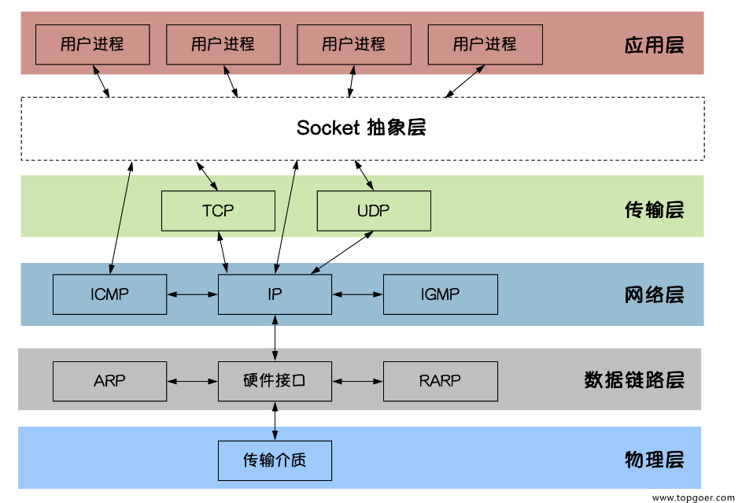
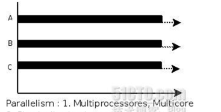

# Go笔记基础篇目

## 1.包,变量与函数

### 包

**每个 Go 程序都由包构成**。

程序从 `main` 包开始运行。

```go
package main

import (
	"fmt"
	"math/rand"  // 导入随机数包
)

func main() {
	fmt.Println("我最喜欢的数字是 ", rand.Intn(10))
}
// 输出随机数 Intn那么范围就是0到9  如果是rand.Float64那么记过就是浮点数 从0到1
```

### 导入

```
import "fmt"
import "math"
```

示例代码：

```go
package main

import (
	"fmt"
	"math"
)

func main() {
	fmt.Printf("现在你有了 %g 个问题。\n", math.Sqrt(7))
}
// %g自动选择最合适的输出方式：如果是浮点数而且小数点后面是0或者没有那么就显示整数
```

### 导出名

在 Go 中，如果一个名字以大写字母开头，那么它就是已导出的。例如，`Pizza` 就是个已导出名，`Pi` 也同样，它导出自 `math` 包。

`pizza` 和 `pi` 并未以大写字母开头，所以它们是未导出的。

在导入一个包时，你只能引用其中已导出的名字。 任何「未导出」的名字在该包外均无法访问。

示例代码：

```go
package main

import (
	"fmt"
	"math"
)

func main() {
	fmt.Println(math.pi)
}
// 这段代码是错误代码：将pi改为大写的P就行了 Pi
// 因为Pi是math中存在的变量
```

### 函数

函数可接受零个或多个参数。

在本例中，`add` 接受两个 `int` 类型的参数。

示例代码：

```go
package main

import "fmt"

func add(x int, y int) int {
	return x + y
}

func main() {
	fmt.Println(add(42, 13))
}
// 后面的int表示返回值也是int类型
```

### 函数（续）

> 将 多个同类型的函数参数简化书写

```go
package main

import "fmt"

// 简化那就见这里
func add(x, y int) int {
	return x + y
}

func main() {
	fmt.Println(add(42, 13))
}
// 结果自热是55
```

### 多返回值

函数可以返回任意数量的返回值。

`swap` 函数返回了两个字符串。

> 可以用多个参数去接收多返回值：如果是不需要使用的参数 那么就用_ 接收

示例代码：
```go
package main

import "fmt"

// 返回的两个参数都为string  下面的那个示例才是将返回的参数命名化
func swap(x, y string) (string, string) {
	return y, x
}

func main() {
	a, b := swap("hello", "world")
	fmt.Println(a, b)
}
// 注意看是i先交换了hello world 然后 在函数里面再反向输出 那么最后的结果自热是正向的了
```

### **带名字的返回值**

Go 的返回值可被命名，它们会被视作定义在函数顶部的变量。

返回值的命名应当能反应其含义，它可以作为文档使用。

没有参数的 `return` 语句会直接返回已命名的返回值，也就是「裸」返回值。

裸返回语句应当仅用在下面这样的短函数中。在长的函数中它们会影响代码的可读性。

示例代码：

```go
package main

import "fmt"

func split(sum int) (x, y int) {
	x = sum * 4 / 9
	y = sum - x
	return
}
// 那么默认返回x和y

func main() {
	fmt.Println(split(17))
}

```

### 变量

`var` 语句用于声明一系列变量。和函数的参数列表一样，类型在最后。

如例中所示，`var` 语句可以出现在包或函数的层级。

示例代码：

```go
package main

import "fmt"

// 简单变量的声明 其类型都是bool  bool变量自动初始化为false
var c, python, java bool

func main() {
	var i int  // int变量自动初始化为0
	fmt.Println(i, c, python, java)
}

```

### 变量的初始化

```go
package main

import "fmt"

var i, j int = 1, 2
// 需要辨析下初始化变量的位置 像c++ int a = 0  :: 注意语法之间的不同

func main() {
	var c, python, java = true, false, "no!"
	fmt.Println(i, j, c, python, java)
}

```

### 短变量声明

在函数中，短赋值语句 `:=` 可在隐式确定类型的 `var` 声明中使用。

函数外的每个语句都 **必须** 以关键字开始（`var`、`func` 等），因此 `:=` 结构不能在函数外使用。

示例代码：
```go
package main

import "fmt"

func main() {
	var i, j int = 1, 2
    k := 3 // 声明短变量  隐式确定类型的 var 声明中使用  := 不能在函数外中使用：：注意全局变量不可使用
	c, python, java := true, false, "no!"

	fmt.Println(i, j, k, c, python, java)
}

```

### 基本类型

```go
bool

string

int  int8  int16  int32  int64
uint uint8 uint16 uint32 uint64 uintptr

byte // uint8 的别名

rune // int32 的别名
     // 表示一个 Unicode 码位

float32 float64

complex64 complex128
```

### 0值

没有明确初始化的变量声明会被赋予对应类型的 **零值**。

零值是：

- 数值类型为 `0`，
- 布尔类型为 `false`，
- 字符串为 `""`（空字符串）。

示例代码：
```go
package main

import "fmt"

func main() {
	var i int
	var f float64
	var b bool
	var s string
	fmt.Printf("%v %v %v %q\n", i, f, b, s)
}

```

运行结果是：

````go
0 0 false ""
````

### 类型转换

一些数值类型的转换：

```
var i int = 42  // 初始化
var f float64 = float64(i)  // 转为float64
var u uint = uint(f) // 转为uint
```

或者，更加简短的形式：（推荐使用）

```
i := 42
f := float64(i)
u := uint(f)
```

示例代码：
```go
package main

import (
	"fmt"
	"math"
)

func main() {
	var x, y int = 3, 4
	var f float64 = math.Sqrt(float64(x*x + y*y))
	var z uint = uint(f)
    
    // 注意这里都是显示转换：：如果不进行显示转换编译器会报错
    
	fmt.Println(x, y, z)
	fmt.Println(f,z)
}

```

> 注意：
> var z = uint(f)  // 这样也是正确的  ；； 这个也是显示转换：笔记是将 f转为 uint然后赋值给 z
>
> var z uint = f  // 这里是错误的 ：： go不允许隐式转换的出现

### 类型推断

在声明一个变量而不指定其类型时（即使用不带类型的 `:=` 语法 `var =` 表达式语法），变量的类型会通过右值推断出来。

当声明的右值确定了类型时，新变量的类型与其相同：

```
var i int
j := i // j 也是一个 int
// 符合类型推断：：这句其实就是 类型的传递
```

不过当右边包含未指明类型的数值常量时，新变量的类型就可能是 `int`、`float64` 或 `complex128` 了，这取决于常量的精度：

```
i := 42           // int
f := 3.142        // float64
g := 0.867 + 0.5i // complex128
// 由右边的精度直接推断数据类型
// complex128是go语言中的一种数据类型：表示复数
```

试着修改示例代码中 `v` 的初始值，并观察它是如何影响类型的。

示例代码：
```go
package main

import "fmt"

func main() {
	v := 42 // 修改这里看看！
	fmt.Printf("v is of type %T\n", v)
}

```

补充go语言小数的精度：

- float32  -> 6，7位
- float64  -> 15，17位

### 常量

常量的声明与变量类似，只不过使用 `const` 关键字。

常量可以是字符、字符串、布尔值或数值。

常量不能用 `:=` 语法声明。

示例代码：
```go
package main

import "fmt"

const Pi = 3.14

func main() {
	const World = "世界"
	fmt.Println("Hello", World)
	fmt.Println("Happy", Pi, "Day")

	const Truth = true
	fmt.Println("Go rules?", Truth)
}

```

### 数值常量

数值常量是高精度的 **值**。

一个未指定类型的常量由上下文来决定其类型。

再试着一下输出 `needInt(Big)` 吧。

（`int` 类型可以存储最大 64 位的整数，根据平台不同有时会更小。）

示例代码：
```go
package main

import "fmt"

const (
	// 将 1 左移 100 位来创建一个非常大的数字
	// 即这个数的二进制是 1 后面跟着 100 个 0
	Big = 1 << 100
	// 再往右移 99 位，即 Small = 1 << 1，或者说 Small = 2
	Small = Big >> 99
)

func needInt(x int) int { return x*10 + 1 }
func needFloat(x float64) float64 {
	return x * 0.1
}

func main() {
	fmt.Println(needInt(Small))
	fmt.Println(needFloat(Small))
	fmt.Println(needFloat(Big))
    // 将Big转为float64
}

```

运行结果：
```go
21
0.2
1.2676506002282295e+29
// 科学计数法“后面跟着 29个 0
```

## 2.流程控制语句

### for 循环

Go 只有一种循环结构：`for` 循环。

基本的 `for` 循环由三部分组成，它们用分号隔开：

- 初始化语句：在第一次迭代前执行
- 条件表达式：在每次迭代前求值
- 后置语句：在每次迭代的结尾执行

初始化语句通常为一句短变量声明，该变量声明仅在 `for` 语句的作用域中可见。

一旦条件表达式求值为 `false`，循环迭代就会终止。

**注意**：和 C、Java、JavaScript 之类的语言不同，Go 的 `for` 语句后面的三个构成部分外没有小括号， 大括号 `{ }` 则是必须的。

示例代码：

```go
package main

import "fmt"

func main() {
	sum := 0
	for i := 0; i < 10; i++ { // 注意没有小括号 但是 必有大括号  但是依旧是 起点 终点 处理 基本三个件
		sum += i
	}
	fmt.Println(sum)
}
// 注意 不需要指明i的类型 也就是 类型推断功能
```

for循环的变式

```go
package main

import "fmt"

func main() {
    sum := 1  // 将 变量初始化 之后移动出去：c++ 等 也支持这样 ; sum < 1000; 但是 : 记得写
	for ; sum < 1000; {
		sum += sum
	}
	fmt.Println(sum)
}
// 当然这两个for循环基本一致：从结果上来看
```

### for 是 Go 中的「while」

c的while在go中叫做for

```go
package main

import "fmt"

func main() {
	sum := 1
	for sum < 1000 {
		sum += sum
	}
	fmt.Println(sum)
}
// 感觉就是上面之前那个示例代码中将 : 去除的样子
// 也就是go语言for灵活了很多：当作while使用
```

### 无限循环

```go
package main

func main() {
	for {
	}
}

```

### if判断

示例代码：

```go
package main

import (
	"fmt"
	"math"
)

func sqrt(x float64) string {
	if x < 0 {
		return sqrt(-x) + "i"
	}
	return fmt.Sprint(math.Sqrt(x))
}

func main() {
	fmt.Println(sqrt(2), sqrt(-4))
}
// 与其他类编程语言也没有太多区别
```

### if 和简短语句

和其他类编程代码依旧没啥区别的那种

示例代码：

```go
package main

import (
	"fmt"
	"math"
)

func pow(x, n, lim float64) float64 {
	if v := math.Pow(x, n); v < lim {
		return v
	}
    // if的后面就是 一个 执行语句 然后判断 然后执行if内的语句
	return lim
}

func main() {
	fmt.Println(
		pow(3, 2, 10),
		pow(3, 3, 20),
	)
}
```

### if和else

和其他语言也没啥区别

示例代码：
```go
package main

import (
	"fmt"
	"math"
)

func pow(x, n, lim float64) float64 {
	if v := math.Pow(x, n); v < lim {
		return v
	} else {
		fmt.Printf("%g >= %g\n", v, lim)
	}
	// can't use v here, though
	return lim
}

func main() {
	fmt.Println(
		pow(3, 2, 10),
		pow(3, 3, 20),
	)
}
// if语句可以进行初值化：当然for也是可以进行初值使用的：两者这里差不多
```

看for循环的同类例子：
```go
package main

import (
    "fmt"
    "math"
)

func main() {
    x := 2.0
    n := 3.0
    lim := 10.0

    for v := math.Pow(x, n); v < lim; n++ {
        fmt.Println(v)
        v = math.Pow(x, n)
    }
    // v值初始化然后输出
}
```

### 练习

> for循环的简单使用和练习

```go
package main

import (
    "fmt"
    "math"
)

func Sqrt(x float64) float64 {
    z := 1.0
    for i := 0; i < 10; i++ {
        z -= (z*z - x) / (2 * z)
        fmt.Println(z)
    }
    return z
}

func main() {
    for i := 1; i <= 10; i++ {
        sqrt := Sqrt(float64(i))
        realSqrt := math.Sqrt(float64(i))
        fmt.Printf("Sqrt(%v): %v, math.Sqrt(%v): %v, difference: %v\n", i, sqrt, i, realSqrt, math.Abs(sqrt-realSqrt))
    }
}
```

### switch分支语句

```go
package main

import (
	"fmt"
	"runtime"
)

func main() {
	fmt.Print("Go 运行的系统环境：")
	switch os := runtime.GOOS; os {
	case "darwin":
		fmt.Println("macOS.")
	case "linux":
		fmt.Println("Linux.")
	default:
		// freebsd, openbsd,
		// plan9, windows...
		fmt.Printf("%s.\n", os)
	}
}
// os := runtime.GOOS; 先执行了一个简单的赋值语句 然后后面才是根据os的值进行判断 调用case中的判断
// switch同样可以初值使用 与if是基本一致的
```

### switch中的求值顺序

顺序：：自上而下

示例代码：
```go
package main

import (
	"fmt"
	"time"
)

func main() {
	fmt.Println("周六是哪天？")
	today := time.Now().Weekday()
	switch time.M {
	case today + 0:
		fmt.Println("今天。")
	case today + 1:
		fmt.Println("明天。")
	case today + 2:
		fmt.Println("后天。")
	default:
		fmt.Println("很多天后。")
	}
}
//  根据差值进行case计算 从插值是0天 开始 到插值是 3天以及以上
```

### 无条件 switch

无条件的 `switch` 同 `switch true` 一样。

这种形式能将一长串 `if-then-else` 写得更加清晰。

示例代码：
```go
package main

import (
	"fmt"
	"time"
)

func main() {
	t := time.Now()
	switch {
	case t.Hour() < 12:  // 每个case后面接的就是 相当于一个if语句
		fmt.Println("早上好！")
	case t.Hour() < 17:
		fmt.Println("下午好！")
	default:
		fmt.Println("晚上好！")
	}
}
// 就是switch后面不判断值 直接使用case进行判断：一般不这么使用
```

> 作用：将一长串 的 if else if  等简化   虽然实际效果大差不差的

### defer 推迟

defer 语句会将函数推迟到外层函数返回之后执行。

推迟调用的函数其参数会立即求值，但直到外层函数返回前该函数都不会被调用。

> 将defer后面的语句压入栈

示例代码：
```go
package main

import "fmt"

func main() {
	defer fmt.Println("world")

	fmt.Println("hello")
}
/*
输出结果是
hello
world
也就是main块执行务必的时候将栈中的world那条语句给放出来了
*/
```

### defer 栈

推迟调用的函数调用会被压入一个栈中。 当外层函数返回时，被推迟的调用会按照后进先出的顺序调用。

示例代码：

```go
package main

import "fmt"

func main() {
	fmt.Println("counting")

	for i := 0; i < 10; i++ {
		defer fmt.Println(i)
	}

	fmt.Println("done")
}
// 结果显然是先输出done 然后逆序输出i序列
```

> 补充 下go语言的函数命名规则
>
> 函数名 ->  参数列表 -> 函数返回值 -> 函数体
>
> 例如：func add(x int, y int) int {}
>
> ​			 func swap(x, y string) (string, string) {}
>
> 有些带有应引用数据类型的那么注意是这样
>
> 指针引用数据类型 -> 函数名 ->  参数列表 -> 函数返回值 -> 函数体
>
> 例如：func (this *Server)add(x int, y int) int {}

## 3.更多数据类型

### 指针

Go 拥有指针。指针保存了值的内存地址。

类型 `*T` 是指向 `T` 类型值的指针，其零值为 `nil`。

```
var p *int
```

`&` 操作符会生成一个指向其操作数的指针。

```
i := 42
p = &i
```

`*` 操作符表示指针指向的底层值。

```
fmt.Println(*p) // 通过指针 p 读取 i
*p = 21         // 通过指针 p 设置 i
```

这也就是通常所说的「解引用」或「间接引用」。

与 C 不同，Go 没有指针运算。

> 指针的定义倒是大差不差 但是 go语言没有 指针的运算

```go
package main

import "fmt"

func main() {
	i, j := 42, 2701

	p := &i         // 指向 i
	fmt.Println(*p) // 通过指针读取 i 的值
	*p = 21         // 通过指针设置 i 的值
    fmt.Println(i)  // 查看 i 的值 :: 可以发现i的值发生了变化

	p = &j         // 指向 j
	*p = *p / 37   // 通过指针对 j 进行除法运算
	fmt.Println(j) // 查看 j 的值  ；； 还是可见j的值发生了变化

```

### 结构体

一个 结构体（`struct`）就是一组 字段（field）。

示例代码：

```go
package main

import "fmt"

type Vertex struct {
	X int
	Y int
}
// 定义结构体 注意前面是有Vertex的

func main() {
	fmt.Println(Vertex{1, 2})
}

```

结构体数组的构建：

```go
package main

import "fmt"

type Vertex struct {
    X int
    Y int
}

func main() {
    vertices := []Vertex{
        {1, 2},
        {3, 4},
        {5, 6},
        // 你可以添加更多的Vertex结构体
    }

    for _, v := range vertices {
        fmt.Println(v)  // 可以实现自动答应数组类型：不用区分x和y 第一个就是x 第二个就是y
    }
    // 注意 range的使用 返回两个参数 第一个是下标 第二个是每一项
}
```

输出结果是： 直接printf结构体就可以输出结果来
```go
{1 2}
{3 4}
{5 6}
```

> 注意printf的结构化输出

结构体字段的访问：

```go
package main

import "fmt"

type Vertex struct {
	X int
	Y int
}

func main() {
	v := Vertex{1, 2}
	v.X = 4
	fmt.Println(v.X)
}
// 也就是通过点号访问
```

结构体指针

示例代码：
```go
package main

import "fmt"

type Vertex struct {
	X int
	Y int
}

func main() {
	v := Vertex{1, 2}  // 创建一个Vertex的数据类型
	p := &v  // 取指针
	p.X = 1e9  // 修改值对象 修改Vertex中的x的值
	fmt.Println(v)
}
// 也就是普通指针的使用而已：不过多赘述
```

**结构体字面量**

特殊的前缀 `&` 返回一个指向结构体的指针。

示例代码：

```go
package main

import "fmt"

type Vertex struct {
	X, Y int
    // 注意这种批量定义变量的形式
}

var (
	v1 = Vertex{1, 2}  // 创建一个 Vertex 类型的结构体
	v2 = Vertex{X: 1}  // X:0 被隐式地赋予零值
	v3 = Vertex{}      // X:0 Y:0
	p  = &Vertex{1, 2} // 创建一个 *Vertex 类型的结构体（指针）
)

func main() {
	fmt.Println(v1, p, v2, v3)
}
// **结构体字面量**：：也就是给其赋予初始值
```

### 数组

```
var a [10]int  // 注意数组的创建方式
```

示例代码：
```go
package main

import "fmt"

func main() {
	var a [2]string  // 字符串数组  // 注意数组的创建语法 也就是普通变量那里添加下[]表示数量即可
	a[0] = "Hello"
	a[1] = "World"
	fmt.Println(a[0], a[1])
	fmt.Println(a)

	primes := [6]int{2, 3, 5, 7, 11, 13}
	fmt.Println(primes)
}

```

### 切片

> 相比于普通数组来说就是动态长度可变的数组了

每个数组的大小都是固定的。而切片则为数组元素提供了动态大小的、灵活的视角。 **在实践中，切片比数组更常用。**

类型 `[]T` 表示一个元素类型为 `T` 的切片。.

切片通过两个下标来界定，一个下界和一个上界，二者以冒号分隔：

```
a[low : high]
```

它会选出一个半闭半开区间，包括第一个元素，但排除最后一个元素。

以下表达式创建了一个切片，它包含 `a` 中下标从 1 到 3 的元素：

```
a[1:4]
```

示例代码：

```go
package main

import "fmt"

func main() {
	primes := [6]int{2, 3, 5, 7, 11, 13}  // 创建数组  // 这里再次强调记忆一下 
    // 普通数据的创建 蔽日 test := int 5 也就是在数据类型前面用方括号表示有多少个元素即可

	var s []int = primes[1:4]  // 创建切片数组 从primes数组的第二个元素到第四个元素：：从已知切片汇总哦那个选取特定的元素信息：按照下标选取
	fmt.Println(s)
}
```

> 关于go语言中切片的解释：
>
> 尤其是这句：var s []int = primes[1:4]
>
> 创建切片数组  从上一个数组中取数据 从 下标1到下标4  尝试了可以从下标0开始取得数据

### 切片类似数组的引用

**切片就像数组的引用 切片并不存储任何数据，它只是描述了底层数组中的一段。**

**更改切片的元素会修改其底层数组中对应的元素。**

和它共享底层数组的切片都会观测到这些修改。

示例代码：
```go
package main

import "fmt"

func main() {
	names := [4]string{
		"John",
		"Paul",
		"George",
		"Ringo",
	}
	fmt.Println(names)  // 创建和打印数组

	a := names[0:2]
	b := names[1:3]  // 取得切片
	fmt.Println(a, b)  // 打印切片

	b[0] = "XXX"   // 修改切片
	fmt.Println(a, b)
	fmt.Println(names)  // 把原数组也修改了
}
// 注意修改切片对原数值的修改操作
```

### 切片字面量

> 关于go语言中的字面量的概念解释：
>
> 在 Go 语言中，字面量（Literal）是源代码中固定值的表示法。字面量可以直接表示整数、浮点数、复数、布尔值、字符串、字符（rune）、数组、结构体、map 以及这些类型的指针类型。

切片字面量类似于没有长度的数组字面量。

这是一个数组字面量：

```
[3]bool{true, true, false}
```

下面这样则会创建一个和上面相同的数组，然后再构建一个引用了它的切片：

```
[]bool{true, true, false}
```

示例代码：
```go
package main

import "fmt"

func main() {
	q := []int{2, 3, 5, 7, 11, 13}
	fmt.Println(q)

	r := []bool{true, false, true, true, false, true}
	fmt.Println(r)

	s := []struct {
		i int
		b bool
	}{
		{2, true},
		{3, false},
		{5, true},
		{7, true},
		{11, false},
		{13, true},
	}
	fmt.Println(s)
}
// 创建struct的同时 表示创建的是数组 然后后面紧跟着的是6个数组项
```

### 切片的默认行为

在进行切片时，你可以利用它的默认行为来忽略上下界。

切片下界的默认值为 0，上界则是该切片的长度。

对于数组

```
var a [10]int  // 创建长度固定的数组
```

来说，以下切片表达式和它是等价的：

```
a[0:10]
a[:10]
a[0:]
a[:]  // 这四种使用切片的默认行为来表示原来的数组 默认就是从0到最后一个
```

示例代码：

```go
package main

import "fmt"

func main() {
	s := []int{2, 3, 5, 7, 11, 13}

	s = s[1:4]
	fmt.Println(s)  // 1到4

	s = s[:2]
	fmt.Println(s)  // 0到2

	s = s[1:]
	fmt.Println(s)  // 1到最后一个
}

```

### 切片的长度与容量

切片拥有 **长度** 和 **容量**。

切片的长度就是它所包含的元素个数。

切片的容量是从它的第一个元素开始数，到其底层数组元素末尾的个数。

切片 `s` 的长度和容量可通过表达式 `len(s)` 和 `cap(s)` 来获取。

你可以通过重新切片来扩展一个切片，给它提供足够的容量。 试着修改示例程序中的切片操作，向外扩展它的长度，看看会发生什么。

> 容量是可以扩充的  每次空间不够了 扩充到原来的2倍

示例代码：
```go
package main

import "fmt"

func main() {
	s := []int{2, 3, 5, 7, 11, 13}  // 创建切片数组
	printSlice(s)  // 打印切片数组

	// 截取切片取其0长度开始  所以 len为0  但是cap为 6
	s = s[:0]  // 切割显示  // 也就是将后面的元素给截取掉了
	printSlice(s)  // len=0 但是cap=6

	// 扩展其长度
	s = s[:4]  // 从0到4
	printSlice(s)

	// 舍弃前两个值
	s = s[2:]
	printSlice(s)  // 注意这里才是舍去其前面的值 之前那里不是舍弃  这里的len=2 但是cap=4
}

func printSlice(s []int) {
	fmt.Printf("len=%d cap=%d %v\n", len(s), cap(s), s)
}
// 这里注意切片的截取是start到end-1  所以切片0到4 实际上就是0 1 2 3 不包括4
```

### nil 切片

切片的零值是 `nil`。

nil 切片的长度和容量为 0 且没有底层数组。

示例代码：
```go
package main

import "fmt"

func main() {
	var s []int  // 空切片 [] 0 0
	fmt.Println(s, len(s), cap(s))
	if s == nil {
		fmt.Println("nil!")  // nil!
	}
}

```

### 用 make 创建切片

切片可以用内置函数 `make` 来创建，这也是你创建动态数组的方式。

`make` 函数会分配一个元素为零值的数组并返回一个引用了它的切片：

```
a := make([]int, 5)  // len(a)=5  // int类型5个空间
```

要指定它的容量，需向 `make` 传入第三个参数：

```
b := make([]int, 0, 5) // len(b)=0, cap(b)=5   // int类型 len为0 cap为6

b = b[:cap(b)] // len(b)=5, cap(b)=5  输出结果是 0 1 2 3 4 不包括4 所以可见长度也是5
b = b[1:]      // len(b)=4, cap(b)=4
```

示例代码：

```go
package main

import "fmt"

func main() {
	a := make([]int, 5)
	printSlice("a", a)

	b := make([]int, 0, 5)
	printSlice("b", b)

	c := b[:2]  // 0到2
	printSlice("c", c)

	d := c[2:5]
	printSlice("d", d)
}

func printSlice(s string, x []int) {
	fmt.Printf("%s len=%d cap=%d %v\n",
		s, len(x), cap(x), x)
}

```

### 切片的切片

切片可以包含任何类型，当然也包括其他切片。

示例代码：

```go
package main

import (
	"fmt"
	"strings"
)

func main() {
	// 创建一个井字棋（经典游戏）
	board := [][]string{
		[]string{"_", "_", "_"},
		[]string{"_", "_", "_"},
		[]string{"_", "_", "_"},
	}
    // 创建切片二维数组：二维数组的切片表示方法：第一个string表示是二维数组
    // 然后下面的strng都是一个string数组 多个数组就是二维数组

	// 两个玩家轮流打上 X 和 O
	board[0][0] = "X"
	board[2][2] = "O"
	board[1][2] = "X"
	board[1][0] = "O"
	board[0][2] = "X"
    // 填充数据：直接使用二维数组的使用方法

	for i := 0; i < len(board); i++ {
		fmt.Printf("%s\n", strings.Join(board[i], " "))
	}
    // 然后遍历输出结果
}
// 自热可见结果 无论时X还是O两者都没获胜
```

输出结果是：
```go
X _ X
O _ X
_ _ O

```

### 向切片追加元素

使用append函数

示例代码：

```go
package main

import "fmt"

func main() {
	var s []int  // 创建切片数组
	printSlice(s)

	// 可在空切片上追加
	s = append(s, 0)
	printSlice(s)  // 追加数据0

	// 这个切片会按需增长
	s = append(s, 1)
	printSlice(s)

	// 可以一次性添加多个元素
	s = append(s, 2, 3, 4)
	printSlice(s)
}

func printSlice(s []int) {
	fmt.Printf("len=%d cap=%d %v\n", len(s), cap(s), s)
}
// 既要使用s去调用append函数 同hi是还要将其添加到append的参数中
```

### range 遍历

示例代码：
```go
package main

import "fmt"

var pow = []int{1, 2, 4, 8, 16, 32, 64, 128}  // 创建切片数组

func main() {
	for i, v := range pow {  // 使用range进行遍历 前为下标 后为值
		fmt.Printf("2**%d = %d\n", i, v)
	}
}

```

可以将下标或值赋予 `_` 来忽略它。（推荐用法）

```
for i, _ := range pow  // 只需要下标
for _, value := range pow  // 只需要值
```

若你只需要索引，忽略第二个变量即可。

```
for i := range pow  // 也可以直接忽略
```

示例代码：
```go
package main

import "fmt"

func main() {
	pow := make([]int, 10)  // 使用切片和make函数 创建10个空间
	for i := range pow {
		pow[i] = 1 << uint(i) // == 2**i
	}
    // 使用遍历赋值的方式
	for _, value := range pow {
		fmt.Printf("%d\n", value)
	}
}

```

### map 映射

`map` 映射将键映射到值。

映射的零值为 `nil` 。`nil` 映射既没有键，也不能添加键。

`make` 函数会返回给定类型的映射，并将其初始化备用。

示例代码：

```go
package main

import "fmt"

type Vertex struct {
	Lat, Long float64
}
// 创建结构体用来别是键值对每一项

var m map[string]Vertex
// map前为键 后为值

func main() {
	m = make(map[string]Vertex)  // 创建map映射 键是string  值是两个 float64	
	m["Bell Labs"] = Vertex{
		40.68433, -74.39967,
	}
    // 创建一个键是 “Bell Labs" 值是 上面两个float64
	fmt.Println(m["Bell Labs"])
}

```

代码解释如下：

- `type Vertex struct { Lat, Long float64 }`：这行代码定义了一个名为 `Vertex` 的结构体，它有两个字段：`Lat` 和 `Long`，它们的类型都是 `float64`。
- `var m map[string]Vertex`：这行代码声明了一个名为 `m` 的变量，它的类型是一个映射，该映射的键是字符串，值是 `Vertex` 结构体。
- `m = make(map[string]Vertex)`：这行代码使用 `make` 函数创建了一个新的映射，并将它赋值给 `m`。在 Go 语言中，映射必须使用 `make` 函数创建后才能使用。
- `m["Bell Labs"] = Vertex{ 40.68433, -74.39967, }`：这行代码创建了一个新的 `Vertex` 结构体，并将它添加到映射 `m` 中，键是 `"Bell Labs"`。
- `fmt.Println(m["Bell Labs"])`：这行代码打印出映射 `m` 中键为 `"Bell Labs"` 的值。

### 映射字面量

映射的字面量和结构体类似，只不过必须有键名。

示例代码：

```go
package main

import "fmt"

type Vertex struct {
	Lat, Long float64
}
// 创建结构体

var m = map[string]Vertex{
	"Bell Labs": Vertex{
		40.68433, -74.39967,
	},
	"Google": Vertex{
		37.42202, -122.08408,
	},
}
// 创建m键值对

func main() {
	fmt.Println(m)
}
// 稍微区分一下
```

若顶层类型只是一个类型名，那么你可以在字面量的元素中省略它。

代码示例：

```go
package main

import "fmt"

type Vertex struct {
	Lat, Long float64
}

var m = map[string]Vertex{
	"Bell Labs": {40.68433, -74.39967},  // 在字面量的元素中省略
	"Google":    {37.42202, -122.08408},
}

func main() {
	fmt.Println(m)
}

```

> 补充：什么是go语言的字面量  --> 简言之 每种数据类型后买你那堆具体数据就是 字面量
>
> 在 Go 语言中，字面量（Literal）是一种表示固定值的表示法。字面量可以是整数、浮点数、布尔值、字符串、数组、切片、结构体、映射等类型的值。
>
> - 整数字面量：`10`、`-3`、`0x7f` 等。
> - 浮点数字面量：`3.14`、`-0.01`、`1.0e7` 等。
> - 布尔值字面量：`true` 和 `false`。
> - 字符串字面量：`"hello"`、`"world"` 等。
> - 数组字面量：`[3]int{1, 2, 3}`、`[...]string{"apple", "banana", "cherry"}` 等。
> - 切片字面量：`[]int{1, 2, 3}`、`[]string{"apple", "banana", "cherry"}` 等。
> - 结构体字面量：`Vertex{1.0, 2.0}`、`Person{"Alice", 30}` 等。
> - 映射字面量：`map[string]int{"apple": 1, "banana": 2}`、`map[int]Vertex{1: {1.0, 2.0}, 2: {3.0, 4.0}}` 等。

### 修改映射

> 直接根据键修映射即可

在映射 `m` 中插入或修改元素：

```
m[key] = elem
```

获取元素：

```
elem = m[key]
```

删除元素：

```
delete(m, key)
```

通过双赋值检测某个键是否存在：

```
elem, ok = m[key]
// 双赋值在go语言中非常常见
```

若 `key` 在 `m` 中，`ok` 为 `true` ；否则，`ok` 为 `false`。

若 `key` 不在映射中，则 `elem` 是该映射元素类型的零值。

**注**：若 `elem` 或 `ok` 还未声明，你可以使用短变量声明：

```
elem, ok := m[key]
```

示例代码：
```go
package main

import "fmt"

func main() {
	m := make(map[string]int)

	m["答案"] = 42
	fmt.Println("值：", m["答案"])

	m["答案"] = 48
	fmt.Println("值：", m["答案"])

	delete(m, "答案")
	fmt.Println("值：", m["答案"])

	v, ok := m["答案"]
	fmt.Println("值：", v, "是否存在？", ok)
    // 根据映射关系直接修改字面量
}

```

### 函数值 -> 高阶函数

函数也是值。它们可以像其他值一样传递。

函数值可以用作函数的参数或返回值。

示例代码：
```go
package main

import (
	"fmt"
	"math"
)

func compute(fn func(float64, float64) float64) float64 {  // 仔细分析结构知道 函数的蚕食是一个函数值
	return fn(3, 4)  // 也就是将3 和 4 向上传递给fn
}
// 看着像是套娃的感觉
// 稍微复杂点的函数 调用 但是实际看好像效果还不错

func main() {
	hypot := func(x, y float64) float64 {
		return math.Sqrt(x*x + y*y)
        // 13的平凡是5的平方和12的平方的和
	}
    // 创建函数值
    
	fmt.Println(hypot(5, 12))

	fmt.Println(compute(hypot))
	fmt.Println(compute(math.Pow))
}

```

运行结果：
```go
13
5
81
```

关于那三行函数的相关调用信息信息i:

```go
fmt.Println(hypot(5, 12))：这行代码首先调用了 hypot 函数，参数是 5 和 12，然后将 hypot 函数的返回值作为参数传递给 fmt.Println 函数，最后打印出 hypot 函数的返回值。

fmt.Println(compute(hypot))：这行代码首先调用了 compute 函数，参数是 hypot 函数，然后将 compute 函数的返回值作为参数传递给 fmt.Println 函数，最后打印出 compute 函数的返回值。在 compute 函数内部，hypot 函数被调用，参数是 3 和 4。
3的平方加4的平凡开放的结果是5

fmt.Println(compute(math.Pow))：这行代码首先调用了 compute 函数，参数是 math.Pow 函数，然后将 compute 函数的返回值作为参数传递给 fmt.Println 函数，最后打印出 compute 函数的返回值。在 compute 函数内部，math.Pow 函数被调用，参数是 3 和 4
81就是3的4次方
```


> 相关解释如下：
>
> 这个函数名为 `compute`，它接受一个函数作为参数，并返回一个 `float64` 类型的值。
>
> 参数 `fn` 是一个函数，这个函数接受两个 `float64` 类型的参数，并返回一个 `float64` 类型的值。在 `compute` 函数内部，`fn` 函数被调用，并传入了两个参数 `3` 和 `4`，然后 `compute` 函数返回了 `fn` 函数的返回值。
>
> 这是一个高阶函数的例子，高阶函数是一种可以接受其他函数作为参数或者将其他函数作为结果返回的函数。在这个例子中，`compute` 函数接受一个函数作为参数，然后调用这个函数，并返回其结果。这种模式在函数式编程中非常常见，可以用来创建各种复杂的行为。

### 函数闭包

> 闭包？？？

Go 函数可以是一个闭包。闭包是一个函数值，它引用了其函数体之外的变量。 该函数可以访问并赋予其引用的变量值，换句话说，该函数被“绑定”到了这些变量。

例如，函数 `adder` 返回一个闭包。每个闭包都被绑定在其各自的 `sum` 变量上。

示例代码：
```go
package main

import "fmt"

func adder() func(int) int {  // 注意函数的构造类型：参数为空，返回值是一个函数2 函数2的参数为int 返回值也是int
	sum := 0
	return func(x int) int {
		sum += x
		return sum
	}
}
// 创建闭包函数 adder  // 那么最后的返回值也是int

func main() {
	pos, neg := adder(), adder()  // 先定义函数
	for i := 0; i < 10; i++ {
		fmt.Println(
            pos(i),  //  展开来看就是 add((i))
			neg(-2*i),  // 往函数里面传递参数  
		)
	}
}
// 简单理解就是 adder函数本来就没有参数信息 然后将i传入进去作为func的参数信息：：既可以是实现整个函数的功能
```

> 有一种闭包的美感：但是感觉实际上使用率应该不高

斐波那契闭包：

```go
package main

import "fmt"

func fibonacci() func() int {
    a, b := 0, 1
    return func() int {
        a, b = b, a+b  // 斐波那契数列的处理方式  // 然后每次将结果传递给下一层  有一总递归函数的美感
        return a
    }
}

func main() {
    f := fibonacci() // 创建函数
    for i := 0; i < 10; i++ {
        fmt.Println(f())  // 闭包调用函数  // 因为重复执行了里面的匿名函数 导致每次都可以继承之前的结果
    }
    // 尝试改为2开始的for循环 但是依旧从1 1 开始显示 然后显示8个数字
}
// 显示结果就是从1 1 开始 然后显示多少个 与 for循环的范无关：  范围内为越大 显示的内容就越多
// 因为每次使用的都是func自带的值 而没有传递任何参数
```

> 闭包概念是在之前的编程语言中没了解过的知识点 可以稍微多看看 了解了解

关于该斐波那契闭包的解释如下：

1. `func fibonacci() func() int {...}`：这是一个名为 `fibonacci` 的函数，它没有参数，返回值是一个函数，这个返回的函数没有参数，返回值是 `int` 类型。在 `fibonacci` 函数内部，定义了两个 `int` 类型的变量 `a` 和 `b`，并分别初始化为 `0` 和 `1`。然后返回了一个匿名函数，这个匿名函数在被调用时，会更新 `a` 和 `b` 的值，然后返回新的 `a` 的值。
2. `f := fibonacci()`：这行代码在 `main` 函数中调用了 `fibonacci` 函数，并将返回的函数赋值给了变量 `f`。
3. `for i := 0; i < 10; i++ {...}`：这是一个循环，它会执行10次。在每次循环中，都会执行其中的代码。
4. `fmt.Println(f())`：这行代码在循环中被执行，它调用了 `f` 函数，并将 `f` 函数的返回值打印出来。

## 4.方法

Go 没有类。不过你可以为类型定义方法。

方法就是一类带特殊的 **接收者** 参数的函数。  就是我上面提到的 func (this *server) ms (int) int {} 这种特殊的构造

方法接收者在它自己的参数列表内，位于 `func` 关键字和方法名之间。

在此例中，`Abs` 方法拥有一个名字为 `v`，类型为 `Vertex` 的接收者。

什么是方法示例代码：
```go
package main

import (
	"fmt"
	"math"
)

type Vertex struct {
	X, Y float64
}
// 创建go结构体

// 带一个Vertex参数
func (v Vertex) Abs() float64 {
	return math.Sqrt(v.X*v.X + v.Y*v.Y)
}


func main() {
	v := Vertex{3, 4}
	fmt.Println(v.Abs())
}

```

### 方法即函数

记住：方法只是个带接收者参数的函数。

现在这个 `Abs` 的写法就是个正常的函数，功能并没有什么变化。

也就是函数调用用到了一个参数Vertex中的值而已：注意上面是浅拷贝

### 方法（续）

你也可以为非结构体类型声明方法。

在此例中，我们看到了一个带 `Abs` 方法的数值类型 `MyFloat`。

你只能为在同一个包中定义的接收者类型声明方法，而不能为其它别的包中定义的类型 （包括 `int` 之类的内置类型）声明方法。

（译注：就是接收者的类型定义和方法声明必须在同一包内。）

示例代码如下：
```go
package main

import (
	"fmt"
	"math"
)

type MyFloat float64  //数据类型自定义 名称

func (f MyFloat) Abs() float64 {
	if f < 0 {
		return float64(-f)
	}
	return float64(f)
}

func main() {
	f := MyFloat(-math.Sqrt2)
	fmt.Println(f.Abs())
}
// 用f.Abs() 实现给Abs带参数
```

### 指针类型的接收者

示例代码：
```go
package main

import (
	"fmt"
	"math"
)

type Vertex struct {
	X, Y float64
}
// 创建结构体

func (v Vertex) Abs() float64 {
	return math.Sqrt(v.X*v.X + v.Y*v.Y)
}
// 创建带参方法  ：也就是对象的使用方法

func (v *Vertex) Scale(f float64) {
	v.X = v.X * f
	v.Y = v.Y * f
}
// 创建带引用值的方法 ：： 使用了引用（指针）那么就可以改变原来的数值了
// 推荐使用这种定义方式：既可以接受普通对象：也可以接收指针对象

func main() {
	v := Vertex{3, 4}  // 定义一个结构体变量 v
	v.Scale(10)  // 对v调用Scale改变v的值
	fmt.Println(v.Abs())
}
// 重点是调用ads和调用Scale之间有什么区别和联系
```

### 指针与函数

示例代码：
```go
package main

import (
	"fmt"
	"math"
)

type Vertex struct {
	X, Y float64
}

func Abs(v Vertex) float64 {
	return math.Sqrt(v.X*v.X + v.Y*v.Y)
}

func Scale(v *Vertex, f float64) {
	v.X = v.X * f
	v.Y = v.Y * f
}
// 有点像像是指针的调用  ：：可以实现改变v的值 ：：感觉这里和上卖弄方法大差不大的

func main() {
	v := Vertex{3, 4}
	Scale(&v, 10)
	fmt.Println(Abs(v))
}

```

### 方法与指针重定向

比较前两个程序，你大概会注意到带指针参数的函数必须接受一个指针：

```
var v Vertex
ScaleFunc(v, 5)  // 编译错误！
ScaleFunc(&v, 5) // OK
```

而接收者为指针的的方法被调用时，接收者既能是值又能是指针：

```
var v Vertex
v.Scale(5)  // OK
p := &v
p.Scale(10) // OK
// 可见调用方法更适配些
```

对于语句 `v.Scale(5)` 来说，即便 `v` 是一个值而非指针，带指针接收者的方法也能被直接调用。 也就是说，由于 `Scale` 方法有一个指针接收者，为方便起见，Go 会将语句 `v.Scale(5)` 解释为 `(&v).Scale(5)`。

示例代码：
```go
package main

import (
	"fmt"
	"math"
)

type Vertex struct {
	X, Y float64
}

func (v Vertex) Abs() float64 {
	return math.Sqrt(v.X*v.X + v.Y*v.Y)
}

func AbsFunc(v Vertex) float64 {
	return math.Sqrt(v.X*v.X + v.Y*v.Y)
}

func main() {
	v := Vertex{3, 4}
	fmt.Println(v.Abs())
	fmt.Println(AbsFunc(v))

	p := &Vertex{4, 3}
	fmt.Println(p.Abs())
	fmt.Println(AbsFunc(*p))
}

```


### 方法与指针重定向（续）

示例代码：
```go
package main

import (
	"fmt"
	"math"
)

type Vertex struct {
	X, Y float64
}
// 创建结构体

func (v Vertex) Abs() float64 {
	return math.Sqrt(v.X*v.X + v.Y*v.Y)
}
// 创建浅拷贝方法

func AbsFunc(v Vertex) float64 {
	return math.Sqrt(v.X*v.X + v.Y*v.Y)
}
// 创建浅拷贝函数
// 两个方法都是浅拷贝

func main() {
	v := Vertex{3, 4}
	fmt.Println(v.Abs())
	fmt.Println(AbsFunc(v))
    // 调用浅拷贝方法和浅拷贝函数

	p := &Vertex{4, 3}  // 指针结构体  //创建对象之后将对象的指针赋给p  然后稍微注意下p的调用
	fmt.Println(p.Abs())  
	fmt.Println(AbsFunc(*p))
    // 这两种调用也是可以的  非指针的函数接收指针的变量，但是指针的函数不接受非指针的变量
}

```

### 选择值或指针作为接收者

使用指针接收者的原因有二：

首先，方法能够修改其接收者指向的值。

其次，这样可以避免在每次调用方法时复制该值。若值的类型为大型结构体时，这样会更加高效。

在本例中，`Scale` 和 `Abs` 接收者的类型为 `*Vertex`，即便 `Abs` 并不需要修改其接收者。

通常来说，所有给定类型的方法都应该有值或指针接收者，但并不应该二者混用。 （我们会在接下来几页中明白为什么。）

示例代码：

```go
package main

import (
	"fmt"
	"math"
)

type Vertex struct {
	X, Y float64
}

func (v *Vertex) Scale(f float64) {
	v.X = v.X * f
	v.Y = v.Y * f
}
// 深拷贝方法

func (v *Vertex) Abs() float64 {
	return math.Sqrt(v.X*v.X + v.Y*v.Y)
}
// 深拷贝方法

func main() {
	v := &Vertex{3, 4}  // 结构体指针  // 创建指针对象
	fmt.Printf("缩放前：%+v，绝对值：%v\n", v, v.Abs())
	v.Scale(5)  // 调用函数
	fmt.Printf("缩放后：%+v，绝对值：%v\n", v, v.Abs())
}

```

> 并不应该混用

### 接口

**接口类型** 的定义为一组方法签名。

接口类型的变量可以持有任何实现了这些方法的值。

**注意:** 示例代码的第 22 行存在一个错误。由于 `Abs` 方法只为 `*Vertex` （指针类型）定义，因此 `Vertex`（值类型）并未实现 `Abser`。

示例代码：
```go
package main

import (
	"fmt"
	"math"
)

type Abser interface {
	Abs() float64
}
// 创建接口 ：但是并未实现  ：：这里接其实和java差不太多：都是需要对象来实现

func main() {
	var a Abser // 创建接口a
	f := MyFloat(-math.Sqrt2)  // 这里就是对2开方而已
	v := Vertex{3, 4}
    // v就是一个Vertex对象

	a = f  // a MyFloat 实现了 Abser
	a = &v // a *Vertex 实现了 Abser
    // 为接口赋值然后就可以直接调用实现的方法了

	// 下面一行，v 是一个 Vertex（而不是 *Vertex）
	// 所以没有实现 Abser。
	a = v

	fmt.Println(a.Abs())
}

type MyFloat float64  // 自定义数据类型的名称
 
func (f MyFloat) Abs() float64 {
	if f < 0 {
		return float64(-f)
	}
	return float64(f)
}
// 用Myfloat对象实现Abs方法

type Vertex struct {
	X, Y float64
}
// 创建Vertex对象

func (v *Vertex) Abs() float64 {
	return math.Sqrt(v.X*v.X + v.Y*v.Y)
}
// 用Vertex对象实现Abs方法

// 总结就是Abser是接口：其内部的Abs需要对象去实现：大概就这样咯
```

关于go语言的接口以及如何使用

```
在 Go 语言中，接口是一种类型，它定义了一组方法，但是这些方法的具体实现是由其他类型（实现类型）来完成的。接口类型的变量可以保存任何实现了这些方法的值。

例如定义一个接口：
type Shape interface {
    Area() float64
}

这个示例和上面的基本一直

然后，我们可以定义 Rectangle 和 Circle 类型，它们都实现了 Shape 接口的 Area 方法：
type Rectangle struct {
    Width, Height float64
}
//定义结构体用于实现接口功能

func (r Rectangle) Area() float64 {
    return r.Width * r.Height
}
// 实现机构体功能

type Circle struct {
    Radius float64
}

func (c Circle) Area() float64 {
    return math.Pi * c.Radius * c.Radius
}
// 实现机构体功能  几乎都是采用方法实现的:非指针：浅引用方法


// 从代码可见就是定义接口再用某种对象去实现其中的内部方法：而且具有多态性：多个对象都可以对应接口里面的方法
```

### 接口与隐式实现

类型通过实现一个接口的所有方法来实现该接口。既然无需专门显式声明，也就没有“implements”关键字。

隐式接口从接口的实现中解耦了定义，这样接口的实现可以出现在任何包中，无需提前准备。

因此，也就无需在每一个实现上增加新的接口名称，这样同时也鼓励了明确的接口定义。

示例代码：
```go
package main

import "fmt"

type I interface {
	M()
}
// 创建接口

type T struct {
	S string
}
// 创建T结构体

// 此方法表示类型 T 实现了接口 I，不过我们并不需要显式声明这一点。
func (t T) M() {
	fmt.Println(t.S)
}
// 没有显示的声明实现了接口？？？呃：一般不是就是这样用的嘛？

func main() {
	var i I = T{"hello"}
	i.M()
}

// 意思式T实现了M，但是没有声明哪里T实现了M
```

> 关于隐式实现的说明：
>
> 在这段代码中，`T` 结构体实现了 `I` 接口的隐式实现。
>
> 首先，我们定义了一个接口 `I`，这个接口有一个方法 `M`，没有参数，也没有返回值。
>
> 然后，我们定义了一个结构体 `T`，这个结构体有一个字段 `S`，类型是 `string`。
>
> 接着，我们为 `T` 定义了一个方法 `M`，这个方法打印 `T` 的 `S` 字段。这个方法的签名和 `I` 接口的 `M` 方法签名一致，所以我们说 `T` 实现了 `I` 接口。但是我们并没有在 `T` 上明确声明它实现了 `I` 接口，这就是所谓的隐式实现。

### 接口值

**接口也是值。它们可以像其它值一样传递。**

**接口值可以用作函数的参数或返回值。**

在内部，接口值可以看做包含值和具体类型的元组：

```
(value, type)
```

接口值保存了一个具体底层类型的具体值。

接口值调用方法时会执行其底层类型的同名方法。

示例代码：
```go
package main

import (
	"fmt"
	"math"
)

type I interface {
	M()
}
// 创建接口

type T struct {
	S string
}
// 用于实现接口的结构体

func (t *T) M() {
	fmt.Println(t.S)
}
// 实现接口：用指针方法实现的：：推荐使用：对象更纯的感觉

type F float64 // 自定义数据类型名称

func (f F) M() {
	fmt.Println(f)
}

func main() {
	var i I  // 创建I接口赋值给i

	i = &T{"Hello"}  // 然后直接调用接口
	describe(i)
	i.M()  // 调用I接口中的函数

	i = F(math.Pi)
	describe(i)
	i.M()
}

func describe(i I) {
	fmt.Printf("(%v, %T)\n", i, i)
}

// 这里有点多态性的感觉  ：： 其实就是接口对象的调用  ：：这里稍微不用于对象调用接口里面的方法
```

> 关于输出那里的%v和%T的区别如下：
>
> 1. `%v`：这是最基本的格式化动词，它可以打印任何类型的值。对于复合类型的值，`%v` 会以 Go 语言的语法格式输出。
> 2. `%T`：这个动词用于打印一个值的类型。

### 底层值为 nil 的接口值

> 即便接口内的具体值为 nil，方法仍然会被 nil 接收者调用。

在一些语言中，这会触发一个空指针异常，但在 Go 中通常会写一些方法来优雅地处理它（如本例中的 `M` 方法）。

**注意:** 保存了 nil 具体值的接口其自身并不为 nil。

示例代码：

```go
package main

import "fmt"

type I interface {
	M()
}
// 创建接口

type T struct {
	S string
}

func (t *T) M() {  // 带指针的方法实现接口
	if t == nil {
		fmt.Println("<nil>")
		return
	}
	fmt.Println(t.S)
}
// 创建接口 结构体 以及实现接口函数M

func main() {
	var i I  // 创建接口

	var t *T  // 创建指针结构体T赋值给t
	i = t  // 将t赋值给接口
	describe(i)
	i.M()  // 调用M

	i = &T{"hello"}  //为接口中的T结构体进行赋值
	describe(i)
	i.M()  // 然后调用M方法
}

func describe(i I) {
	fmt.Printf("(%v, %T)\n", i, i)
}
```

> 可以看看 describe的输出结果：上面代码的输出结果是：  可见describe可以将传递的接口的详细信息显示出来
>
> ```
> (<nil>, *main.T)  // 赋值前
> <nil>  //因为是nil自然输出nil
> (&{hello}, *main.T)  // 赋值后
> hello  // 赋值了hello那么输出hello
> 
> *main.T 就是指向 T 类型的指针
> ```

> 这段代码还是很有意思的~：：尤其是赋值那段：尝试下非指针赋值结果会是什么？ -> 将& 号去掉之后就报错啦
>
> 因为 func (t *T) M() 可见是T实现的接口不是T，所以报错
>
> 易错易混点：详见下面copilot的解释

> 为什么非指针实现的方法指针对象也可以使用？（这句话同样使用于接口：就是非指针对象实现的内容的使用更广泛）
>
>  Go 语言中，指针接收者和值接收者的方法在接口实现和方法调用上有一些不同的规则。
>
> 如果你为类型 `T` 定义了一个方法，那么这个方法就属于类型 `T` 的值和指针。也就是说，无论你有一个 `T` 类型的值还是一个 `T` 类型的指针，你都可以调用这个方法。
>
> 但是，如果你为类型 `*T`（`T` 的指针类型）定义了一个方法，那么这个方法只属于类型 `*T`，并不属于类型 `T`。也就是说，只有 `T` 类型的指针可以调用这个方法，`T` 类型的值不能调用这个方法。
>
> 这就是为什么在你的例子中，指针接收者的方法不能被非指针对象使用的原因。
>
> 同样的规则也适用于接口实现。如果一个接口的方法是由类型 `T` 实现的，那么这个接口可以被类型 `T` 的值和指针实现。但是，如果一个接口的方法是由类型 `*T` 实现的，那么这个接口只能被类型 `*T` 实现，不能被类型 `T` 实现。
>
> 这些规则的存在是为了保持语言的简单性和一致性，同时也避免了一些可能的错误和混淆。

### nil接口值

nil 接口值既不保存值也不保存具体类型。

为 nil 接口调用方法会产生运行时错误，因为接口的元组内并未包含能够指明该调用哪个 **具体** 方法的类型。

示例代码：

```go
package main

import "fmt"

type I interface {
	M()
}
// 创建接口

func main() {
	var i I  // 创建接口赋值给i
	describe(i)  // 接口信息打印调试
	i.M()  // 调用接口的函数实现
}

func describe(i I) {
	fmt.Printf("(%v, %T)\n", i, i)  // 值为空 接口也为空
}
// %v就是对应value打印变量的值 %T就是Type打印变量的类型
```

> `fmt.Printf("(%v, %T)\n", i, i)` 这行代码会打印出两个值，第一个是变量 `i` 的值，第二个是变量 `i` 的类型。
>
> 打印结果是： 运行时错误
>
> ```
> (<nil>, <nil>)
> panic: runtime error: invalid memory address or nil pointer dereference
> [signal SIGSEGV: segmentation violation code=0x1 addr=0x0 pc=0x481b59]
> 
> 解释就是啥也没实现所以运行时出错
> ```

### 空接口

> 空接口用途非常广泛

指定了零个方法的接口值被称为 *空接口：*

```
interface{}
```

空接口可保存任何类型的值。（因为每个类型都至少实现了零个方法。）

空接口被用来处理未知类型的值。例如，`fmt.Print` 可接受类型为 `interface{}` 的任意数量的参数。

示例代码：

```go
package main

import "fmt"

func main() {
	var i interface{}  // 创建空接口
	describe(i)  // 描述空接口

	i = 42
	describe(i)  // 对上面 那个空接口进行赋值

	i = "hello"  // 对空接口赋值
	describe(i)
}

func describe(i interface{}) { 
	fmt.Printf("(%v, %T)\n", i, i)
}

// 可见空接口的灵活性
```

运行结果如下： 空接口后面自动补全数据类型

```
(<nil>, <nil>)
(42, int)
(hello, string)
```

### 类型断言

**类型断言** 提供了访问接口值底层具体值的方式。

```
t := i.(T)
// T指的是Type 某种数据类型
```

该语句断言接口值 `i` 保存了具体类型 `T`，并将其底层类型为 `T` 的值赋予变量 `t`。

若 `i` 并未保存 `T` 类型的值，该语句就会触发一个 panic。

为了 **判断** 一个接口值是否保存了一个特定的类型，类型断言可返回两个值：其底层值以及一个报告断言是否成功的布尔值。

```
t, ok := i.(T)
// ok指的是i是否时T类型 如果时那么就是true 否则就是false
```

若 `i` 保存了一个 `T`，那么 `t` 将会是其底层值，而 `ok` 为 `true`。

否则，`ok` 将为 `false` 而 `t` 将为 `T` 类型的零值，程序并不会产生 panic。

请注意这种语法和读取一个映射时的相同之处。

示例代码：
```go
package main

import "fmt"

func main() {
	var i interface{} = "hello"  // 创建接口  // 其值是 “hello”

	s := i.(string)
	fmt.Println(s)  将i的string赋值给s
 
	s, ok := i.(string)  // 这里可以检查接口的值  hello true
	fmt.Println(s, ok)

	f, ok := i.(float64)  // 上面是匹配正确：这里是匹配失败  0 false
	fmt.Println(f, ok)

	f = i.(float64) // panic
	fmt.Println(f)
}
// 这种方式可以用来判断接口里面到底是什么制
```

> 关于什么是go语言里的断言？：
> 检查接口值是否保存了特定类型的值的方式。类型断言的语法如下：

### 类型选择

示例代码：

```go
package main

import "fmt"

// 传入的i是一个空接口，其中参数值以及类型不明确：由后面的switch语句来判断
func do(i interface{}) {  // 改方法的接受值是接口类型
	switch v := i.(type) {
	case int:
		fmt.Printf("二倍的 %v 是 %v\n", v, v*2)
	case string:
		fmt.Printf("%q 长度为 %v 字节\n", v, len(v))
	default:
		fmt.Printf("我不知道类型 %T!\n", v)
	}
    // 几种基本类型的判断
}
// 直接使用type获取i的数据类型 ：然后就是通过switch的case语句来逐一判断咯

func main() {
	do(21)
	do("hello")
	do(true)
}

```

### Stringer

`fmt`包中定义的 `Stringer`是最普遍的接口之一。

```
type Stringer interface {
    String() string
}
// Stringer接口的实现之一：返回一个string类型的字符串
```

`Stringer` 是一个可以用字符串描述自己的类型。`fmt` 包（还有很多包）都通过此接口来打印值。

示例代码：
```go
package main

import "fmt"

type Person struct {
	Name string
	Age  int
}
// 创建结构体  ： 当然这个结构体看着没啥问题

func (p Person) String() string {
	return fmt.Sprintf("%v (%v years)", p.Name, p.Age)
}
// 创建方法 ：返回一个string 通过Sprintf进行格式化输出为字符串

func main() {
	a := Person{"Arthur Dent", 42}
	z := Person{"Zaphod Beeblebrox", 9001}  // 创建结构体对象
    fmt.Println(a, z)  // 调用方法：：由于Stringer接口  默认i盗用了String()方法：将两个字符串拼接起来了
}
// 别想太多 就是普通的输出结果的链式凭借罢了 也就是 +  +  +  +  效果是一样的
```

运行结果如下：
```go
Arthur Dent (42 years) Zaphod Beeblebrox (9001 years)
```

解释如下：
```go
因为 Person 类型实现了 Stringer 接口，所以 fmt.Println 会调用 a 和 z 的 String 方法，然后打印返回的字符串。
```

有点像是隐式调用方法：虽然不是直接调用：但是间接调用了

示例代码：
```go
package main

import "fmt"

type IPAddr [4]byte

// 为 IPAddr 添加一个 "String() string" 方法。
func (ip IPAddr) String() string {
    return fmt.Sprintf("%v.%v.%v.%v", ip[0], ip[1], ip[2], ip[3])
}

func main() {
    hosts := map[string]IPAddr{
        "loopback":  {127, 0, 0, 1},
        "googleDNS": {8, 8, 8, 8},
    }
    for name, ip := range hosts {
        fmt.Printf("%v: %v\n", name, ip)
    }
    // 稍微回一下range遍历map对象 普通数组注意_
}
```

### 错误类型

Go 程序使用 `error` 值来表示错误状态。

与 `fmt.Stringer` 类似，`error` 类型是一个内建接口：

```
type error interface {
    Error() string
}
// error是接口 Error是接口的方法实现
```

（与 `fmt.Stringer` 类似，`fmt` 包也会根据对 `error` 的实现来打印值。）

通常函数会返回一个 `error` 值，调用它的代码应当判断这个错误是否等于 `nil` 来进行错误处理。

```
i, err := strconv.Atoi("42")
if err != nil {
    fmt.Printf("couldn't convert number: %v\n", err)
    return
}
fmt.Println("Converted integer:", i)
```

`error` 为 nil 时表示成功；非 nil 的 `error` 表示失败。

示例代码：

```go
package main

import (
	"fmt"
	"time"
)

type MyError struct {
	When time.Time
	What string
}
// 创建简单MyError的结构体

func (e *MyError) Error() string {
	return fmt.Sprintf("at %v, %s",
		e.When, e.What)
}
// 用MyError的指针对象实现Error方法


// run函数的定义在这里 ：放回置是一个error类型
func run() error {
	return &MyError{
		time.Now(),
		"it didn't work",
	}  // 返回的是一个MyError结构体的指针
}
// 创建一个普通的函数 ：： 注意返回值：

func main() {
	if err := run(); err != nil {  // 创建if语句的时候赋值：和将赋值语句移出去效果一直
		fmt.Println(err)
	}
    // 先调用run函数 然后检查err是不是错误：如果是错入就答应err的错误信息i
}

```

示例结果：

```go
at 2009-11-10 23:00:00 +0000 UTC m=+0.000000001, it didn't work
```

### Readers

> 关于输入输出流相关的接口

`io` 包指定了 `io.Reader` 接口，它表示数据流的读取端。

Go 标准库包含了该接口的许多实现，包括文件、网络连接、压缩和加密等等。

`io.Reader` 接口有一个 `Read` 方法：

```
func (T) Read(b []byte) (n int, err error)
```

`Read` 用数据填充给定的字节切片并返回填充的字节数和错误值。在遇到数据流的结尾时，它会返回一个 `io.EOF` 错误。

示例代码创建了一个 `strings.Reader` 并以每次 8 字节的速度读取它的输出。

示例代码：

```go
package main

import (
	"fmt"
	"io"  // 引入io包
	"strings"
)

func main() {
	r := strings.NewReader("Hello, Reader!")  // 创建String：创建Reader对象

	b := make([]byte, 8)  // 创建byte切片 共8个容量
	for {
		n, err := r.Read(b) // 将r的内容写入b 由于b开了8个空间 n自然而然就是8咯 读取到了8个字符到b中
		fmt.Printf("n = %v err = %v b = %v\n", n, err, b)  // 每次读取操作的结果：：
		fmt.Printf("b[:n] = %q\n", b[:n])  // 输出实际读取的值
		if err == io.EOF {
			break
		}
	}
    // 这个for循环本就是无限循环：从r中取值：直到EOF 在err不是EOF之前哪都说明还可以继续读取
}
 
```

运行结果是：
```go
n = 8 err = <nil> b = [72 101 108 108 111 44 32 82]
b[:n] = "Hello, R"
n = 6 err = <nil> b = [101 97 100 101 114 33 32 82]
b[:n] = "eader!"
n = 0 err = EOF b = [101 97 100 101 114 33 32 82]
b[:n] = ""

// 可见每次读取的都是后面的字段：续着来的
```

稍微区分下字符的二进制表示以及b的实际含义：以及每次读取的n的意思是什么：：：：：b储存的是字符的二进制表示

> 相关说明：
> strings.Reader是封装好的包，可以实现io.Writ和io.Reader等综合功能

### 图像

> go语言中的图像接口

`image` 包定义了 `Image` 接口：

```
package image

type Image interface {
    ColorModel() color.Model
    Bounds() Rectangle
    At(x, y int) color.Color
}
```

**注意:** `Bounds` 方法的返回值 `Rectangle` 实际上是一个 `image.Rectangle`)，它在 `image` 包中声明。

`color.Color` 和 `color.Model` 类型也是接口，但是通常因为直接使用预定义的实现 `image.RGBA` 和 `image.RGBAModel` 而被忽视了。这些接口和类型由 `image/color` 包定义。

示例代码：

```go
package main

import (
	"fmt"
	"image"
)

func main() {
	m := image.NewRGBA(image.Rect(0, 0, 100, 100))
	fmt.Println(m.Bounds())
	fmt.Println(m.At(0, 0).RGBA())
}
// 调用图像接口推至Rectangle
```

```go
关于为什么没有绘制出一个矩形出来：？
你的代码创建了一个100x100的RGBA图像，并打印了图像的边界和(0,0)位置的颜色。但是，它并没有绘制出图像。

在Go语言中，image包用于处理图像，但它并不包含绘制图像的功能。要在屏幕上显示图像，你需要使用其他的库，例如image/draw包可以用于绘制图像，image/png或image/jpeg包可以用于将图像保存为文件。
```

下面是一个完整的可绘制出一个矩形的代码：

```go
package main

import (
    "image"
    "image/color"
    "image/png"
    "os"
)

func main() {
    // 创建一个100x100的RGBA图像
    img := image.NewRGBA(image.Rect(0, 0, 100, 100))

    // 创建一个红色
    red := color.RGBA{255, 0, 0, 255}

    // 遍历图像的每个像素，将其设置为红色
    for y := 0; y < img.Bounds().Dy(); y++ {
        for x := 0; x < img.Bounds().Dx(); x++ {
            img.Set(x, y, red)
        }
    }

    // 创建一个文件
    file, err := os.Create("rectangle.png")
    if err != nil {
        panic(err)
    }
    defer file.Close()

    // 将图像编码为PNG并写入文件
    png.Encode(file, img)
}
// 绘制图像并且将图像存入文件中
```

> 绘制图像到文件中：终端中不可能直接绘制图像：下面是创建web服务器进行图像绘制

示例代码：
```go
package main

import (
    "image"
    "image/color"
    "image/png"
    "net/http"
)
// 导包

func main() {
    http.HandleFunc("/", func(w http.ResponseWriter, r *http.Request) {  // 处理函数：当用户访问 / 时会被调用： 
        // 创建一个100x100的RGBA图像
        img := image.NewRGBA(image.Rect(0, 0, 100, 100))
        // 像是绘制像素点：再由后面的来填充颜色

        red := color.RGBA{255, 0, 0, 255}
        // 填充红色

        // 遍历图像的每个像素，将其设置为红色
        for y := 0; y < img.Bounds().Dy(); y++ {
            for x := 0; x < img.Bounds().Dx(); x++ {
                img.Set(x, y, red)
            }
        }
        // 遍历将每个像素点绘制为红色

        // 将图像编码为PNG并写入响应
        w.Header().Set("Content-Type", "image/png")  // 编码并且写入响应
        png.Encode(w, img)
    })

    // 启动web服务器
    http.ListenAndServe(":8080", nil)  // 监听端口
}
```

> 顺便学下这里的web服务器编程
>
> 关于这比较重要的两句：
>
> 1. `w http.ResponseWriter`：这是一个接口，它提供了一组方法，用于构造HTTP响应。你可以通过这个接口写入响应头（header）和响应体（body）。
> 2. `r *http.Request`：这是一个指向http.Request结构体的指针，它包含了HTTP请求的所有信息，如请求方法（GET、POST等）、URL、头部信息、请求体等。

## 5.泛型

### 类型参数

可以使用类型参数编写 Go 函数来处理多种类型。 函数的类型参数出现在函数参数之前的方括号之间。

```
func Index[T comparable](s []T, x T) int
// 创建一个函数：Index 参数是T的切片s和一个类型为T的值x。   返回值是int
// 意思就是定义了一个泛型：对于处理不确定的传入的数据类型 T comparable 其中T就是Type的意思
```

此声明意味着 `s` 是满足内置约束 `comparable` 的任何类型 `T` 的切片。 `x` 也是相同类型的值。

`comparable` 是一个有用的约束，它能让我们对任意满足该类型的值使用 `==` 和 `!=` 运算符。在此示例中，我们使用它将值与所有切片元素进行比较，直到找到匹配项。 该 `Index` 函数适用于任何支持比较的类型。

示例代码：

```go
package main

import "fmt"

// Index 返回 x 在 s 中的下标，未找到则返回 -1。
func Index[T comparable](s []T, x T) int {
	for i, v := range s {
		// v 和 x 的类型为 T，它拥有 comparable 可比较的约束，
		// 因此我们可以使用 ==。
		if v == x {
			return i
		}  //有点像是查找函数  ；； 找对对应的下标i 然后返回 否则返回 -1
	}
	return -1
}
// 定义一个泛型的查找函数


func main() {
	// Index 可以在整数切片上使用
	si := []int{10, 20, 15, -10}  // 创建切片数组
	fmt.Println(Index(si, 15))  // 查找的是15号

	// Index 也可以在字符串切片上使用
	ss := []string{"foo", "bar", "baz"}  // 创建string切片数组
	fmt.Println(Index(ss, "hello"))  // 查找的是hello：显然没有
}

```

```go
// 简略解释如下：
这个程序定义了一个泛型函数 Index，并在 main 函数中对其进行了调用。这个函数使用了 Go 1.18 引入的泛型特性。

Index 函数接受两个参数：一个类型为 T 的切片 s 和一个类型为 T 的值 x。这里的 T 是一个类型参数，表示任何可比较的类型。函数返回一个 int 类型的值，表示 x 在 s 中的索引，如果 s 中没有 x，则返回 -1。

在 Index 函数中，使用 range 关键字遍历切片 s，对于每个元素 v，如果 v 等于 x，则返回当前的索引 i。如果遍历完整个切片都没有找到等于 x 的元素，就返回 -1。

在 main 函数中，首先创建了一个整数切片 si 和一个字符串切片 ss，然后调用 Index 函数查找 15 在 si 中的索引和 "hello" 在 ss 中的索引，然后打印这两个索引。因为 15 在 si 中的索引为 2，而 ss 中没有 "hello"，所以输出将是 2 和 -1。
```

关于[T comparable]的解释如下：
```go
[T comparable] 是一个类型参数列表。这是Go 1.18版本引入的泛型特性的一部分。

在这个列表中，T 是一个类型参数，你可以把它看作是一个占位符，它可以代表任何类型。在函数调用时，调用者可以用实际的类型来替换它。

comparable 是一个类型约束，它限制了 T 可以代表的类型。comparable 是Go语言预定义的一个约束，表示任何可以进行 == 和 != 操作的类型。这包括所有的基本类型，如int、float64、string等，以及由这些类型组成的数组和结构体。

所以，[T comparable] 的意思是，T 是一个可以代表任何可比较类型的类型参数。
// 简言之就是泛型比价参数  -->  泛型函数
```

### 泛型类型

除了泛型函数之外，Go 还支持泛型类型。 类型可以使用类型参数进行参数化，这对于实现通用数据结构非常有用。

此示例展示了能够保存任意类型值的单链表的简单类型声明。

作为练习，请为此链表的实现添加一些功能。

示例代码：

```go
package main

import "fmt"

type List[T any] struct {
    next *List[T]
    val  T
}

func New[T any](val T) *List[T] {
    return &List[T]{val: val}
}
// 这里就是new出一个节点罢

func (l *List[T]) Add(val T) {
    for l.next != nil {
        l = l.next
    }
    l.next = New(val)
}
// 添加下一个节点

func (l *List[T]) Print() {
    for l != nil {
        fmt.Println(l.val)
        l = l.next
    }
}

func main() {
    l := New(1)
    l.Add(2)
    l.Add(3)
    l.Print()

    s := New("hello")
    s.Add("world")
    s.Print()
}
```

> 注意：泛型有点像是c++里面的模板创建各种类型的容器
>
> 注意：go语言里面是有链表的板子的  包名   "container/list"   

## 6.并发

### Go 协程  ： 简称 go程

Go 程（goroutine）是由 Go 运行时管理的轻量级线程。

```
go f(x, y, z)   // 通过go来运行go程
```

会启动一个新的 Go 协程并执行

```
f(x, y, z)
```

`f`, `x`, `y` 和 `z` 的求值发生在当前的 Go 协程中，而 `f` 的执行发生在新的 Go 协程中。

Go 程在相同的地址空间中运行，因此在访问共享的内存时必须进行同步。[`sync`](https://go-zh.org/pkg/sync/) 包提供了这种能力，不过在 Go 中并不经常用到，因为还有其它的办法.

示例代码：
```go
package main

import (
	"fmt"
	"time"
)

func say(s string) {
	for i := 0; i < 5; i++ {
		time.Sleep(100 * time.Millisecond)  // 每次休眠1s
		fmt.Println(s)
	}
    // for循环遍历5遍
}
// 创建一个go程

func main() {
	go say("world")  // 运行go程  // 当然这个go程和主线程main是并发执行的
	say("hello")  // 普通函数调用
}
// 运行结果可见是并发执行的  
```

> 补充一下make的使用：切片（`slice`）、映射（`map`）和通道（`chan`）。以下是这三种类型的 `make` 使用示例：
>
> 1. 切片（`slice`）：`make` 可以用于创建一个指定长度和容量的切片。例如：
>
> s := make([]int, 5, 10) // 创建一个长度为 5，容量为 10 的 int 类型切片
>
> 1. 映射（`map`）：`make` 可以用于创建一个指定初始容量的映射。例如：
>
> m := make(map[string]int, 10) // 创建一个初始容量为 10 的 string 到 int 的映射
>
> 1. 通道（`chan`）：`make` 可以用于创建一个指定缓冲区大小的通道。例如：
>
> c := make(chan int, 5) // 创建一个缓冲区大小为 5 的 int 类型通道
>
> 注意，对于切片和通道，如果你不指定容量，`make` 将创建一个长度和容量相同的切片，或者一个无缓冲的通道。对于映射，如果你不指定初始容量，`make` 将创建一个默认初始容量的映射。

### 信道(先入先出)

信道是带有类型的管道，你可以通过它用信道操作符 `<-` 来发送或者接收值。

```
ch <- v    // 将 v 发送至信道 ch。    // 发送
v := <-ch  // 从 ch 接收值并赋予 v。  // 接收
```

（“箭头”就是数据流的方向。）

和映射与切片一样，信道在使用前必须创建：

```
ch := make(chan int)
// 用make创建一个通道
```

默认情况下，发送和接收操作在另一端准备好之前都会阻塞。这使得 Go 程可以在没有显式的锁或竞态变量的情况下进行同步。

以下示例对切片中的数进行求和，将任务分配给两个 Go 程。一旦两个 Go 程完成了它们的计算，它就能算出最终的结果。

> 关于ch := make(chan int)这行代码：
> `make(chan int)` 是创建通道的语法，其中 `chan int` 表示这是一个整数类型的通道。由于没有指定缓冲区大小，所以这是一个无缓冲通道，也就是说，发送和接收操作都是阻塞的，直到另一方准备好为止。
>
> 没有指定缓冲区大小 是一个无缓冲的通道
>
> 下面是创建有缓冲区的通道：
> ch := make(chan int, 10)

示例代码：
```go
package main

import "fmt"

func sum(s []int, c chan int) {  // 接收参数是一个int数组s，一个通道c
	sum := 0
	for _, v := range s {  // 遍历数组s将结果累加到sum上
		sum += v
	}
	c <- sum // 发送 sum 到 c
}

func main() {
	s := []int{7, 2, 8, -9, 4, 0}  // 创建原始数组

	c := make(chan int)  // 创建int通道
	go sum(s[:len(s)/2], c)  // 开启go程  
	go sum(s[len(s)/2:], c)  // 开启go程 
	x, y := <-c, <-c // 从 c 接收 
	// x的结果可能是-5  y的结果可能是17  x+y的结果是12  // 可见信道的读取像是读去堆栈一样 X ：：实际原因是因为go程的执行顺序不定
	fmt.Println(x, y, x+y)
}
// 不能预测x和y的值谁是17谁是-5 但是x+y的值一定是12
```

### 带缓冲的信道

信道可以是 **带缓冲的**。将缓冲长度作为第二个参数提供给 `make` 来初始化一个带缓冲的信道：

```
ch := make(chan int, 100)  // 有初始化长度的信道就是带缓冲区的信道
```

仅当信道的缓冲区填满后，向其发送数据时才会阻塞。当缓冲区为空时，接受方会阻塞。

修改示例填满缓冲区，然后看看会发生什么。

示例代码：

```go
package main

import "fmt"

func main() {
	ch := make(chan int, 2)  // 创建长度为2的信道
	ch <- 1
	ch <- 2  // 向信道中写入两个数
	fmt.Println(<-ch) 
	fmt.Println(<-ch)
}
// 带两个缓冲空间的通道
```

### range 和 close

发送者可通过 `close` 关闭一个信道来表示没有需要发送的值了。接收者可以通过为接收表达式分配第二个参数来测试信道是否被关闭：若没有值可以接收且信道已被关闭，那么在执行完

```
v, ok := <-ch
```

此时 `ok` 会被设置为 `false`。

循环 `for i := range c` 会不断从信道接收值，直到它被关闭。

**注意**： 只应由发送者关闭信道，而不应油接收者关闭。向一个已经关闭的信道发送数据会引发程序 panic。

**还要注意**： 信道与文件不同，通常情况下无需关闭它们。只有在必须告诉接收者不再有需要发送的值时才有必要关闭，例如终止一个 `range` 循环。

示例代码：
```go
package main

import (
	"fmt"
)

func fibonacci(n int, c chan int) {
	x, y := 0, 1
	for i := 0; i < n; i++ {
		c <- x  // 每次将x读入到信道c中
		x, y = y, x+y
	}
	close(c)  // 关闭信道
}
// 创建函数

func main() {
	c := make(chan int, 10)  // 创建10个缓存空间
	go fibonacci(cap(c), c)   
	for i := range c {
		fmt.Println(i)
	}
    // 将信道中的数据全部取出来  实际上取出来的顺序是顺序的：“那么之前说像堆栈一样的说法是错误的
}

```

### select 语句

`elect` 语句使一个 Go 程可以等待多个通信操作。

`select` 会阻塞到某个分支可以继续执行为止，这时就会执行该分支。当多个分支都准备好时会随机选择一个执行。

示例代码：

```go
package main

import "fmt"

func fibonacci(c, quit chan int) {  // 传入两个信道c和quit
	x, y := 0, 1
	for {
		select {
		case c <- x:
			x, y = y, x+y
		case <-quit:
			fmt.Println("quit")
			return
		}
	}
}
// 创建函数

func main() {
	c := make(chan int)
	quit := make(chan int)  // 创建两个无缓冲区的信道
    
	go func() {
		for i := 0; i < 10; i++ {
			fmt.Println(<-c)
            // 输出信道c中的值
		}
		quit <- 0  // 表示终止
	}()  //() 是对这个匿名函数的调用。这意味着，当 Go 运行到这一行代码时，它会立即执行这个匿名函数的函数体。
    // 创建go程
    
	fibonacci(c, quit)  
    // 无限制的计算 ；； 知道select 选择了quit
}
// 这里通道的使用顺序是需要辨析的：有一种 先后顺序  以及c的可取数据和quit的可取数据
```

> 关于go程的理解有很大作用，稍微多加理解下

### 默认选择

当 `select` 中的其它分支都没有准备好时，`default` 分支就会执行。

为了在尝试发送或者接收时不发生阻塞，可使用 `default` 分支：

```
select {
case i := <-c:
    // 使用 i
default:
    // 从 c 中接收会阻塞时执行
}
```

示例代码：
```go
package main

import (
	"fmt"
	"time"
)

func main() {
	tick := time.Tick(100 * time.Millisecond)  // 定时器100ms触发
	boom := time.After(500 * time.Millisecond) // 定时器500ms触发
	for {
		select {
		case <-tick:
			fmt.Println("tick.")
		case <-boom:
			fmt.Println("BOOM!")
			return
		default:
			fmt.Println("    .")
			time.Sleep(50 * time.Millisecond)

		}
	}
}

```

输出结果是：
```go
    .
    .
tick.
    .
    .
tick.
    .
    .
    .
tick.
    .
tick.
    .
    .
tick.
BOOM!
// tick是没100ms执行一次，BOOM是每1s执行一次  Tick和After应该是用来表示是否继续的状态码？
```

### sync.Mutex

我们已经看到信道非常适合在各个 Go 程间进行通信。

但是如果我们并不需要通信呢？比如说，若我们只是想保证每次只有一个 Go 程能够访问一个共享的变量，从而避免冲突？

这里涉及的概念叫做 *互斥（mutual*exclusion）* ，我们通常使用 *互斥锁（Mutex）* 这一数据结构来提供这种机制。

Go 标准库中提供了 `sync.Mutex`互斥锁类型及其两个方法：

- `Lock`
- `Unlock`

我们可以通过在代码前调用 `Lock` 方法，在代码后调用 `Unlock` 方法来保证一段代码的互斥执行。参见 `Inc` 方法。

我们也可以用 `defer` 语句来保证互斥锁一定会被解锁。参见 `Value` 方法。

示例代码：

```go
package main

import (
	"fmt"
	"sync"
	"time"
)

// SafeCounter 是并发安全的
type SafeCounter struct {
	mu sync.Mutex
	v  map[string]int
}

// Inc 对给定键的计数加一
func (c *SafeCounter) Inc(key string) {
	c.mu.Lock()
	// 锁定使得一次只有一个 Go 协程可以访问映射 c.v。
	c.v[key]++
	c.mu.Unlock()
}

// Value 返回给定键的计数的当前值。
func (c *SafeCounter) Value(key string) int {
	c.mu.Lock()
	// 锁定使得一次只有一个 Go 协程可以访问映射 c.v。
	defer c.mu.Unlock()
	return c.v[key]
}

func main() {
	c := SafeCounter{v: make(map[string]int)}
	for i := 0; i < 1000; i++ {
		go c.Inc("somekey")
	}

	time.Sleep(time.Second)
	fmt.Println(c.Value("somekey"))
}

```

举例Go语言互斥锁的例子如下：

第一种情况就是没加锁然后计算错误

```go
package main

import (
    "fmt"
    "sync"
)

var lock sync.Mutex

func main() {
    var wg sync.WaitGroup //协程池
    count := 0
    wg.Add(3)  // 创建三个协程
    go add(&count, &wg)
    go add(&count, &wg)
    go add(&count, &wg)
    wg.Wait()  // 等待协程运行完毕
    fmt.Printf("count最后计算的结果：%d\n", count)
}

//变量加10000次1
func add(count *int, wg *sync.WaitGroup) {
    for i := 0; i < 10000; i++ {
        *count += 1
    }
    wg.Done()
}
// 自定义add函数
// 没有锁自结果会出现错误
```

第二种就是加了锁之后计算结果正确的情况

```go
package main

import (
    "fmt"
    "sync"
)

var lock sync.Mutex

func main() {
    var wg sync.WaitGroup //协程池
    count := 0
    wg.Add(3)  // 创建三个协程
    go add(&count, &wg)
    go add(&count, &wg)
    go add(&count, &wg)  // 三个协程是并发运行的 共享count变量  三次10000 所以最后的计算结果是30000
    wg.Wait()  // 等待协程运行完毕
    fmt.Printf("count最后计算的结果：%d\n", count)
}

//变量加10000次1
func add(count *int, wg *sync.WaitGroup) {
    for i := 0; i < 10000; i++ {
        lock.Lock()
        *count += 1
        lock.Unlock()
    }
    wg.Done()
}
// 自定义add函数
// 加了锁之后结果就是i对呃呃
```

### Web爬虫

在这个练习中，我们将会使用 Go 的并发特性来并行化一个 Web 爬虫。

修改 `Crawl` 函数来并行地抓取 URL，并且保证不重复。

*提示：* 你可以用一个 map 来缓存已经获取的 URL，但是要注意 map 本身并不是并发安全的！

示例代码：

```go
package main

import (
    "fmt"
)

// Fetcher 是一个接口，定义了获取网页内容和链接的方法
type Fetcher interface {
    // Fetch 方法接收一个 URL，返回该 URL 页面的内容，页面上的所有 URL，以及可能的错误
    Fetch(url string) (body string, urls []string, err error)
}

// Crawl 函数接收一个 URL，一个深度限制和一个 Fetcher 实例
// 它开始于给定的 URL，递归地爬取链接，直到达到给定的深度
func Crawl(url string, depth int, fetcher Fetcher) {
    // 如果深度小于等于0，停止爬取
    if depth <= 0 {
        return
    }
    // 使用 fetcher 获取页面内容和链接
    body, urls, err := fetcher.Fetch(url)
    // 如果获取过程中出现错误，打印错误并停止爬取
    if err != nil {
        fmt.Println(err)
        return
    }
    // 打印找到的页面内容
    fmt.Printf("found: %s %q\n", url, body)
    // 对找到的每个链接，递归地进行爬取
    for _, u := range urls {
        Crawl(u, depth-1, fetcher)
    }
    return
}

func main() {
    // 从 "https://golang.org/" 开始，使用 fetcher 进行爬取，深度限制为 4
    Crawl("https://golang.org/", 4, fetcher)
}

// fakeFetcher 是一个模拟的 Fetcher，它使用一个 map 来存储预定义的爬取结果
type fakeFetcher map[string]*fakeResult

// fakeResult 是一个结构体，用于存储一个页面的内容和链接
type fakeResult struct {
    body string
    urls []string
}

// Fetch 方法实现了 Fetcher 接口，它从预定义的结果中查找给定的 URL
func (f fakeFetcher) Fetch(url string) (string, []string, error) {
    // 如果 URL 在预定义的结果中，返回对应的内容和链接
    if res, ok := f[url]; ok {
        return res.body, res.urls, nil
    }
    // 如果 URL 不在预定义的结果中，返回一个错误
    return "", nil, fmt.Errorf("not found: %s", url)
}

// fetcher 是一个已经填充了预定义结果的 fakeFetcher
var fetcher = fakeFetcher{
    "https://golang.org/": &fakeResult{
        "The Go Programming Language",
        []string{
            "https://golang.org/pkg/",
            "https://golang.org/cmd/",
        },
    },
    "https://golang.org/pkg/": &fakeResult{
        "Packages",
        []string{
            "https://golang.org/",
            "https://golang.org/cmd/",
            "https://golang.org/pkg/fmt/",
            "https://golang.org/pkg/os/",
        },
    },
    "https://golang.org/pkg/fmt/": &fakeResult{
        "Package fmt",
        []string{
            "https://golang.org/",
            "https://golang.org/pkg/",
        },
    },
    "https://golang.org/pkg/os/": &fakeResult{
        "Package os",
        []string{
            "https://golang.org/",
            "https://golang.org/pkg/",
        },
    },
}
//这段代码定义了一个名为 fetcher 的变量，它是 fakeFetcher 类型的一个实例。fakeFetcher 是一个映射（map），它将字符串（URL）映射到 *fakeResult 类型的值。

//fakeResult 是一个结构体，包含一个表示页面内容的字符串 body 和一个表示页面上所有链接的字符串切片 urls。
```

# Go笔记高级篇目

## 1.面向对象编程

### 接口

关于下列代码能否通过编译？

```go
type People interface {
    Speak(string) string
}

type Student struct{}

func (stu *Stduent) Speak(think string) (talk string) {  // 这不是指针实现接口嘛？
    if think == "sb" {
        talk = "你是个大帅比"
    } else {
        talk = "您好"
    }
    return
}

func main() {
    var peo People = Student{}  // 创建接口：将Student对象传给它
    think := "bitch"
    fmt.Println(peo.Speak(think))  // 调用接口函数
}
```

> 答案是 不能	接口实现的对象不一致
>
> var peo People = &Student{}
>
> 声明了一个名为`peo`的变量，类型为`People`接口，并将一个`Student`结构体的指针赋值给它。
>
> 对这句的不理解是因为没理解到接口的赋值
>
> var peo People = &Student{}改这里就行了

#### 值接收者和指针接收者实现接口的区别

有接口和示例如下：

```go
type Mover interface {
    move()
}

type dog struct {}
// 已经有了Mover接口和dog对象
```

##### 	值接收者实现接口

```go
func (d dog) move() {
    fmt.Println("狗会动")
}
// 值接收者实现接口（值为dog对象）
```

此时实现接口的是dog类型：

```go
func main() {
    var x Mover  // 创建接口
    var wangcai = dog{} // 创建dog对象 旺财
    x = wangcai         // 将dog对象赋予给x接口（值实现接口）
    var fugui = &dog{}  // 创建*dog对象 富贵
    x = fugui           // 将*dog对象赋予给x接口（指针实现接口）
    x.move()
}
```

> 因为`dog`类型定义了`move`方法。所以，`dog`类型的变量和`*dog`类型的变量都可以赋值给`Mover`类型的变量。

##### 指针接收者实现接口

```go
func (d *dog) move() {
    fmt.Println("狗会动")
}
func main() {
    var x Mover
    var wangcai = dog{} // 旺财是dog类型
    x = wangcai         // x不可以接收dog类型
    var fugui = &dog{}  // 富贵是*dog类型
    x = fugui           // x可以接收*dog类型
}
```

> 此时实现Mover接口的是`*dog`类型，所以不能给x传入dog类型的wangcai，此时x只能存储`*dog`类型的值。

> 有一种大范围小范围的概念在里面： dog对象包括dog对象和 *dog  但是 *dog没有包括dog

#### 接口的使用

已知下列接口：

```go
// Sayer 接口
type Sayer interface {
    say()
}

// Mover 接口
type Mover interface {
    move()
}
```

使用如下：

```go
type dog struct {
    name string
}

// 实现Sayer接口
func (d dog) say() {
    fmt.Printf("%s会叫汪汪汪\n", d.name)
}

// 实现Mover接口
func (d dog) move() {
    fmt.Printf("%s会动\n", d.name)
}

func main() {
    var x Sayer
    var y Mover

    var a = dog{name: "旺财"}
    x = a
    y = a
    x.say()
    y.move()
}
```

> 总结就是 创建接口 -> 用对象给接口赋值 -> 接口调用函数

### 空接口

定义示例：

```go
func main() {
    // 定义一个空接口x
    var x interface{}
    s := "pprof.cn"
    x = s
    fmt.Printf("type:%T value:%v\n", x, x)
    i := 100
    x = i
    fmt.Printf("type:%T value:%v\n", x, x)
    b := true
    x = b
    fmt.Printf("type:%T value:%v\n", x, x)
}
```

输出结果：

>type:string value:pprof.cn
>type:int value:100
>type:bool value:true
>
>// 容易知道 %T指的是类型 %v指的是value

#### 应用

#####  空接口作为函数的参数

​	使用空接口实现可以接收任意类型的函数参数。

```go
// 空接口作为函数参数
func show(a interface{}) {
    fmt.Printf("type:%T value:%v\n", a, a)
}
```

#####  空接口作为map的值

实现任意数据类型的字典

```go
// 空接口作为map值
    var studentInfo = make(map[string]interface{})
    studentInfo["name"] = "李白"
    studentInfo["age"] = 18
    studentInfo["married"] = false
    fmt.Println(studentInfo)
```

#### 对于空接口的类型断言

```go
func main() {
    var x interface{}
    x = "pprof.cn"
    v, ok := x.(string)  // 只有string类型才匹配断言才ok~
    if ok {
        fmt.Println(v)
    } else {
        fmt.Println("类型断言失败")
    }
}
```

## 2.网络编程

> 网络编程第一步就是：理清思路，没那么复杂

### socket图解

> 一般的网络编程又叫做socket编程就是因为和socket打交道



- Socket又称“套接字”，应用程序通常通过“套接字”向网络发出请求或者应答网络请求
- 常用的Socket类型有两种：流式Socket和数据报式Socket，流式是一种面向连接的Socket，针对于面向连接的TCP服务应用，数据报式Socket是一种无连接的Socket，针对于无连接的UDP服务应用

### go-TCP编程

#### TCP服务端

一个TCP服务端可以同时连接很多个客户端，例如世界各地的用户使用自己电脑上的浏览器访问淘宝网。因为Go语言中创建多个goroutine实现并发非常方便和高效，所以我们**可以每建立一次链接就创建一个goroutine去处理。**

TCP服务端程序的处理流程：

```
1.监听端口
2.接收客户端请求建立链接
3.创建goroutine处理链接。
```

> 监听 -> 链接 -> 处理

我们使用Go语言的net包实现的TCP服务端代码如下：

```go
// tcp/server/main.go

// TCP server端

// 处理函数
func process(conn net.Conn) {  // 传入一个conn
    defer conn.Close() // 关闭连接
    for {
        reader := bufio.NewReader(conn)  // 创建reader接收连接
        var buf [128]byte
        n, err := reader.Read(buf[:]) // 读取数据 到buf中
        if err != nil {
            fmt.Println("read from client failed, err:", err)
            break
        }
        // 抛出读取错误
        recvStr := string(buf[:n])  // 转为string
        fmt.Println("收到client端发来的数据：", recvStr)
        conn.Write([]byte(recvStr)) // 发送数据
    }
}
// 处理函数两部曲 接收 -> 处理

func main() {
    listen, err := net.Listen("tcp", "127.0.0.1:20000")  // 监听20000端口
    if err != nil {
        fmt.Println("listen failed, err:", err)
        return
    }
    // 抛出监听错误
    for {
        conn, err := listen.Accept() // 建立连接
        if err != nil {
            fmt.Println("accept failed, err:", err)
            continue
        }
        // 抛出连接错误
        go process(conn) // 启动一个goroutine处理连接
    }
}
// main函数共3部曲 监听 -> 连接 -> 处理 （开一个go程去处理）（一般是有多个客户端）
```

将上面的代码保存之后编译成server或server.exe可执行文件。

#### TCP客户端

一个TCP客户端进行TCP通信的流程如下：

```
1.建立与服务端的链接
2.进行数据收发
3.关闭链接
```

使用Go语言的net包实现的TCP客户端代码如下：

```go
// tcp/client/main.go

// 客户端
func main() {
    conn, err := net.Dial("tcp", "127.0.0.1:20000")  // 调用接口 ： 尝试建立TCP连接 两个返回值：一个conn  一个如果err  ：：有类型有ip和端口
    if err != nil {
        fmt.Println("err :", err)
        return
    }
    // 抛出连接错误
    defer conn.Close() // 关闭连接
    inputReader := bufio.NewReader(os.Stdin)  // 这里的buf不是conn的buf因为需要客户输入内容
    for {
        input, _ := inputReader.ReadString('\n') // 读取用户输入
        inputInfo := strings.Trim(input, "\r\n") // 去除读取换行和回车键 Trim函数就是删去指定内容
        if strings.ToUpper(inputInfo) == "Q" { // 如果输入q/Q就退出（调用了strings这个接口)
            return
        }
        // 简单来说就是输出处理  ：：这里注意下strings这个接口的使用
        _, err = conn.Write([]byte(inputInfo)) // 向conn这个通道中发送数据
        if err != nil {
            return
        }
        // 下面是读入写回的数据
        buf := [512]byte{}
        n, err := conn.Read(buf[:])  // conn是最开始连接的时候创的
        if err != nil {
            fmt.Println("recv failed, err:", err)
            return
        }
        fmt.Println(string(buf[:n]))
    }
}
```

将上面的代码编译成client或client.exe可执行文件，先启动server端再启动client端，在client端输入任意内容回车之后就能够在server端看到client端发送的数据，从而实现TCP通信。

### go-UDP编程

#### UDP服务端

使用Go语言的net包实现的UDP服务端代码如下：

```go
// UDP/server/main.go

// UDP server端
func main() {
    listen, err := net.ListenUDP("udp", &net.UDPAddr{
        IP:   net.IPv4(0, 0, 0, 0),
        Port: 30000,
    })
    if err != nil {
        fmt.Println("listen failed, err:", err)
        return
    }
    // 一致略
    defer listen.Close()  //只不过处理放到了main函数里面
    for {
        var data [1024]byte
        n, addr, err := listen.ReadFromUDP(data[:]) // 接收数据  3个返回值  // 接收客户端发送的数据
        if err != nil {
            fmt.Println("read udp failed, err:", err)
            continue
        }
        fmt.Printf("data:%v addr:%v count:%v\n", string(data[:n]), addr, n)
        _, err = listen.WriteToUDP(data[:n], addr) // 发送数据  // 像客户端发送数据
        if err != nil {
            fmt.Println("write to udp failed, err:", err)
            continue
        }
    }
}
// 三部曲 监听端口 -> 接收数据 -> 发送数据
```

#### UDP客户端

使用Go语言的net包实现的UDP客户端代码如下：

```go
// UDP 客户端
func main() {
    socket, err := net.DialUDP("udp", nil, &net.UDPAddr{
        IP:   net.IPv4(0, 0, 0, 0),
        Port: 30000,
    })
    // 建立连接
    if err != nil {
        fmt.Println("连接服务端失败，err:", err)
        return
    }
    defer socket.Close()
    sendData := []byte("Hello server")
    _, err = socket.Write(sendData) // 发送数据
    if err != nil {
        fmt.Println("发送数据失败，err:", err)
        return
    }
    data := make([]byte, 4096)
    n, remoteAddr, err := socket.ReadFromUDP(data) // 接收数据
    if err != nil {
        fmt.Println("接收数据失败，err:", err)
        return
    }
    fmt.Printf("recv:%v addr:%v count:%v\n", string(data[:n]), remoteAddr, n)
}
// 三部曲 建立连接 -> 发送数据 -> 接收数据
```

### go-TCP粘包

#### 问题展示

出现”粘包”的关键在于接收方不确定将要传输的数据包的大小，因此我们可以对数据包进行封包和拆包的操作。

现象如下：服务端代码如下：

```go
// socket_stick/server/main.go

func process(conn net.Conn) {
    defer conn.Close()
    reader := bufio.NewReader(conn)
    var buf [1024]byte
    for {
        n, err := reader.Read(buf[:])
        if err == io.EOF {
            break
        }
        if err != nil {
            fmt.Println("read from client failed, err:", err)
            break
        }
        recvStr := string(buf[:n])
        fmt.Println("收到client发来的数据：", recvStr)
    }
}

func main() {

    listen, err := net.Listen("tcp", "127.0.0.1:30000")
    if err != nil {
        fmt.Println("listen failed, err:", err)
        return
    }
    defer listen.Close()
    for {
        conn, err := listen.Accept()
        if err != nil {
            fmt.Println("accept failed, err:", err)
            continue
        }
        go process(conn)
    }
    // 监听 -> 连接 -> 处理
}
```

客户端代码如下：

```go
// socket_stick/client/main.go

func main() {
    conn, err := net.Dial("tcp", "127.0.0.1:30000")
    if err != nil {
        fmt.Println("dial failed, err", err)
        return
    }
    defer conn.Close()
    for i := 0; i < 20; i++ {
        msg := `Hello, Hello. How are you?`
        conn.Write([]byte(msg))
    }
    // 连接 -> 发送数据
}
```

将上面的代码保存后，分别编译。先启动服务端再启动客户端，可以看到服务端输出结果如下：

```
收到client发来的数据： Hello, Hello. How are you?Hello, Hello. How are you?Hello, Hello. How are you?Hello, Hello. How are you?Hello, Hello. How are you?
收到client发来的数据： Hello, Hello. How are you?Hello, Hello. How are you?Hello, Hello. How are you?Hello, Hello. How are you?Hello, Hello. How are you?Hello, Hello. How are you?Hello, Hello. How are you?Hello, Hello. How are you?
收到client发来的数据： Hello, Hello. How are you?Hello, Hello. How are you?
收到client发来的数据： Hello, Hello. How are you?Hello, Hello. How are you?Hello, Hello. How are you?
收到client发来的数据： Hello, Hello. How are you?Hello, Hello. How are you?
```

客户端分10次发送的数据，在服务端并没有成功的输出10次，而是多条数据“粘”到了一起。

>主要原因就是tcp数据传递模式是流模式，在保持长连接的时候可以进行多次的收和发。
>
>“粘包”可发生在发送端也可发生在接收端：

#### 解决办法

我们可以自己定义一个协议，比如数据包的前4个字节为包头，里面存储的是发送的数据的长度。

```go
// socket_stick/proto/proto.go
package proto

import (
    "bufio"
    "bytes"
    "encoding/binary"
)

// Encode 将消息编码
func Encode(message string) ([]byte, error) {
    // 读取消息的长度，转换成int32类型（占4个字节）
    var length = int32(len(message))  // 转类型
    var pkg = new(bytes.Buffer)
    // 写入消息头
    err := binary.Write(pkg, binary.LittleEndian, length)
    if err != nil {
        return nil, err
    }
    // 写入消息实体
    err = binary.Write(pkg, binary.LittleEndian, []byte(message))
    if err != nil {
        return nil, err
    }
    return pkg.Bytes(), nil
}

// Decode 解码消息
func Decode(reader *bufio.Reader) (string, error) {
    // 读取消息的长度
    lengthByte, _ := reader.Peek(4) // 读取前4个字节的数据
    lengthBuff := bytes.NewBuffer(lengthByte)
    var length int32
    err := binary.Read(lengthBuff, binary.LittleEndian, &length)
    if err != nil {
        return "", err
    }
    // Buffered返回缓冲中现有的可读取的字节数。
    if int32(reader.Buffered()) < length+4 {
        return "", err
    }

    // 读取真正的消息数据
    pack := make([]byte, int(4+length))
    _, err = reader.Read(pack)
    if err != nil {
        return "", err
    }
    return string(pack[4:]), nil
}
```

接下来在服务端和客户端分别使用上面定义的proto包的Decode和Encode函数处理数据。

服务端代码如下：

```go
// socket_stick/server2/main.go

func process(conn net.Conn) {
    defer conn.Close()
    reader := bufio.NewReader(conn)  // 建立连接对象 reader
    for {
        msg, err := proto.Decode(reader)  // 使用连接对象读取数据到msg中
        if err == io.EOF {
            return
        }
        if err != nil {
            fmt.Println("decode msg failed, err:", err)
            return
        }
        fmt.Println("收到client发来的数据：", msg)
    }
}

func main() {

    listen, err := net.Listen("tcp", "127.0.0.1:30000")
    if err != nil {
        fmt.Println("listen failed, err:", err)
        return
    }
    defer listen.Close()
    for {
        conn, err := listen.Accept()
        if err != nil {
            fmt.Println("accept failed, err:", err)
            continue
        }
        go process(conn)
    }
}
// main函数没什么变化
```

客户端代码如下：

```go
// socket_stick/client2/main.go

func main() {
    conn, err := net.Dial("tcp", "127.0.0.1:30000")
    if err != nil {
        fmt.Println("dial failed, err", err)
        return
    }
    defer conn.Close()
    // 建立TCP连接
    for i := 0; i < 20; i++ {
        msg := `Hello, Hello. How are you?`
        data, err := proto.Encode(msg)  // 将要发送的数据msg编码 到data中
        if err != nil {
            fmt.Println("encode msg failed, err:", err)
            return
        }
        conn.Write(data)  // 写入数据到conn中
    }
    // 循环20次发送数据
}
```

### go-HTTP编程（重点）

> 之前的项目开发使用的就是go语言的HTTP编程实现后端功能  ：： 当然对于前端来说就是API接口

#### web工作流程

- Web服务器的工作原理可以简单地归纳为
  - 客户机通过TCP/IP协议建立到服务器的TCP连接
  - 客户端向服务器发送HTTP协议请求包，请求服务器里的资源文档
  - 服务器向客户机发送HTTP协议应答包，如果请求的资源包含有动态语言的内容，那么服务器会调用动态语言的解释引擎负责处理“动态内容”，并将处理得到的数据返回给客户端
  - 客户机与服务器断开。由客户端解释HTML文档，在客户端屏幕上渲染图形结果

#### HTTP协议

- 超文本传输协议(HTTP，HyperText Transfer Protocol)是互联网上应用最为广泛的一种网络协议，它详细规定了浏览器和万维网服务器之间互相通信的规则，通过因特网传送万维网文档的数据传送协议
- HTTP协议通常承载于TCP协议之上

> 注意：http协议就是超文本传输协议-别想太多了

#### HTTP服务端

```go
package main

import (
    "fmt"
    "net/http"
)

func main() {
    //http://127.0.0.1:8000/go
    // 单独写回调函数
    http.HandleFunc("/go", myHandler)    // 将接收的路径和myHandler绑定起来：只有当接收路径中为go时才去处理
    //http.HandleFunc("/ungo",myHandler2 )
    // addr：监听的地址
    // handler：回调函数
    http.ListenAndServe("127.0.0.1:8000", nil)  // 监听本地ip和端口
}
// main 二部曲 创建回调函数 -> 监听端口  ：：总结就是 处理回调 和 监听端口


// handler函数
func myHandler(w http.ResponseWriter, r *http.Request) {  // 接收头和请求体
    fmt.Println(r.RemoteAddr, "连接成功")
    // 请求方式：GET POST DELETE PUT UPDATE
    fmt.Println("method:", r.Method)  // 查看接收头的状态码时什么
    // /go
    fmt.Println("url:", r.URL.Path)
    fmt.Println("header:", r.Header)
    fmt.Println("body:", r.Body) 
    // 回复
    w.Write([]byte("www.5lmh.com"))  // 回复一个带有网站连接的byte切片数据
}
// 比较重要的几种基本使用方式 GET POST DELETE PUT UPDATE
```

#### HTTP客户端

```go
package main

import (
    "fmt"
    "io"
    "net/http"
)

func main() {
    //resp, _ := http.Get("http://www.baidu.com")
    //fmt.Println(resp)
    resp, _ := http.Get("http://127.0.0.1:8000/go")  // 发送请求 向本地的8000端口 路径为go 发送的时GET请求体
    defer resp.Body.Close()
    // 200 OK
    fmt.Println(resp.Status)
    fmt.Println(resp.Header)  // 答应连接状态和接收的头

    buf := make([]byte, 1024)  // 创建byte切片
    for {
        // 接收服务端信息
        n, err := resp.Body.Read(buf)  // 将接收的数 写入buf中
        if err != nil && err != io.EOF {
            fmt.Println(err)
            return  // 错误处理
        } else {
            fmt.Println("读取完毕")
            res := string(buf[:n])
            fmt.Println(res)
            break
        }
        // 读取完毕 输出结果
    }
}
```

> 相对来说：gttp编程还是非常重要的 -> 对于处理哪几种基本请求很请求来说

### WebSocket编程（重点）

#### webSocket是什么

- WebSocket是一种在单个TCP连接上进行全双工通信的协议
- WebSocket使得客户端和服务器之间的数据交换变得更加简单，允许服务端主动向客户端推送数据
- 在WebSocket API中，浏览器和服务器只需要完成一次握手，两者之间就直接可以创建持久性的连接，并进行双向数据传输
- 需要安装第三方包：
  - cmd中：go get -u -v github.com/gorilla/websocket

#### 举个聊天室的小例子

在同一级目录下新建四个go文件`connection.go|data.go|hub.go|server.go`

**运行**

```
go run server.go hub.go data.go connection.go
// 将这一个main包里面的四个go语言代码同时运行
```

运行之后执行local.html文件

##### server.go文件代码

```go
package main

import (
    "fmt"
    "net/http"

    "github.com/gorilla/mux"
)

func main() {
    router := mux.NewRouter()  // 创建路由
    go h.run()  // 执行go程
    router.HandleFunc("/ws", myws)  // 当路由为/ws的时候调用myws函数处理路由
    if err := http.ListenAndServe("127.0.0.1:8080", router); err != nil {
        fmt.Println("err:", err)
    }
    // 监听端口 路由
}

```

##### hub.go文件代码

```go
package main

import "encoding/json"

var h = hub{
    c: make(map[*connection]bool),
    u: make(chan *connection),
    b: make(chan []byte),
    r: make(chan *connection),
}
// 创建chan通道

type hub struct {
    c map[*connection]bool  // map
    b chan []byte
    r chan *connection
    u chan *connection
}
// 创建hub结构体 上面是定义了一个hub变量h

func (h *hub) run() {
    for {
        select {
        case c := <-h.r:
            h.c[c] = true
            c.data.Ip = c.ws.RemoteAddr().String()
            c.data.Type = "handshake"
            c.data.UserList = user_list
            data_b, _ := json.Marshal(c.data)
            c.sc <- data_b
        case c := <-h.u:
            if _, ok := h.c[c]; ok {
                delete(h.c, c)
                close(c.sc)
            }
        case data := <-h.b:
            for c := range h.c {
                select {
                case c.sc <- data:
                default:
                    delete(h.c, c)
                    close(c.sc)
                }
            }
        }
        // 将多个if-else语句改为switch-select简洁多了
        // 对接收的多种connection的判断和处理
    }
}
// 创建run方法
```

##### data.go文件代码

```go
package main

type Data struct {
    Ip       string   `json:"ip"`
    User     string   `json:"user"`
    From     string   `json:"from"`
    Type     string   `json:"type"`
    Content  string   `json:"content"`
    UserList []string `json:"user_list"`
}
// 主要是处理数据类型  创建结构体 用于json数据之间的转换
```

##### connection.go文件代码

```go
package main

import (
    "encoding/json"
    "fmt"
    "net/http"

    "github.com/gorilla/websocket"
)

type connection struct {
    ws   *websocket.Conn
    sc   chan []byte
    data *Data
}

var wu = &websocket.Upgrader{ReadBufferSize: 512,
    WriteBufferSize: 512, CheckOrigin: func(r *http.Request) bool { return true }}

func myws(w http.ResponseWriter, r *http.Request) {
    ws, err := wu.Upgrade(w, r, nil)
    if err != nil {
        return
    }
    c := &connection{sc: make(chan []byte, 256), ws: ws, data: &Data{}}
    h.r <- c
    go c.writer()
    c.reader()
    defer func() {
        c.data.Type = "logout"
        user_list = del(user_list, c.data.User)
        c.data.UserList = user_list
        c.data.Content = c.data.User
        data_b, _ := json.Marshal(c.data)
        h.b <- data_b
        h.r <- c
    }()
}

func (c *connection) writer() {
    for message := range c.sc {
        c.ws.WriteMessage(websocket.TextMessage, message)
    }
    c.ws.Close()
}

var user_list = []string{}

func (c *connection) reader() {
    for {
        _, message, err := c.ws.ReadMessage()
        if err != nil {
            h.r <- c
            break
        }
        json.Unmarshal(message, &c.data)
        switch c.data.Type {
        case "login":
            c.data.User = c.data.Content
            c.data.From = c.data.User
            user_list = append(user_list, c.data.User)
            c.data.UserList = user_list
            data_b, _ := json.Marshal(c.data)
            h.b <- data_b
        case "user":
            c.data.Type = "user"
            data_b, _ := json.Marshal(c.data)
            h.b <- data_b
        case "logout":
            c.data.Type = "logout"
            user_list = del(user_list, c.data.User)
            data_b, _ := json.Marshal(c.data)
            h.b <- data_b
            h.r <- c
        default:
            fmt.Print("========default================")
        }
    }
}

func del(slice []string, user string) []string {
    count := len(slice)
    if count == 0 {
        return slice
    }
    if count == 1 && slice[0] == user {
        return []string{}
    }
    var n_slice = []string{}
    for i := range slice {
        if slice[i] == user && i == count {
            return slice[:count]
        } else if slice[i] == user {
            n_slice = append(slice[:i], slice[i+1:]...)
            break
        }
    }
    fmt.Println(n_slice)
    return n_slice
}
```

##### local.html文件代码  (基于websocket和html和javascript的聊天室代码)

```html
<!DOCTYPE html>
<html>
<head>
    <title></title>
    <meta http-equiv="content-type" content="text/html;charset=utf-8">
    <style>
        p {
            text-align: left;
            padding-left: 20px;
        }
    </style>
</head>
<body>
<div style="width: 800px;height: 600px;margin: 30px auto;text-align: center">
    <h1>www.5lmh.comy演示聊天室</h1>
    <div style="width: 800px;border: 1px solid gray;height: 300px;">
        <div style="width: 200px;height: 300px;float: left;text-align: left;">
            <p><span>当前在线:</span><span id="user_num">0</span></p>
            <div id="user_list" style="overflow: auto;">
            </div>
        </div>
        <div id="msg_list" style="width: 598px;border:  1px solid gray; height: 300px;overflow: scroll;float: left;">
        </div>
    </div>
    <br>
    <textarea id="msg_box" rows="6" cols="50" onkeydown="confirm(event)"></textarea><br>
    <input type="button" value="发送" onclick="send()">
</div>
</body>
</html>
<script type="text/javascript">
    var uname = prompt('请输入用户名', 'user' + uuid(8, 16));
    var ws = new WebSocket("ws://127.0.0.1:8080/ws");
    ws.onopen = function () {
        var data = "系统消息：建立连接成功";
        listMsg(data);
    };
    ws.onmessage = function (e) {
        var msg = JSON.parse(e.data);
        var sender, user_name, name_list, change_type;
        switch (msg.type) {
            case 'system':
                sender = '系统消息: ';
                break;
            case 'user':
                sender = msg.from + ': ';
                break;
            case 'handshake':
                var user_info = {'type': 'login', 'content': uname};
                sendMsg(user_info);
                return;
            case 'login':
            case 'logout':
                user_name = msg.content;
                name_list = msg.user_list;
                change_type = msg.type;
                dealUser(user_name, change_type, name_list);
                return;
        }
        var data = sender + msg.content;
        listMsg(data);
    };
    ws.onerror = function () {
        var data = "系统消息 : 出错了,请退出重试.";
        listMsg(data);
    };
    function confirm(event) {
        var key_num = event.keyCode;
        if (13 == key_num) {
            send();
        } else {
            return false;
        }
    }
    function send() {
        var msg_box = document.getElementById("msg_box");
        var content = msg_box.value;
        var reg = new RegExp("\r\n", "g");
        content = content.replace(reg, "");
        var msg = {'content': content.trim(), 'type': 'user'};
        sendMsg(msg);
        msg_box.value = '';
    }
    function listMsg(data) {
        var msg_list = document.getElementById("msg_list");
        var msg = document.createElement("p");
        msg.innerHTML = data;
        msg_list.appendChild(msg);
        msg_list.scrollTop = msg_list.scrollHeight;
    }
    function dealUser(user_name, type, name_list) {
        var user_list = document.getElementById("user_list");
        var user_num = document.getElementById("user_num");
        while(user_list.hasChildNodes()) {
            user_list.removeChild(user_list.firstChild);
        }
        for (var index in name_list) {
            var user = document.createElement("p");
            user.innerHTML = name_list[index];
            user_list.appendChild(user);
        }
        user_num.innerHTML = name_list.length;
        user_list.scrollTop = user_list.scrollHeight;
        var change = type == 'login' ? '上线' : '下线';
        var data = '系统消息: ' + user_name + ' 已' + change;
        listMsg(data);
    }
    function sendMsg(msg) {
        var data = JSON.stringify(msg);
        ws.send(data);
    }
    function uuid(len, radix) {
        var chars = '0123456789ABCDEFGHIJKLMNOPQRSTUVWXYZabcdefghijklmnopqrstuvwxyz'.split('');
        var uuid = [], i;
        radix = radix || chars.length;
        if (len) {
            for (i = 0; i < len; i++) uuid[i] = chars[0 | Math.random() * radix];
        } else {
            var r;
            uuid[8] = uuid[13] = uuid[18] = uuid[23] = '-';
            uuid[14] = '4';
            for (i = 0; i < 36; i++) {
                if (!uuid[i]) {
                    r = 0 | Math.random() * 16;
                    uuid[i] = chars[(i == 19) ? (r & 0x3) | 0x8 : r];
                }
            }
        }
        return uuid.join('');
    }
</script>
```

> 好像稍微HTTP编程简单点

> 关于websocket编程：
> WebSocket是一种网络通信协议，提供了浏览器（客户端）与服务器之间的**全双工通信能力**。这意味着客户端和服务器可以在建立连接后随时相互发送数据，非常适合需要实时数据更新的应用，比如在线游戏、聊天应用等。Go语言对WebSocket编程提供了支持，可以通过多种库来实现，其中最流行的是`gorilla/websocket`。

先看看演示效果吧：


> 感觉就很nb  使用vscode live share打开：不然不排除出现跨域问题


现在go需要在go mod下导入模块 

所以需要先 go mod init test1

然后下载对应的包文件

go get github.com/gorilla/websocket

...

如果是需要运行起来就： （一起跑一遍就行了）

```
go run server.go hub.go data.go connection.go
```

挺复杂的但是又很有意思

文件结果如下（同意目录即可）

		

## 3.并发编程

### 并发介绍

#### 进程和线程

```
    A. 进程是程序在操作系统中的一次执行过程，系统进行资源分配和调度的一个独立单位。
    B. 线程是进程的一个执行实体,是CPU调度和分派的基本单位,它是比进程更小的能独立运行的基本单位。
    C.一个进程可以创建和撤销多个线程;同一个进程中的多个线程之间可以并发执行。
```

#### 并发和并行

```
    A. 多线程程序在一个核的cpu上运行，就是并发。
    B. 多线程程序在多个核的cpu上运行，就是并行。
```

#### 并发


#### 并行



#### 协程和线程

```
协程：独立的栈空间，共享堆空间，调度由用户自己控制，本质上有点类似于用户级线程，这些用户级线程的调度也是自己实现的。
线程：一个线程上可以跑多个协程，协程是轻量级的线程。
```

#### goroutine 只是由官方实现的超级"线程池"。

每个实力`4~5KB`的栈内存占用和由于实现机制而大幅减少的创建和销毁开销是go高并发的根本原因。

#### 并发不是并行：

并发主要由切换时间片来实现"同时"运行，并行则是直接利用多核实现多线程的运行，go可以设置使用核数，以发挥多核计算机的能力。

#### goroutine 奉行通过通信来共享内存，而不是共享内存来通信。

### go程

Go语言中的goroutine就是这样一种机制，goroutine的概念类似于线程，但 goroutine是由Go的运行时（runtime）调度和管理的。Go程序会智能地将 goroutine 中的任务合理地分配给每个CPU。Go语言之所以被称为现代化的编程语言，就是因为它在语言层面已经内置了调度和上下文切换的机制。

在Go语言编程中你不需要去自己写进程、线程、协程，你的技能包里只有一个技能–goroutine，当你需要让某个任务并发执行的时候，你只需要把这个任务包装成一个函数，开启一个goroutine去执行这个函数就可以了，就是这么简单粗暴。

#### 使用go程

go + go程

串行执行：

```go
func hello() {
    fmt.Println("Hello Goroutine!")
}
func main() {
    hello()
    fmt.Println("main goroutine done!")
}
```

并行执行：

```go
func main() {
    go hello() // 启动另外一个goroutine去执行hello函数
    fmt.Println("main goroutine done!")
}
```


main等待go程：

```go
func main() {
    go hello() // 启动另外一个goroutine去执行hello函数
    fmt.Println("main goroutine done!")
    time.Sleep(time.Second)
}
```

####  启动多个goroutine  

> 这里是启动了多个go程
>
> var wg sync.WaitGroup 并发安全与锁

```go
var wg sync.WaitGroup
//Add、Done和Wait。

func hello(i int) {
    defer wg.Done() // goroutine结束就登记-1
    fmt.Println("Hello Goroutine!", i)
}
func main() {

    for i := 0; i < 10; i++ {
        wg.Add(1) // 启动一个goroutine就登记+1
        go hello(i)
    }
    wg.Wait() // 等待所有登记的goroutine都结束
}
```

多次执行上面的代码，会发现每次打印的数字的顺序都不一致。这是因为10个goroutine是并发执行的，而goroutine的调度是随机的。

```go
package main

import (
    "fmt"
    "time"
)

func main() {
    // 合起来写  ；也就是将go程写入主函数中直接执行
    go func() {
        i := 0
        for {
            i++
            fmt.Printf("new goroutine: i = %d\n", i)
            time.Sleep(time.Second)
        }
    }()
    // 这个go程是无限打印
    
    i := 0
    for {
        i++
        fmt.Printf("main goroutine: i = %d\n", i)
        time.Sleep(time.Second)
        if i == 2 {
            break
        }
    }
}
```

>当主协程结束时，程序会立即退出，不会等待其他goroutine。因此，即使新的goroutine的循环没有退出条件，当主协程结束时，新的goroutine也会被强制结束。

#### 可增长的栈

OS线程（操作系统线程）一般都有固定的栈内存（通常为2MB）,一个goroutine的栈在其生命周期开始时只有很小的栈（典型情况下2KB），goroutine的栈不是固定的，他可以按需增大和缩小，goroutine的栈大小限制可以达到1GB，虽然极少会用到这个大。所以在Go语言中一次创建十万左右的goroutine也是可以的。

#### goroutine调度

GPM是Go语言运行时（runtime）层面的实现，是go语言自己实现的一套调度系统。区别于操作系统调度OS线程。

- 1.G很好理解，就是个goroutine的，里面除了存放本goroutine信息外 还有与所在P的绑定等信息。
- 2.P管理着一组goroutine队列，P里面会存储当前goroutine运行的上下文环境（函数指针，堆栈地址及地址边界），P会对自己管理的goroutine队列做一些调度（比如把占用CPU时间较长的goroutine暂停、运行后续的goroutine等等）当自己的队列消费完了就去全局队列里取，如果全局队列里也消费完了会去其他P的队列里抢任务。
- 3.M（machine）是Go运行时（runtime）对操作系统内核线程的虚拟， M与内核线程一般是一一映射的关系， 一个groutine最终是要放到M上执行的；

P与M一般也是一一对应的。他们关系是： P管理着一组G挂载在M上运行。当一个G长久阻塞在一个M上时，runtime会新建一个M，阻塞G所在的P会把其他的G 挂载在新建的M上。当旧的G阻塞完成或者认为其已经死掉时 回收旧的M。

P的个数是通过runtime.GOMAXPROCS设定（最大256），Go1.5版本之后默认为物理线程数。 在并发量大的时候会增加一些P和M，但不会太多，切换太频繁的话得不偿失。

单从线程调度讲，Go语言相比起其他语言的优势在于OS线程是由OS内核来调度的，goroutine则是由Go运行时（runtime）自己的调度器调度的，这个调度器使用一个称为m:n调度的技术（复用/调度m个goroutine到n个OS线程）。 其一大特点是goroutine的调度是在用户态下完成的， 不涉及内核态与用户态之间的频繁切换，包括内存的分配与释放，都是在用户态维护着一块大的内存池， 不直接调用系统的malloc函数（除非内存池需要改变），成本比调度OS线程低很多。 另一方面充分利用了多核的硬件资源，近似的把若干goroutine均分在物理线程上， 再加上本身goroutine的超轻量，以上种种保证了go调度方面的性能。


### runtime包

####  runtime.Gosched()

让出CPU时间片，重新等待安排任务(大概意思就是本来计划的好好的周末出去烧烤，但是你妈让你去相亲,两种情况第一就是你相亲速度非常快，见面就黄不耽误你继续烧烤，第二种情况就是你相亲速度特别慢，见面就是你侬我侬的，耽误了烧烤，但是还馋就是耽误了烧烤你还得去烧烤)

```go
package main

import (
    "fmt"
    "runtime"
)

func main() {
    go func(s string) {
        for i := 0; i < 2; i++ {
            fmt.Println(s)
        }
    }("world")
    // 主协程
    
    
    for i := 0; i < 2; i++ {
        // 切一下，再次分配任务
        runtime.Gosched()
        fmt.Println("hello")
    }
}
```

> `runtime.Gosched()`函数会让当前goroutine让出CPU，使得其他goroutine有机会运行。这不保证其他goroutine会立即运行，具体取决于Go运行时的调度。
>
> 需要注意的是，当主协程结束时，程序会立即退出，不会等待其他goroutine。因此，如果主协程先于新的goroutine结束，新的goroutine可能不会有机会打印出"world"。

#### runtime.Goexit()

退出当前协程(一边烧烤一边相亲，突然发现相亲对象太丑影响烧烤，果断让她滚蛋，然后也就没有然后了)

```go
package main

import (
    "fmt"
    "runtime"
)

func main() {
    go func() {
        defer fmt.Println("A.defer")
        func() {
            defer fmt.Println("B.defer")
            // 结束协程
            runtime.Goexit()  // 后面两行直接直接结束了（并未运行）
            defer fmt.Println("C.defer")
            fmt.Println("B")
        }()
        fmt.Println("A")
    }()
    
    for {
    }
    // 防止main程结束导致其他go程陆陆续续结束
}
```

>B.defer
>A.defer
>这两行字符串的打印顺序是由 defer 的后进先出（LIFO）规则决定的。

#### runtime.GOMAXPROCS

Go运行时的调度器使用GOMAXPROCS参数来确定需要使用多少个OS线程来同时执行Go代码。默认值是机器上的CPU核心数。例如在一个8核心的机器上，调度器会把Go代码同时调度到8个OS线程上（GOMAXPROCS是m:n调度中的n）。

**Go语言中可以通过runtime.GOMAXPROCS()函数设置当前程序并发时占用的CPU逻辑核心数。**

Go1.5版本之前，默认使用的是单核心执行。Go1.5版本之后，默认使用全部的CPU逻辑核心数。

我们可以通过将任务分配到不同的CPU逻辑核心上实现并行的效果，这里举个例子：

```go
func a() {
    for i := 1; i < 10; i++ {
        fmt.Println("A:", i)
    }
}

func b() {
    for i := 1; i < 10; i++ {
        fmt.Println("B:", i)
    }
}

func main() {
    runtime.GOMAXPROCS(1)
    go a()
    go b()
    time.Sleep(time.Second)
}
```

两个任务只有一个逻辑核心，此时是做完一个任务再做另一个任务。 将逻辑核心数设为2，此时两个任务并行执行，代码如下。

```go
func a() {
    for i := 1; i < 10; i++ {
        fmt.Println("A:", i)
    }
}

func b() {
    for i := 1; i < 10; i++ {
        fmt.Println("B:", i)
    }
}

func main() {
    runtime.GOMAXPROCS(2)
    go a()
    go b()
    time.Sleep(time.Second)
}
```

Go语言中的操作系统线程和goroutine的关系：

- 1.一个操作系统线程对应用户态多个goroutine。
- 2.go程序可以同时使用多个操作系统线程。
- 3.goroutine和OS线程是多对多的关系，即m:n。

### channel

#### channel简介

channel的缓冲大小是可选的。

```
make(chan 元素类型, [缓冲大小])
```

```go
ch4 := make(chan int)
ch5 := make(chan bool)
ch6 := make(chan []int)
```

#### channel操作

通道有发送（send）、接收(receive）和关闭（close）三种操作。

发送和接收都使用<-符号。

#### 无缓冲的channel


无缓冲的通道又称为阻塞的通道。我们来看一下下面的代码：

```go
func main() {
    ch := make(chan int)
    ch <- 10
    fmt.Println("发送成功")
}
```

上面这段代码能够通过编译，但是执行的时候会出现以下错误：

```
fatal error: all goroutines are asleep - deadlock!

goroutine 1 [chan send]:
main.main()
        .../src/github.com/pprof/studygo/day06/channel02/main.go:8 +0x54
```

因为我们使用ch := make(chan int)创建的是无缓冲的通道，无缓冲的通道只有在有人接收值的时候才能发送值。就像你住的小区没有快递柜和代收点，快递员给你打电话必须要把这个物品送到你的手中，简单来说就是无缓冲的通道必须有接收才能发送。

解决方案：

```go
func recv(c chan int) {
    ret := <-c
    fmt.Println("接收成功", ret)
}
// 通过并行的go程来接收chan

func main() {
    ch := make(chan int)
    go recv(ch) // 启用goroutine从通道接收值
    ch <- 10
    fmt.Println("发送成功")
}
```

#### 有缓冲的channel


```go
func main() {
    ch := make(chan int, 1) // 创建一个容量为1的有缓冲区通道
    ch <- 10
    fmt.Println("发送成功")
}
```

只要通道的容量大于零，那么该通道就是有缓冲的通道，通道的容量表示通道中能存放元素的数量。就像你小区的快递柜只有那么个多格子，格子满了就装不下了，就阻塞了，等到别人取走一个快递员就能往里面放一个。

我们可以使用内置的len函数获取通道内元素的数量，使用cap函数获取通道的容量，虽然我们很少会这么做。

在正确的时机关闭：

```go
package main

import "fmt"

func main() {
    c := make(chan int)
    go func() {
        for i := 0; i < 5; i++ {
            c <- i
        }
        close(c)
    }()
    for {
        if data, ok := <-c; ok {
            fmt.Println(data)
        } else {
            break
        }
    }
    fmt.Println("main结束")
}
```

优雅的从channel中取值：

```go
// channel 练习
func main() {
    ch1 := make(chan int)
    ch2 := make(chan int)
    // 开启goroutine将0~100的数发送到ch1中
    go func() {
        for i := 0; i < 100; i++ {
            ch1 <- i
        }
        close(ch1)
    }()
    // 开启goroutine从ch1中接收值，并将该值的平方发送到ch2中
    go func() {
        for {
            i, ok := <-ch1 // 通道关闭后再取值ok=false
            if !ok {
                break
            }
            ch2 <- i * i
        }
        close(ch2)
    }()
    // 在主goroutine中从ch2中接收值打印
    for i := range ch2 { // 通道关闭后会退出for range循环
        fmt.Println(i)
    }
}
```

#### 单向通道

```
1.chan<- int是一个只能发送的通道，可以发送但是不能接收；
2.<-chan int是一个只能接收的通道，可以接收但是不能发送。
```

```go
func counter(out chan<- int) {
    for i := 0; i < 100; i++ {
        out <- i
    }
    close(out)
}

func squarer(out chan<- int, in <-chan int) {
    for i := range in {
        out <- i * i
    }
    close(out)
}
func printer(in <-chan int) {
    for i := range in {
        fmt.Println(i)
    }
}

func main() {
    ch1 := make(chan int)
    ch2 := make(chan int)
    go counter(ch1)
    go squarer(ch2, ch1)
    printer(ch2)
}
```

#### 通道总结


### worker pool（goroutine池）

- 本质上是生产者消费者模型

```go
package main

import (
    "fmt"
    "math/rand"
)

type Job struct {
    // id
    Id int
    // 需要计算的随机数
    RandNum int
}

type Result struct {
    // 这里必须传对象实例
    job *Job
    // 求和
    sum int
}

func main() {
    // 需要2个管道
    // 1.job管道
    jobChan := make(chan *Job, 128)
    // 2.结果管道
    resultChan := make(chan *Result, 128)
    // 3.创建工作池
    createPool(64, jobChan, resultChan)
    // 4.开个打印的协程
    go func(resultChan chan *Result) {
        // 遍历结果管道打印
        for result := range resultChan {
            fmt.Printf("job id:%v randnum:%v result:%d\n", result.job.Id,
                result.job.RandNum, result.sum)
        }
    }(resultChan)
    var id int
    // 循环创建job，输入到管道
    for {
        id++
        // 生成随机数
        r_num := rand.Int()
        job := &Job{
            Id:      id,
            RandNum: r_num,
        }
        jobChan <- job
    }
}

// 创建工作池
// 参数1：开几个协程
func createPool(num int, jobChan chan *Job, resultChan chan *Result) {
    // 根据开协程个数，去跑运行
    for i := 0; i < num; i++ {
        go func(jobChan chan *Job, resultChan chan *Result) {
            // 执行运算
            // 遍历job管道所有数据，进行相加
            for job := range jobChan {
                // 随机数接过来
                r_num := job.RandNum
                // 随机数每一位相加
                // 定义返回值
                var sum int
                for r_num != 0 {
                    tmp := r_num % 10
                    sum += tmp
                    r_num /= 10
                }
                // 想要的结果是Result
                r := &Result{
                    job: job,
                    sum: sum,
                }
                //运算结果扔到管道
                resultChan <- r
            }
        }(jobChan, resultChan)
    }
}
```

#### 定时器

- Timer：时间到了，执行只执行1次

示例代码：

```go
package main

import (
    "fmt"
    "time"
)

func main() {
    // 1.timer基本使用
    //timer1 := time.NewTimer(2 * time.Second)
    //t1 := time.Now()
    //fmt.Printf("t1:%v\n", t1)
    //t2 := <-timer1.C
    //fmt.Printf("t2:%v\n", t2)

    // 2.验证timer只能响应1次
    //timer2 := time.NewTimer(time.Second)
    //for {
    // <-timer2.C
    // fmt.Println("时间到")
    //}

    // 3.timer实现延时的功能
    //(1)
    //time.Sleep(time.Second)
    //(2)
    //timer3 := time.NewTimer(2 * time.Second)
    //<-timer3.C
    //fmt.Println("2秒到")
    //(3)
    //<-time.After(2*time.Second)
    //fmt.Println("2秒到")

    // 4.停止定时器
    //timer4 := time.NewTimer(2 * time.Second)
    //go func() {
    // <-timer4.C
    // fmt.Println("定时器执行了")
    //}()
    //b := timer4.Stop()
    //if b {
    // fmt.Println("timer4已经关闭")
    //}

    // 5.重置定时器
    timer5 := time.NewTimer(3 * time.Second)
    timer5.Reset(1 * time.Second)
    fmt.Println(time.Now())
    fmt.Println(<-timer5.C)

    for {
    }
}
```

- Ticker：时间到了，多次执行

```go
package main

import (
    "fmt"
    "time"
)

func main() {
    // 1.获取ticker对象
    ticker := time.NewTicker(1 * time.Second)
    i := 0
    // 子协程
    go func() {
        for {
            //<-ticker.C
            i++
            fmt.Println(<-ticker.C)
            if i == 5 {
                //停止
                ticker.Stop()
            }
        }
    }()
    for {
    }
}
```

>`<-ticker.C` 是从 `ticker.C` channel 接收一个值。在这个例子中，它会阻塞，直到 `ticker` 发送一个值到 
>
>`ticker.C` channel。


--------------------------------------------------------------------------------------------------------------------------------------------

####  select

##### select多路复用

> 实现通道的选择

```go
for{
    // 尝试从ch1接收值
    data, ok := <-ch1
    // 尝试从ch2接收值
    data, ok := <-ch2
    …
}
```

使用select关键字：

```
select {
case <-chan1:
   // 如果chan1成功读到数据，则进行该case处理语句
case chan2 <- 1:
   // 如果成功向chan2写入数据，则进行该case处理语句
default:
   // 如果上面都没有成功，则进入default处理流程
}
```

- select可以同时监听一个或多个channel，直到其中一个channel ready

```go
func test1(ch chan string) {
   time.Sleep(time.Second * 5)
   ch <- "test1"
}
func test2(ch chan string) {
   time.Sleep(time.Second * 2)
   ch <- "test2"
}

select {
case s1 := <-output1:
  fmt.Println("s1=", s1)
case s2 := <-output2:
  fmt.Println("s2=", s2)
}
```

- 如果多个channel同时ready，则随机选择一个执行

```go
 go func() {
      //time.Sleep(2 * time.Second)
      int_chan <- 1
   }()
   go func() {
      string_chan <- "hello"
   }()
   select {
   case value := <-int_chan:
      fmt.Println("int:", value)
   case value := <-string_chan:
      fmt.Println("string:", value)
   }
```

- ##### 可以用于判断管道是否存满

```go
package main

import (
   "fmt"
   "time"
)

// 判断管道有没有存满
func main() {
   // 创建管道
   output1 := make(chan string, 10)  // 创建拥有10哥缓冲区的管道
   // 调用子协程写数据
   go write(output1)
   // 取数据
   for s := range output1 {
      fmt.Println("res:", s)
      time.Sleep(time.Second)
   }
    // 打印数据 // 每次打印一条信息都停留1s
}

func write(ch chan string) {  // 字go程用来写数据的
   for {
      select {
      // 写数据
      case ch <- "hello":  // 用于判断是否还可以写入数据：如果还可以则写入hello
         fmt.Println("write hello")
      default:
         fmt.Println("channel full")
      }
      time.Sleep(time.Millisecond * 500)
   }
}
```

##### 并发安全和锁

有时候在Go代码中可能会存在多个goroutine同时操作一个资源（临界区），这种情况会发生竞态问题（数据竞态）。类比现实生活中的例子有十字路口被各个方向的的汽车竞争；还有火车上的卫生间被车厢里的人竞争。

典型的channel竞争关系：

```go
var x int64
var wg sync.WaitGroup

func add() {
    for i := 0; i < 5000; i++ {
        x = x + 1
    }
    wg.Done()
}
func main() {
    wg.Add(2)  // 添加两个go程管理
    go add()
    go add()
    wg.Wait()
    fmt.Println(x)
}
```

- `Add(delta int)`：用来增加WaitGroup计数器的值，`delta`可以是正数也可以是负数。通常在启动一个新的goroutine之前调用，并且`delta`通常设置为1。
- `Done()`：用来减少WaitGroup计数器的值，等同于`Add(-1)`。通常在goroutine的任务完成时调用。
- `Wait()`：阻塞调用它的goroutine，直到WaitGroup计数器的值变为0，即等待所有通过`Add`方法增加的计数通过`Done`方法都已经减去。

> 上面的代码分析：
>
> 当两个 goroutine 同时尝试更新 `x` 的值时，它们可能会读取到 `x` 的旧值，然后基于这个旧值进行计算，

###### 互斥锁

正确代码：

```go
package main

import (
    "fmt"
    "sync"
)

var x int64
var wg sync.WaitGroup
var lock sync.Mutex  // 声明一个互斥锁	

func add() {
    for i := 0; i < 5000; i++ {
        lock.Lock()  // 在修改x之前加锁
        x = x + 1
        lock.Unlock()  // 修改完成后解锁
        			   // 这里有点像是数据库的锁机制
    }
    wg.Done()
}

func main() {
    wg.Add(2)  // 添加两个goroutine到WaitGroup
    go add()
    go add()
    wg.Wait()  // 等待所有goroutine完成
    fmt.Println(x)  // 输出x的值
}
```

###### 读写互斥锁

```go
var (
    x      int64
    wg     sync.WaitGroup
    lock   sync.Mutex      // 互斥锁
    rwlock sync.RWMutex    // 读写互斥锁
)
// 创建全局变量

func write() {
    // lock.Lock()   // 加互斥锁
    rwlock.Lock() // 加写锁
    x = x + 1
    time.Sleep(10 * time.Millisecond) // 假设读操作耗时10毫秒
    rwlock.Unlock()                   // 解写锁
    // lock.Unlock()                     // 解互斥锁
    wg.Done()
}

func read() {
    // lock.Lock()                  // 加互斥锁
    rwlock.RLock()               // 加读锁
    time.Sleep(time.Millisecond) // 假设读操作耗时1毫秒
    rwlock.RUnlock()             // 解读锁
    // lock.Unlock()                // 解互斥锁
    wg.Done()
}

func main() {
    start := time.Now()
    for i := 0; i < 10; i++ {
        wg.Add(1)
        go write()
    }
    // 添加10个go程去write

    for i := 0; i < 1000; i++ {
        wg.Add(1)
        go read()
    }
    // 添加1000个go程去read

    wg.Wait()
    end := time.Now()
    fmt.Println(end.Sub(start))
    // 输出运行结果
}
```

> 两种锁的使用主要看应用场景

#### Sync

##### sync.WaitGroup

在代码中生硬的使用time.Sleep肯定是不合适的，Go语言中可以使用sync.WaitGroup来实现并发任务的同步。 sync.WaitGroup有以下几个方法：

| 计数器+delta        | (wg * WaitGroup) Add(delta int) |
| ------------------- | ------------------------------- |
| 计数器-1            | (wg *WaitGroup) Done()          |
| 阻塞直到计数器变为0 | (wg *WaitGroup) Wait()          |

sync.WaitGroup内部维护着一个计数器，计数器的值可以增加和减少。例如当我们启动了N 个并发任务时，就将计数器值增加N。每个任务完成时通过调用Done()方法将计数器减1。通过调用Wait()来等待并发任务执行完，当计数器值为0时，表示所有并发任务已经完成。

```go
var wg sync.WaitGroup

func hello() {
    defer wg.Done()
    fmt.Println("Hello Goroutine!")
}
func main() {
    wg.Add(1)
    go hello() // 启动另外一个goroutine去执行hello函数
    fmt.Println("main goroutine done!")
    wg.Wait()
    // 避免了生硬的使用sleep函数
}
```

#### sync.Once -> 只做一次

sync.Once只有一个Do方法，其签名如下：

```go
func (o *Once) Do(f func()) {}
```

注意：如果要执行的函数f需要传递参数就需要搭配**闭包来使用**。


延迟一个开销很大的初始化操作到真正用到它的时候再执行是一个很好的实践。因为预先初始化一个变量（比如在init函数中完成初始化）会增加程序的启动耗时，而且有可能实际执行过程中这个变量没有用上，那么这个初始化操作就不是必须要做的。我们来看一个例子：

```go
var icons map[string]image.Image

func loadIcons() {
    icons = map[string]image.Image{
        "left":  loadIcon("left.png"),
        "up":    loadIcon("up.png"),
        "right": loadIcon("right.png"),
        "down":  loadIcon("down.png"),
    }
    // 看这个函数以及icons的定义都是没有任何问题的
}

// Icon 被多个goroutine调用时不是并发安全的
func Icon(name string) image.Image {
    if icons == nil {
        loadIcons()
    }
    return icons[name]
}
```

多个goroutine并发调用Icon函数时不是并发安全的，现代的编译器和CPU可能会在保证每个goroutine都满足串行一致的基础上自由地重排访问内存的顺序。loadIcons函数可能会被重排为以下结果：

```go
func loadIcons() {
    icons = make(map[string]image.Image)
    icons["left"] = loadIcon("left.png")
    icons["up"] = loadIcon("up.png")
    icons["right"] = loadIcon("right.png")
    icons["down"] = loadIcon("down.png")
    // 这里顺序替换了
}
```

在这种情况下就会出现即使判断了icons不是nil也不意味着变量初始化完成了。考虑到这种情况，我们能想到的办法就是添加互斥锁，保证初始化icons的时候不会被其他的goroutine操作，但是这样做又会引发性能问题。

优化代码如下：

```go
var icons map[string]image.Image

var loadIconsOnce sync.Once  // 这是新增的

func loadIcons() {
    icons = map[string]image.Image{
        "left":  loadIcon("left.png"),
        "up":    loadIcon("up.png"),
        "right": loadIcon("right.png"),
        "down":  loadIcon("down.png"),
    }
}

// Icon 是并发安全的
func Icon(name string) image.Image {
    loadIconsOnce.Do(loadIcons)  // 这里是和上面有点不一样的
    return icons[name]
}
```

sync.Once其实内部包含一个互斥锁和一个布尔值，互斥锁保证布尔值和数据的安全，而布尔值用来记录初始化是否完成。这样设计就能保证初始化操作的时候是并发安全的并且初始化操作也不会被执行多次。

#### sync.Map

Go语言中内置的map不是并发安全的。请看下面的示例：

```go
var m = make(map[string]int)

func get(key string) int {
    return m[key]
}

func set(key string, value int) {
    m[key] = value
}
// 上面就是简单的get set函数

func main() {
    wg := sync.WaitGroup{}
    for i := 0; i < 20; i++ {
        wg.Add(1)  // 开20个go程来执行
        go func(n int) {
            key := strconv.Itoa(n)  // 该char
            set(key, n)  // 设置键值对 设key(string)的value为n(int)
            fmt.Printf("k=:%v,v:=%v\n", key, get(key))
            wg.Done()
        }(i)
    }
    wg.Wait()
}
```

上面的代码开启少量几个goroutine的时候可能没什么问题，当并发多了之后执行上面的代码就会报fatal error: concurrent map writes错误。

```go
var m = sync.Map{}

func main() {
    wg := sync.WaitGroup{}
    for i := 0; i < 20; i++ {
        wg.Add(1)
        go func(n int) {
            key := strconv.Itoa(n)
            m.Store(key, n)  // 注意这里
            value, _ := m.Load(key)  // 注意这里
            fmt.Printf("k=:%v,v:=%v\n", key, value)
            wg.Done()
        }(i)
    }
    wg.Wait()
}
```

像这种场景下就需要为map加锁来保证并发的安全性了，Go语言的sync包中提供了一个开箱即用的并发安全版map–sync.Map。开箱即用表示不用像内置的map一样使用make函数初始化就能直接使用。同时sync.Map内置了诸如Store、Load、LoadOrStore、Delete、Range等操作方法。

> 应该很容易理解go程开了太多会对某个键值多次操作 就容易出现问题了

#### 原子操作(atomic包)

```go
var x int64
var l sync.Mutex
var wg sync.WaitGroup

// 普通版加函数
func add() {
    // x = x + 1
    x++ // 等价于上面的操作
    wg.Done()
}

// 互斥锁版加函数
func mutexAdd() {
    l.Lock()
    x++
    l.Unlock()
    wg.Done()
}

// 原子操作版加函数
func atomicAdd() {
    atomic.AddInt64(&x, 1)
    wg.Done()
}
// 原子操作 看着像是对内存进行操作

func main() {
    start := time.Now()
    for i := 0; i < 10000; i++ {
        wg.Add(1)
        // go add()       // 普通版add函数 不是并发安全的
        // go mutexAdd()  // 加锁版add函数 是并发安全的，但是加锁性能开销大
        go atomicAdd() // 原子操作版add函数 是并发安全，性能优于加锁版
    }
    wg.Wait()
    end := time.Now()
    fmt.Println(x)
    fmt.Println(end.Sub(start))
}
```

#### GMP原理

> 详细的来源见这里：
>
> https://www.topgoer.com/%E5%B9%B6%E5%8F%91%E7%BC%96%E7%A8%8B/GMP%E5%8E%9F%E7%90%86%E4%B8%8E%E8%B0%83%E5%BA%A6.html
>
> 转自公众号：刘丹冰Aceld
>
> 具体就不再这里赘述了：这是个比较复杂的问题

#### go语言爬虫小案例

- 明确目标（确定在哪个网站搜索）
- 爬（爬下内容）
- 取（筛选想要的）
- 处理数据（按照你的想法去处理）

下面是示例代码：

```go
package main

import (
    "fmt"
    "io/ioutil"
    "net/http"
    "regexp"
)

//这个只是一个简单的版本只是获取QQ邮箱并且没有进行封装操作，另外爬出来的数据也没有进行去重操作
var (
    // \d是数字
    reQQEmail = `(\d+)@qq.com`
    // 过滤数据用
)

// 爬邮箱
func GetEmail() {
    // 1.去网站拿数据::发送get请求
    resp, err := http.Get("https://tieba.baidu.com/p/6051076813?red_tag=1573533731")
    HandleError(err, "http.Get url")  // 处理错误
    defer resp.Body.Close()
    // 2.读取页面内容
    pageBytes, err := ioutil.ReadAll(resp.Body)
    HandleError(err, "ioutil.ReadAll")
    // 字节转字符串
    pageStr := string(pageBytes)
    //fmt.Println(pageStr)
    // 3.过滤数据，过滤qq邮箱  // 调用库函数筛选信息
    re := regexp.MustCompile(reQQEmail) 
    // -1代表取全部
    results := re.FindAllStringSubmatch(pageStr, -1)
    //fmt.Println(results)

    // 遍历结果
    for _, result := range results {
        fmt.Println("email:", result[0])
        fmt.Println("qq:", result[1])
    }
}

// 处理异常
func HandleError(err error, why string) {
    if err != nil {
        fmt.Println(why, err)
    }
}
func main() {
    GetEmail()
}
```

>Error: http.Get url: Get "https://tieba.baidu.com/p/6051076813?red_tag=1573533731": dial tcp: lookup tieba.baidu.com: no such host

#### 正则表达式

- API
  - re := regexp.MustCompile(reStr)，传入正则表达式，得到正则表达式对象
  - ret := re.FindAllStringSubmatch(srcStr,-1)：用正则对象，获取页面页面，srcStr是页面内容，-1代表取全部
- 爬邮箱
- 方法抽取
- 爬超链接
- 爬手机号
  - http://www.zhaohaowang.com/ 如果连接失效了自己找一个有手机号的就好了
- 爬身份证号
  - http://henan.qq.com/a/20171107/069413.htm 如果连接失效了自己找一个就好了
- 爬图片链接

```go
package main

import (
    "fmt"
    "io/ioutil"
    "net/http"
    "regexp"
)

var (
    // w代表大小写字母+数字+下划线
    reEmail = `\w+@\w+\.\w+`
    // s?有或者没有s
    // +代表出1次或多次
    //\s\S各种字符
    // +?代表贪婪模式
    reLinke  = `href="(https?://[\s\S]+?)"`
    rePhone  = `1[3456789]\d\s?\d{4}\s?\d{4}`
    reIdcard = `[123456789]\d{5}((19\d{2})|(20[01]\d))((0[1-9])|(1[012]))((0[1-9])|([12]\d)|(3[01]))\d{3}[\dXx]`
    reImg    = `https?://[^"]+?(\.((jpg)|(png)|(jpeg)|(gif)|(bmp)))`
)


// 处理异常
func HandleError(err error, why string) {
    if err != nil {
        fmt.Println(why, err)
    }
}


func GetEmail2(url string) {
    pageStr := GetPageStr(url)  // 见下面那个函数的构造
    re := regexp.MustCompile(reEmail)
    results := re.FindAllStringSubmatch(pageStr, -1)
    for _, result := range results {
        fmt.Println(result)
    }
    // 这里和上面那里的爬虫示例代码是一致的
}

// 抽取根据url获取内容
func GetPageStr(url string) (pageStr string) {
    resp, err := http.Get(url)
    HandleError(err, "http.Get url")
    defer resp.Body.Close()
    // 2.读取页面内容
    pageBytes, err := ioutil.ReadAll(resp.Body)
    HandleError(err, "ioutil.ReadAll")
    // 字节转字符串
    pageStr = string(pageBytes)
    return pageStr
}

func main() {
    // 2.抽取的爬邮箱
    // GetEmail2("https://tieba.baidu.com/p/6051076813?red_tag=1573533731")
    // 3.爬链接
    //GetLink("http://www.baidu.com/s?wd=%E8%B4%B4%E5%90%A7%20%E7%95%99%E4%B8%8B%E9%82%AE%E7%AE%B1&rsv_spt=1&rsv_iqid=0x98ace53400003985&issp=1&f=8&rsv_bp=1&rsv_idx=2&ie=utf-8&tn=baiduhome_pg&rsv_enter=1&rsv_dl=ib&rsv_sug2=0&inputT=5197&rsv_sug4=6345")
    // 4.爬手机号
    //GetPhone("https://www.zhaohaowang.com/")
    // 5.爬身份证号
    //GetIdCard("https://henan.qq.com/a/20171107/069413.htm")
    // 6.爬图片
    // GetImg("http://image.baidu.com/search/index?tn=baiduimage&ps=1&ct=201326592&lm=-1&cl=2&nc=1&ie=utf-8&word=%E7%BE%8E%E5%A5%B3")
}

func GetIdCard(url string) {
    pageStr := GetPageStr(url)
    re := regexp.MustCompile(reIdcard)
    results := re.FindAllStringSubmatch(pageStr, -1)
    for _, result := range results {
        fmt.Println(result)
    }
}

// 爬链接
func GetLink(url string) {
    pageStr := GetPageStr(url)
    re := regexp.MustCompile(reLinke)
    results := re.FindAllStringSubmatch(pageStr, -1)
    for _, result := range results {
        fmt.Println(result[1])
    }
}

//爬手机号
func GetPhone(url string) {
    pageStr := GetPageStr(url)
    re := regexp.MustCompile(rePhone)
    results := re.FindAllStringSubmatch(pageStr, -1)
    for _, result := range results {
        fmt.Println(result)
    }
}

func GetImg(url string) {
    pageStr := GetPageStr(url)
    re := regexp.MustCompile(reImg)
    results := re.FindAllStringSubmatch(pageStr, -1)
    for _, result := range results {
        fmt.Println(result[0])
    }
}
// 后面这几个和爬取email几乎一致
// 其实他们之间的区别主要就是 正则表达式的不同
```

#### 并发爬取美图

```go
package main

import (
    "fmt"
    "io/ioutil"
    "net/http"
    "regexp"
    "strconv"
    "strings"
    "sync"
    "time"
)

func HandleError(err error, why string) {
    if err != nil {
        fmt.Println(why, err)
    }
}

// 下载图片，传入的是图片叫什么
func DownloadFile(url string, filename string) (ok bool) {
    resp, err := http.Get(url)
    HandleError(err, "http.get.url")
    defer resp.Body.Close()
    bytes, err := ioutil.ReadAll(resp.Body)
    HandleError(err, "resp.body")
    filename = "E:/topgoer.com/src/github.com/student/3.0/img/" + filename
    // 写出数据
    err = ioutil.WriteFile(filename, bytes, 0666)
    if err != nil {
        return false
    } else {
        return true
    }
}

// 并发爬思路：
// 1.初始化数据管道
// 2.爬虫写出：26个协程向管道中添加图片链接
// 3.任务统计协程：检查26个任务是否都完成，完成则关闭数据管道
// 4.下载协程：从管道里读取链接并下载

var (
    // 存放图片链接的数据管道
    chanImageUrls chan string
    waitGroup     sync.WaitGroup
    // 用于监控协程
    chanTask chan string
    reImg    = `https?://[^"]+?(\.((jpg)|(png)|(jpeg)|(gif)|(bmp)))`
)

func main() {
    // myTest()
    // DownloadFile("http://i1.shaodiyejin.com/uploads/tu/201909/10242/e5794daf58_4.jpg", "1.jpg")

    // 1.初始化管道
    chanImageUrls = make(chan string, 1000000)
    chanTask = make(chan string, 26)
    // 2.爬虫协程
    for i := 1; i < 27; i++ {
        waitGroup.Add(1)
        go getImgUrls("https://www.bizhizu.cn/shouji/tag-%E5%8F%AF%E7%88%B1/" + strconv.Itoa(i) + ".html")
    }
    // 3.任务统计协程，统计26个任务是否都完成，完成则关闭管道
    waitGroup.Add(1)
    go CheckOK()
    // 4.下载协程：从管道中读取链接并下载
    for i := 0; i < 5; i++ {
        waitGroup.Add(1)
        go DownloadImg()
    }
    waitGroup.Wait()
}

// 下载图片
func DownloadImg() {
    for url := range chanImageUrls {
        filename := GetFilenameFromUrl(url)
        ok := DownloadFile(url, filename)
        if ok {
            fmt.Printf("%s 下载成功\n", filename)
        } else {
            fmt.Printf("%s 下载失败\n", filename)
        }
    }
    waitGroup.Done()
}

// 截取url名字
func GetFilenameFromUrl(url string) (filename string) {
    // 返回最后一个/的位置
    lastIndex := strings.LastIndex(url, "/")
    // 切出来
    filename = url[lastIndex+1:]
    // 时间戳解决重名
    timePrefix := strconv.Itoa(int(time.Now().UnixNano()))
    filename = timePrefix + "_" + filename
    return
}

// 任务统计协程
func CheckOK() {
    var count int
    for {
        url := <-chanTask
        fmt.Printf("%s 完成了爬取任务\n", url)
        count++
        if count == 26 {
            close(chanImageUrls)
            break
        }
    }
    waitGroup.Done()
}

// 爬图片链接到管道
// url是传的整页链接
func getImgUrls(url string) {
    urls := getImgs(url)
    // 遍历切片里所有链接，存入数据管道
    for _, url := range urls {
        chanImageUrls <- url
    }
    // 标识当前协程完成
    // 每完成一个任务，写一条数据
    // 用于监控协程知道已经完成了几个任务
    chanTask <- url
    waitGroup.Done()
}

// 获取当前页图片链接
func getImgs(url string) (urls []string) {
    pageStr := GetPageStr(url)
    re := regexp.MustCompile(reImg)
    results := re.FindAllStringSubmatch(pageStr, -1)
    fmt.Printf("共找到%d条结果\n", len(results))
    for _, result := range results {
        url := result[0]
        urls = append(urls, url)
    }
    return
}

// 抽取根据url获取内容
func GetPageStr(url string) (pageStr string) {
    resp, err := http.Get(url)
    HandleError(err, "http.Get url")
    defer resp.Body.Close()
    // 2.读取页面内容
    pageBytes, err := ioutil.ReadAll(resp.Body)
    HandleError(err, "ioutil.ReadAll")
    // 字节转字符串
    pageStr = string(pageBytes)
    return pageStr
}
```

## 4.后续补充敬请期待...
