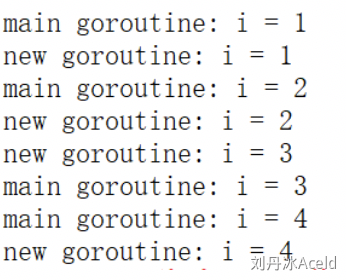
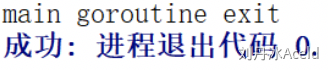
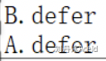
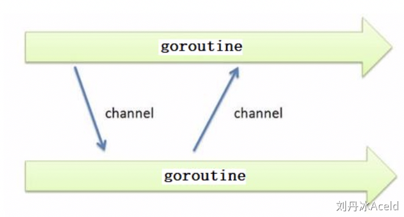
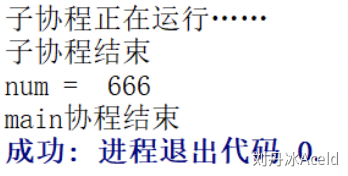
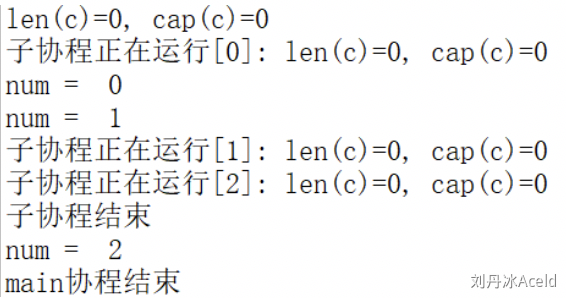
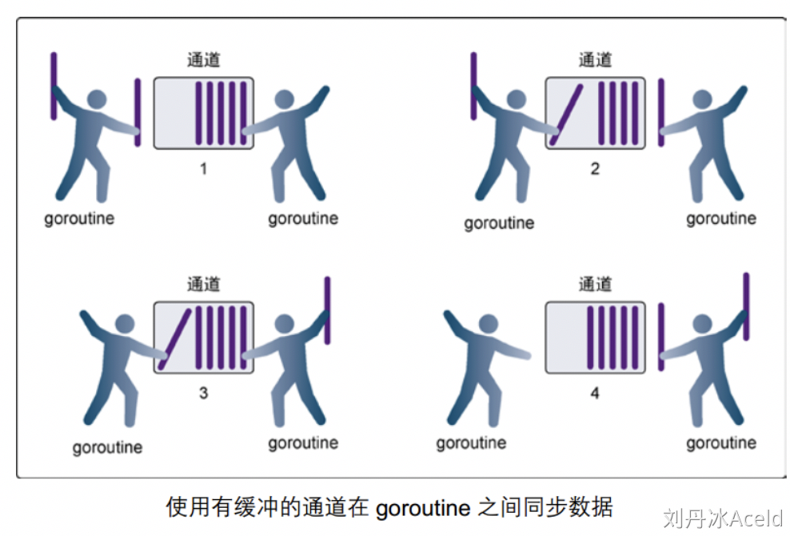
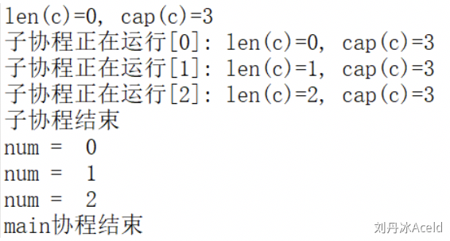
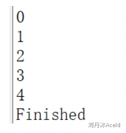
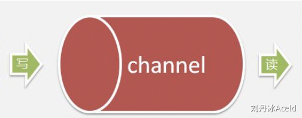

## goroutine

> 首先这里区分下 goroutine是Go语言的轻量级线程，使得并行和并发编程变得简单。使用`go`关键字，你可以让一个函数调用在新的goroutine中异步执行。这意味着你的程序可以继续执行，而不需要等待该函数调用完成。
>
> 不是 go route 路由信息

### 协程并发

协程：coroutine。也叫轻量级线程。	

与传统的系统级线程和进程相比，协程最大的优势在于“轻量级”。可以轻松创建上万个而不会导致系统资源衰竭。而线程和进程通常很难超过1万个。这也是协程别称“轻量级线程”的原因。

一个线程中可以有任意多个协程，但某一时刻只能有一个协程在运行，**多个协程分享该线程分配到的计算机资源**。

多数语言在语法层面并不直接支持协程，而是通过库的方式支持，但用库的方式支持的功能也并不完整，比如仅仅提供协程的创建、销毁与切换等能力。如果在这样的轻量级线程中调用一个同步 IO 操作，比如网络通信、本地文件读写，都会阻塞其他的并发执行轻量级线程，从而无法真正达到轻量级线程本身期望达到的目标。

  在协程中，调用一个任务就像调用一个函数一样，消耗的系统资源最少！但能达到进程、线程并发相同的效果。

在一次并发任务中，进程、线程、协程均可以实现。从系统资源消耗的角度出发来看，进程相当多，线程次之，协程最少。

### Go并发

Go 在语言级别支持协程，叫goroutine。Go 语言标准库提供的所有系统调用操作（包括所有同步IO操作），都会出让CPU给其他goroutine。这让轻量级线程的切换管理不依赖于系统的线程和进程，也不需要依赖于CPU的核心数量。

有人把Go比作21世纪的C语言。第一是因为Go语言设计简单，第二，21世纪最重要的就是并行程序设计，而Go从语言层面就支持并发。同时，并发程序的内存管理有时候是非常复杂的，而Go语言提供了自动垃圾回收机制。

Go语言为并发编程而内置的上层API基于顺序通信进程模型CSP(communicating sequential processes)。这就意味着显式锁都是可以避免的，因为Go通过相对安全的通道发送和接受数据以实现同步，这大大地简化了并发程序的编写。

Go语言中的并发程序主要使用两种手段来实现。goroutine和channel。

### 什么是Goroutine

goroutine是Go语言并行设计的核心，有人称之为go程。 Goroutine从量级上看很像协程，它比线程更小，十几个goroutine可能体现在底层就是五六个线程，Go语言内部帮你实现了这些goroutine之间的内存共享。执行goroutine只需极少的栈内存(大概是4~5KB)，当然会根据相应的数据伸缩。也正因为如此，可同时运行成千上万个并发任务。goroutine比thread更易用、更高效、更轻便。

一般情况下，一个普通计算机跑几十个线程就有点负载过大了，但是同样的机器却可以轻松地让成百上千个goroutine进行资源竞争。

### 创建Goroutine

只需在函数调⽤语句前添加 **go** 关键字，就可创建并发执⾏单元。开发⼈员无需了解任何执⾏细节，调度器会自动将其安排到合适的系统线程上执行。

在并发编程中，我们通常想将一个过程切分成几块，然后让每个goroutine各自负责一块工作，当一个程序启动时，主函数在一个单独的goroutine中运行，我们叫它main goroutine。新的goroutine会用go语句来创建。而go语言的并发设计，让我们很轻松就可以达成这一目的。

示例代码：

```go
package main
 
import (
    "fmt"
    "time"
)
 
func newTask() {
    i := 0
    for {
        i++
        fmt.Printf("new goroutine: i = %d\n", i)
        time.Sleep(1*time.Second) //延时1s
    }
}
 
func main() {
    //创建一个 goroutine，启动另外一个任务
    go newTask()
    i := 0
    //main goroutine 循环打印
    for {
        i++
        fmt.Printf("main goroutine: i = %d\n", i)
        time.Sleep(1 * time.Second) //延时1s
    }
}
```

程序运行结果：





#### Goroutine特性

**主goroutine退出后，其它的工作goroutine也会自动退出：**

```go
package main
 
import (
"fmt"
"time"
)
 
func newTask() {
    i := 0
    for {
        i++
        fmt.Printf("new goroutine: i = %d\n", i)
        time.Sleep(1 * time.Second) //延时1s
    }
}
 
func main() {
    //创建一个 goroutine，启动另外一个任务
    go newTask()
 
    fmt.Println("main goroutine exit")
}
```

程序运行结果：




#### Goexit函数


调用 runtime.Goexit() 将立即终止当前 goroutine 执⾏，调度器确保所有已注册 defer 延迟调用被执行。

示例代码：

```go
package main
 
import (
"fmt"
"runtime"
)
 
func main() {
    go func() {
        defer fmt.Println("A.defer")
 
        func() {
            defer fmt.Println("B.defer")
            runtime.Goexit() // 终止当前 goroutine, import "runtime"
            fmt.Println("B") // 不会执行
        }()
 
        fmt.Println("A") // 不会执行
    }()       //不要忘记()
 
    //死循环，目的不让主goroutine结束
    for {
    }
}
```

程序运行结果：




## **channel**

channel是Go语言中的一个**核心类型**，可以把它看成管道。并发核心单元通过它就可以发送或者接收数据进行通讯，这在一定程度上又进一步降低了编程的难度。

channel是一个数据类型，主要用来解决go程的同步问题以及go程之间数据共享（数据传递）的问题。

goroutine运行在相同的地址空间，因此访问共享内存必须做好同步。goroutine 奉行通过通信来共享内存，而不是共享内存来通信。

引⽤类型 channel可用于多个 goroutine 通讯。其内部实现了同步，确保并发安全。



### 定义channel变量


和map类似，channel也一个对应make创建的底层数据结构的**引用**。


当我们复制一个channel或用于函数参数传递时，我们只是拷贝了一个channel引用，因此调用者和被调用者将引用同一个channel对象。和其它的引用类型一样，channel的零值也是nil。


定义一个channel时，也需要定义发送到channel的值的类型。channel可以使用内置的make()函数来创建：


**chan**是创建channel所需使用的关键字。Type 代表指定channel收发数据的类型。


```go
    make(chan Type)  //等价于make(chan Type, 0)
    make(chan Type, capacity)
```


当我们复制一个channel或用于函数参数传递时，我们只是拷贝了一个channel引用，因此调用者和被调用者将引用同一个channel对象。和其它的引用类型一样，channel的零值也是nil。


当 参数capacity= 0 时，channel 是无缓冲阻塞读写的；当capacity > 0 时，channel 有缓冲、是非阻塞的，直到写满 capacity个元素才阻塞写入。


channel非常像生活中的管道，一边可以存放东西，另一边可以取出东西。channel通过操作符 <- 来接收和发送数据，发送和接收数据语法：

法：


```go
    channel <- value      //发送value到channel
    <-channel             //接收并将其丢弃
    x := <-channel        //从channel中接收数据，并赋值给x
    x, ok := <-channel    //功能同上，同时检查通道是否已关闭或者是否为空
```


默认情况下，channel接收和发送数据都是阻塞的，除非另一端已经准备好，这样就使得goroutine同步变的更加的简单，而**不需要显式的lock。**


示例代码：


```go
package main
 
import (
    "fmt"
)
 
func main() {
    c := make(chan int)
 
    go func() {
        defer fmt.Println("子go程结束")
 
        fmt.Println("子go程正在运行……")
 
        c <- 666 //666发送到c
    }()
 
    num := <-c //从c中接收数据，并赋值给num
 
    fmt.Println("num = ", num)
    fmt.Println("main go程结束")
}
```


程序运行结果：





### 无缓冲的channe

无缓冲的通道（unbuffered channel）是指在接收前没有能力保存任何数据值的通道。


这种类型的通道要求发送goroutine和接收goroutine同时准备好，才能完成发送和接收操作。否则，通道会导致先执行发送或接收操作的 goroutine 阻塞等待。


这种对通道进行发送和接收的交互行为本身就是同步的。其中任意一个操作都无法离开另一个操作单独存在。


**阻塞：**由于某种原因数据没有到达，当前go程（线程）持续处于等待状态，直到条件满足，才解除阻塞。


**同步：**在两个或多个go程（线程）间，保持数据内容一致性的机制。


下图展示两个 goroutine 如何利用无缓冲的通道来共享一个值：


图片为转载


-  在第 1 步，两个 goroutine 都到达通道，但哪个都没有开始执行发送或者接收。 
-  在第 2 步，左侧的 goroutine 将它的手伸进了通道，这模拟了向通道发送数据的行为。这时，这个 goroutine 会在通道中被锁住，直到交换完成。 
-  在第 3 步，右侧的 goroutine 将它的手放入通道，这模拟了从通道里接收数据。这个 goroutine 一样也会在通道中被锁住，直到交换完成。 
-  在第 4 步和第 5 步，进行交换，并最终，在第 6 步，两个 goroutine 都将它们的手从通道里拿出来，这模拟了被锁住的 goroutine 得到释放。两个 goroutine 现在都可以去做其他事情了。 


无缓冲的channel创建格式：


```go
    make(chan Type)   //等价于make(chan Type, 0)
```


如果没有指定缓冲区容量，那么该通道就是同步的，因此会阻塞到发送者准备好发送和接收者准备好接收。

示例代码：


```go
package main
 
import (
    "fmt"
    "time"
)
 
func main() {
    c := make(chan int, 0) //创建无缓冲的通道 c 
 
    //内置函数 len 返回未被读取的缓冲元素数量，cap 返回缓冲区大小
    fmt.Printf("len(c)=%d, cap(c)=%d\n", len(c), cap(c))
 
    go func() {
        defer fmt.Println("子go程结束")
 
        for i := 0; i < 3; i++ {
            c <- i
            fmt.Printf("子go程正在运行[%d]: len(c)=%d, cap(c)=%d\n", i, len(c), cap(c))
        }
    }()
 
    time.Sleep(2 * time.Second) //延时2s
 
    for i := 0; i < 3; i++ {
        num := <-c //从c中接收数据，并赋值给num
        fmt.Println("num = ", num)
    }
 
    fmt.Println("main进程结束")
}
```


程序运行结果：





#### 有缓冲的channel


有缓冲的通道（buffered channel）是一种在被接收前能存储一个或者多个数据值的通道。


这种类型的通道并不强制要求 goroutine 之间必须同时完成发送和接收。通道会阻塞发送和接收动作的条件也不同。


只有通道中没有要接收的值时，接收动作才会阻塞。


只有通道没有可用缓冲区容纳被发送的值时，发送动作才会阻塞。


这导致有缓冲的通道和无缓冲的通道之间的一个很大的不同：无缓冲的通道保证进行发送和接收的 goroutine 会在同一时间进行数据交换；有缓冲的通道没有这种保证。


示例图如下：




图片为转载


-  在第 1 步，右侧的 goroutine 正在从通道接收一个值。 
-  在第 2 步，右侧的这个 goroutine独立完成了接收值的动作，而左侧的 goroutine 正在发送一个新值到通道里。 
-  在第 3 步，左侧的goroutine 还在向通道发送新值，而右侧的 goroutine 正在从通道接收另外一个值。这个步骤里的两个操作既不是同步的，也不会互相阻塞。 
-  最后，在第 4 步，所有的发送和接收都完成，而通道里还有几个值，也有一些空间可以存更多的值。 


有缓冲的channel创建格式：


```go
    make(chan Type, capacity)
```


如果给定了一个缓冲区容量，通道就是异步的。只要缓冲区有未使用空间用于发送数据，或还包含可以接收的数据，那么其通信就会无阻塞地进行。


借助函数 **len(ch)** 求取缓冲区中剩余元素个数， **cap(ch)** 求取缓冲区元素容量大小。


示例代码：


```go
func main() {
    c := make(chan int, 3) //带缓冲的通道
 
    //内置函数 len 返回未被读取的缓冲元素数量， cap 返回缓冲区大小
    fmt.Printf("len(c)=%d, cap(c)=%d\n", len(c), cap(c))
 
    go func() {
        defer fmt.Println("子go程结束")
 
        for i := 0; i < 3; i++ {
            c <- i
            fmt.Printf("子go程正在运行[%d]: len(c)=%d, cap(c)=%d\n", i, len(c), cap(c))
        }
    }()
 
    time.Sleep(2 * time.Second) //延时2s
    for i := 0; i < 3; i++ {
        num := <-c //从c中接收数据，并赋值给num
        fmt.Println("num = ", num)
    }
    fmt.Println("main进程结束")
}
```


程序运行结果：





#### 关闭channel


如果发送者知道，没有更多的值需要发送到channel的话，那么让接收者也能及时知道没有多余的值可接收将是有用的，因为接收者可以停止不必要的接收等待。这可以通过内置的close函数来关闭channel实现。


示例代码：


```go
package main
 
import (
    "fmt"
)
 
func main() {
    c := make(chan int)
 
    go func() {
        for i := 0; i < 5; i++ {
            c <- i
        }
        close(c)
    }()
 
    for {
        //ok为true说明channel没有关闭，为false说明管道已经关闭
        if data, ok := <-c; ok {
            fmt.Println(data)
        } else {
            break
        }
    }
 
    fmt.Println("Finished")
}
```


程序运行结果：





**注意：**


l channel不像文件一样需要经常去关闭，只有当你确实没有任何发送数据了，或者你想显式的结束range循环之类的，才去关闭channel；


l 关闭channel后，无法向channel 再发送数据(引发 panic 错误后导致接收立即返回零值)；


l 关闭channel后，可以继续从channel接收数据；


l 对于nil channel，无论收发都会被阻塞。


可以使用 **range** 来迭代不断操作channel：


```go
package main
 
import (
    "fmt"
)
 
func main() {
    c := make(chan int)
 
    go func() {
        for i := 0; i < 5; i++ {
            c <- i
        }
        close(c)
    }()
 
    for data := range c {
        fmt.Println(data)
    }
    fmt.Println("Finished")
}
```


#### 单向channel及应用


默认情况下，通道channel是双向的，也就是，既可以往里面发送数据也可以同里面接收数据。


但是，我们经常见一个通道作为参数进行传递而只希望对方是单向使用的，要么只让它发送数据，要么只让它接收数据，这时候我们可以指定通道的方向。





单向channel变量的声明非常简单，如下：


```go
var ch1 chan int       // ch1是一个正常的channel，是双向的
var ch2 chan<- float64 // ch2是单向channel，只用于写float64数据
var ch3 <-chan int     // ch3是单向channel，只用于读int数据
```


l chan<- 表示数据进入管道，要把数据写进管道，对于调用者就是输出。


l <-chan 表示数据从管道出来，对于调用者就是得到管道的数据，当然就是输入。


可以将 channel 隐式转换为单向队列，只收或只发，不能将单向 channel 转换为普通 channel：


```go
    c := make(chan int, 3)
    var send chan<- int = c // send-only
    var recv <-chan int = c // receive-only
    send <- 1
    //<-send //invalid operation: <-send (receive from send-only type chan<- int)
    <-recv
    //recv <- 2 //invalid operation: recv <- 2 (send to receive-only type <-chan int)
 
    //不能将单向 channel 转换为普通 channel
    d1 := (chan int)(send) //cannot convert send (type chan<- int) to type chan int
    d2 := (chan int)(recv) //cannot convert recv (type <-chan int) to type chan int
```


示例代码：

```go
//   chan<- //只写
func counter(out chan<- int) {
    defer close(out)
    for i := 0; i < 5; i++ {
        out <- i //如果对方不读 会阻塞
    }
}
 
//   <-chan //只读
func printer(in <-chan int) {
    for num := range in {
        fmt.Println(num)
    }
}
 
func main() {
    c := make(chan int) //   chan   //读写
 
    go counter(c) //生产者
    printer(c)    //消费者
 
    fmt.Println("done")
}
```

## select

### select作用


**Go里面提供了一个关键字select，通过select可以监听channel上的数据流动。**

> 那么作用也就显然是 监听channel上的数据流动啦

有时候我们希望能够借助channel发送或接收数据，并避免因为发送或者接收导致的阻塞，尤其是当channel没有准备好写或者读时。select语句就可以实现这样的功能。


select的用法与switch语言非常类似，由select开始一个新的选择块，每个选择条件由case语句来描述。


与switch语句相比，select有比较多的限制，其中最大的一条限制就是每个**case****语句里必须是一个IO****操作**，大致的结构如下：


```go
    select {
    case <- chan1:
        // 如果chan1成功读到数据，则进行该case处理语句
    case chan2 <- 1:
        // 如果成功向chan2写入数据，则进行该case处理语句
    default:
        // 如果上面都没有成功，则进入default处理流程
    }
```


在一个select语句中，Go语言会按顺序从头至尾评估每一个发送和接收的语句。


如果其中的任意一语句可以继续执行(即没有被阻塞)，那么就从那些可以执行的语句中任意选择一条来使用。


如果没有任意一条语句可以执行(即所有的通道都被阻塞)，那么有两种可能的情况：


l 如果给出了default语句，那么就会执行default语句，同时程序的执行会从select语句后的语句中恢复。


l 如果没有default语句，那么select语句将被阻塞，直到至少有一个通信可以进行下去。


示例代码：


```go
package main

import (
	"fmt"
)

func fibonacci(c, quit chan int) {
	x, y := 1, 1
	// 定义变量

	// for循环与select语句结合使用，使函数能够等待channel上的事件。
	for {
		select {
		case c <- x:
			x, y = y, x+y
		case <-quit:
			fmt.Println("quit")
			return
		}
	}
}

func main() {
	c := make(chan int)
	quit := make(chan int)
	// 两个int类型的chan

	go func() {
		for i := 0; i < 6; i++ {
			fmt.Println(<-c)
		}
		// 从chan c中接收并且打印6个数据
		quit <- 0
		// 向chan quit中发送1个数据（信号0）
	}()

	fibonacci(c, quit)
	// 因为上面的func 是一个 go 线程
}

```


运行结果如下：


## Go Modules

> 感觉这种模块式开发只能多练：然后就熟练了，光看是学不会的：好比如git相关指令

###  A、什么是Go Modules?

Go modules 是 Go 语言的依赖解决方案，发布于 Go1.11，成长于 Go1.12，丰富于 Go1.13，正式于 Go1.14 推荐在生产上使用。


Go moudles 目前集成在 Go 的工具链中，只要安装了 Go，自然而然也就可以使用 Go moudles 了，而 Go modules 的出现也解决了在 Go1.11 前的几个常见争议问题：


1. Go 语言长久以来的依赖管理问题。
2. “淘汰”现有的 GOPATH 的使用模式。
3. 统一社区中的其它的依赖管理工具（提供迁移功能）。


### B、GOPATH的工作模式


Go Modoules的目的之一就是淘汰GOPATH,  那么GOPATH是个什么?


为什么在 Go1.11 前就使用 GOPATH，而 Go1.11 后就开始逐步建议使用 Go modules，不再推荐 GOPATH 的模式了呢？


##### (1) Wait is GOPATH?

​	

我们输入`go env`命令行后可以查看到 GOPATH 变量的结果，我们进入到该目录下进行查看，如下：


```bash
go
├── bin
├── pkg
└── src
    ├── github.com
    ├── golang.org
    ├── google.golang.org
    ├── gopkg.in
    ....
```


GOPATH目录下一共包含了三个子目录，分别是：


- bin：存储所编译生成的二进制文件。
- pkg：存储预编译的目标文件，以加快程序的后续编译速度。
- src：存储所有`.go`文件或源代码。在编写 Go 应用程序，程序包和库时，一般会以`$GOPATH/src/github.com/foo/bar`的路径进行存放。


因此在使用 GOPATH 模式下，我们需要将应用代码存放在固定的`$GOPATH/src`目录下，并且如果执行`go get`来拉取外部依赖会自动下载并安装到`$GOPATH`目录下。


##### (2) GOPATH模式的弊端


在 GOPATH 的 `$GOPATH/src` 下进行 `.go` 文件或源代码的存储，我们可以称其为 GOPATH 的模式，这个模式拥有一些弊端.


- **A. 无版本控制概念.** 在执行`go get`的时候，你无法传达任何的版本信息的期望，也就是说你也无法知道自己当前更新的是哪一个版本，也无法通过指定来拉取自己所期望的具体版本。

- **B.无法同步一致第三方版本号.** 在运行 Go 应用程序的时候，你无法保证其它人与你所期望依赖的第三方库是相同的版本，也就是说在项目依赖库的管理上，你无法保证所有人的依赖版本都一致。
- **C.无法指定当前项目引用的第三方版本号.**  你没办法处理 v1、v2、v3 等等不同版本的引用问题，因为 GOPATH 模式下的导入路径都是一样的，都是`github.com/foo/bar`。


### C、Go Modules模式


我们接下来用Go Modules的方式创建一个项目, 建议为了与GOPATH分开,不要将项目创建在`GOPATH/src`下.


##### (1) go mod命令

| 命令            | 作用                             |
| --------------- | -------------------------------- |
| go mod init     | 生成 go.mod 文件                 |
| go mod download | 下载 go.mod 文件中指明的所有依赖 |
| go mod tidy     | 整理现有的依赖                   |
| go mod graph    | 查看现有的依赖结构               |
| go mod edit     | 编辑 go.mod 文件                 |
| go mod vendor   | 导出项目所有的依赖到vendor目录   |
| go mod verify   | 校验一个模块是否被篡改过         |
| go mod why      | 查看为什么需要依赖某模块         |


##### (2) go mod环境变量


可以通过 `go env` 命令来进行查看


```bash
$ go env
GO111MODULE="auto"
GOPROXY="https://proxy.golang.org,direct"
GONOPROXY=""
GOSUMDB="sum.golang.org"
GONOSUMDB=""
GOPRIVATE=""
...
```


###### GO111MODULE


Go语言提供了 `GO111MODULE`这个环境变量来作为 Go modules 的开关，其允许设置以下参数：


- auto：只要项目包含了 go.mod 文件的话启用 Go modules，目前在 Go1.11 至 Go1.14 中仍然是默认值。
- on：启用 Go modules，推荐设置，将会是未来版本中的默认值。
- off：禁用 Go modules，不推荐设置。


可以通过来设置


```bash
$ go env -w GO111MODULE=on
```


###### GOPROXY

这个环境变量主要是用于设置 Go 模块代理（Go module proxy）,其作用是用于使 Go 在后续拉取模块版本时直接通过镜像站点来快速拉取。


GOPROXY 的默认值是：`https://proxy.golang.org,direct`


`proxy.golang.org`国内访问不了,需要设置国内的代理.


-  阿里云
  https://mirrors.aliyun.com/goproxy/ 
-  七牛云
  https://goproxy.cn,direct 

如:

```bash
$ go env -w GOPROXY=https://goproxy.cn,direct
```

GOPROXY 的值是一个以英文逗号 “,” 分割的 Go 模块代理列表，允许设置多个模块代理，假设你不想使用，也可以将其设置为 “off” ，这将会禁止 Go 在后续操作中使用任何 Go 模块代理。

如:

```bash
$ go env -w GOPROXY=https://goproxy.cn,https://mirrors.aliyun.com/goproxy/,direct
```


direct

而在刚刚设置的值中，我们可以发现值列表中有 “direct” 标识，它又有什么作用呢？

**先通过代理下载 若代理下载失败了就执行后面这句话**

**`direct` 意味着直接从模块的源处下载模块**


###### GOSUMDB

它的值是一个 Go checksum database，用于在拉取模块版本时（无论是从源站拉取还是通过 Go module proxy 拉取）保证拉取到的模块版本数据未经过篡改，若发现不一致，也就是可能存在篡改，将会立即中止。


GOSUMDB 的默认值为：`sum.golang.org`，在国内也是无法访问的，但是 GOSUMDB 可以被 Go 模块代理所代理（详见：Proxying a Checksum Database）。


因此我们可以通过设置 GOPROXY 来解决，而先前我们所设置的模块代理 `goproxy.cn` 就能支持代理 `sum.golang.org`，所以这一个问题在设置 GOPROXY 后，你可以不需要过度关心。


另外若对 GOSUMDB 的值有自定义需求，其支持如下格式：


- 格式 1：`<SUMDB_NAME>+<PUBLIC_KEY>`。
- 格式 2：`<SUMDB_NAME>+<PUBLIC_KEY> <SUMDB_URL>`。


也可以将其设置为“off”，也就是禁止 Go 在后续操作中校验模块版本。


###### GONOPROXY/GONOSUMDB/GOPRIVATE


这三个环境变量都是用在当前项目依赖了私有模块，例如像是你公司的私有 git 仓库，又或是 github 中的私有库，都是属于私有模块，都是要进行设置的，否则会拉取失败。


更细致来讲，就是依赖了由 GOPROXY 指定的 Go 模块代理或由 GOSUMDB 指定 Go checksum database 都无法访问到的模块时的场景。


而一般**建议直接设置 GOPRIVATE，它的值将作为 GONOPROXY 和 GONOSUMDB 的默认值，所以建议的最佳姿势是直接使用 GOPRIVATE**。


并且它们的值都是一个以英文逗号 “,” 分割的模块路径前缀，也就是可以设置多个，例如：


```bash
$ go env -w GOPRIVATE="git.example.com,github.com/eddycjy/mquote"
```


设置后，前缀为 git.xxx.com 和 github.com/eddycjy/mquote 的模块都会被认为是私有模块。


如果不想每次都重新设置，我们也可以利用通配符，例如：


```bash
$ go env -w GOPRIVATE="*.example.com"
```


这样子设置的话，所有模块路径为 example.com 的子域名（例如：git.example.com）都将不经过 Go module proxy 和 Go checksum database，**需要注意的是不包括 example.com 本身**。


### D、使用Go Modules初始化项目


##### (1) 开启Go Modules


```bash
 $ go env -w GO111MODULE=on
```


又或是可以通过直接设置系统环境变量（写入对应的~/.bash_profile 文件亦可）来实现这个目的：


```bash
$ export GO111MODULE=on
```


##### (2) 初始化项目


创建项目目录


```bash
$ mkdir -p $HOME/aceld/modules_test
$ cd $HOME/aceld/modules_test
```


执行Go modules 初始化


```bash
$ go mod init github.com/aceld/modules_test
go: creating new go.mod: module github.com/aceld/modules_test
```


在执行 `go mod init` 命令时，我们指定了模块导入路径为 `github.com/aceld/modules_test`。接下来我们在该项目根目录下创建 `main.go` 文件，如下：


```go
package main

import (
    "fmt"
    "github.com/aceld/zinx/znet"
    "github.com/aceld/zinx/ziface"
)

//ping test 自定义路由
type PingRouter struct {
    znet.BaseRouter
}

//Ping Handle
func (this *PingRouter) Handle(request ziface.IRequest) {
    //先读取客户端的数据
    fmt.Println("recv from client : msgId=", request.GetMsgID(), 
              ", data=", string(request.GetData()))

    //再回写ping...ping...ping
    err := request.GetConnection().SendBuffMsg(0, []byte("ping...ping...ping"))
    if err != nil {
      fmt.Println(err)
    }
}

func main() {
    //1 创建一个server句柄
    s := znet.NewServer()

    //2 配置路由
    s.AddRouter(0, &PingRouter{})

    //3 开启服务
    s.Serve()
}
```


OK, 我们先不要关注代码本身,我们看当前的main.go也就是我们的`aceld/modules_test`项目,是依赖一个叫`github.com/aceld/zinx`库的. `znet`和`ziface`只是`zinx`的两个模块.


接下来我们在`$HOME/aceld/modules_test`,本项目的根目录执行


```bash
$ go get github.com/aceld/zinx/znet

go: downloading github.com/aceld/zinx v0.0.0-20200221135252-8a8954e75100
go: found github.com/aceld/zinx/znet in github.com/aceld/zinx v0.0.0-20200221135252-8a8954e75100
```


我们会看到 我们的`go.mod`被修改,同时多了一个`go.sum`文件.


##### (3) 查看go.mod文件


aceld/modules_test/go.mod


```go
module github.com/aceld/modules_test

go 1.14

require github.com/aceld/zinx v0.0.0-20200221135252-8a8954e75100 // indirect
```


我们来简单看一下这里面的关键字


`module`: 用于定义当前项目的模块路径


`go`:标识当前Go版本.即初始化版本


`require`: 当前项目依赖的一个特定的必须版本


```
// indirect`: 示该模块为间接依赖，也就是在当前应用程序中的 import 语句中，并没有发现这个模块的明确引用，有可能是你先手动 `go get` 拉取下来的，也有可能是你所依赖的模块所依赖的.我们的代码很明显是依赖的`"github.com/aceld/zinx/znet"`和`"github.com/aceld/zinx/ziface"`,所以就间接的依赖了`github.com/aceld/zinx
```


##### (4) 查看go.sum文件


在第一次拉取模块依赖后，会发现多出了一个 go.sum 文件，其详细罗列了当前项目直接或间接依赖的所有模块版本，并写明了那些模块版本的 SHA-256 哈希值以备 Go 在今后的操作中保证项目所依赖的那些模块版本不会被篡改。


```bash
github.com/aceld/zinx v0.0.0-20200221135252-8a8954e75100 h1:Ez5iM6cKGMtqvIJ8nvR9h74Ln8FvFDgfb7bJIbrKv54=
github.com/aceld/zinx v0.0.0-20200221135252-8a8954e75100/go.mod h1:bMiERrPdR8FzpBOo86nhWWmeHJ1cCaqVvWKCGcDVJ5M=
github.com/golang/protobuf v1.3.3/go.mod h1:vzj43D7+SQXF/4pzW/hwtAqwc6iTitCiVSaWz5lYuqw=
```


我们可以看到一个模块路径可能有如下两种：


h1:hash情况


```bash
github.com/aceld/zinx v0.0.0-20200221135252-8a8954e75100 h1:Ez5iM6cKGMtqvIJ8nvR9h74Ln8FvFDgfb7bJIbrKv54=
```


go.mod hash情况


```bash
github.com/aceld/zinx v0.0.0-20200221135252-8a8954e75100/go.mod h1:bMiERrPdR8FzpBOo86nhWWmeHJ1cCaqVvWKCGcDVJ5M=
github.com/golang/protobuf v1.3.3/go.mod h1:vzj43D7+SQXF/4pzW/hwtAqwc6iTitCiVSaWz5lYuqw=
```


h1 hash 是 Go modules 将目标模块版本的 zip 文件开包后，针对所有包内文件依次进行 hash，然后再把它们的 hash 结果按照固定格式和算法组成总的 hash 值。


而 h1 hash 和 go.mod hash 两者，要不就是同时存在，要不就是只存在 go.mod hash。那什么情况下会不存在 h1 hash 呢，就是当 Go 认为肯定用不到某个模块版本的时候就会省略它的 h1 hash，就会出现不存在 h1 hash，只存在 go.mod hash 的情况。


### E、修改模块的版本依赖关系


​		为了作尝试,假定我们现在都zinx版本作了升级, 由`zinx v0.0.0-20200221135252-8a8954e75100` 升级到 `zinx v0.0.0-20200306023939-bc416543ae24` (注意zinx是一个没有打版本tag打第三方库,如果有的版本号是有tag的,那么可以直接对应v后面的版本号即可)


​		那么,我们是怎么知道zinx做了升级呢, 我们又是如何知道的最新的`zinx`版本号是多少呢?


​		先回到`$HOME/aceld/modules_test`,本项目的根目录执行


```bash
$ go get github.com/aceld/zinx/znet
go: downloading github.com/aceld/zinx v0.0.0-20200306023939-bc416543ae24
go: found github.com/aceld/zinx/znet in github.com/aceld/zinx v0.0.0-20200306023939-bc416543ae24
go: github.com/aceld/zinx upgrade => v0.0.0-20200306023939-bc416543ae24
```


这样我们,下载了最新的zinx, 版本是`v0.0.0-20200306023939-bc416543ae24`


​		然后,我么看一下go.mod


```go
module github.com/aceld/modules_test

go 1.14

require github.com/aceld/zinx v0.0.0-20200306023939-bc416543ae24 // indirect
```


我们会看到,当我们执行`go get` 的时候, 会自动的将本地将当前项目的`require`更新了.变成了最新的依赖.


好了, 现在我们就要做另外一件事,就是,我们想用一个旧版本的zinx. 来修改当前`zinx`模块的依赖版本号.


目前我们在`$GOPATH/pkg/mod/github.com/aceld`下,已经有了两个版本的zinx库


```bash
/go/pkg/mod/github.com/aceld$ ls
zinx@v0.0.0-20200221135252-8a8954e75100
zinx@v0.0.0-20200306023939-bc416543ae24
```


​		目前,我们`/aceld/modules_test`依赖的是`zinx@v0.0.0-20200306023939-bc416543ae24` 这个是最新版, 我们要改成之前的版本`zinx@v0.0.0-20200306023939-bc416543ae24`.


​		回到`/aceld/modules_test`项目目录下,执行


```bash
$ go mod edit -replace=zinx@v0.0.0-20200306023939-bc416543ae24=zinx@v0.0.0-20200221135252-8a8954e75100
```


​	然后我们打开go.mod查看一下


```go
module github.com/aceld/modules_test

go 1.14

require github.com/aceld/zinx v0.0.0-20200306023939-bc416543ae24 // indirect

replace zinx v0.0.0-20200306023939-bc416543ae24 => zinx v0.0.0-20200221135252-8a8954e75100
```


​	这里出现了`replace`关键字.用于将一个模块版本替换为另外一个模块版本。


## 笔记提纲


